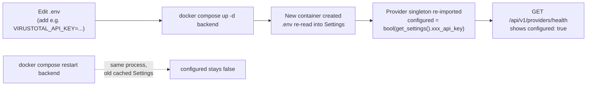

# Admin Guide

Practical, mechanics-only reference for what an operator actually does on this
platform: manage user accounts, enable a provider connector, and check provider
health. User management (create/edit/enable/disable/reset-password, all
audit-logged) has a real admin web UI at `/admin` (frontend) and a real REST API
under `/api/v1/admin` (backend) — no direct database edit is needed for any of it.
Provider/AI configuration also has its own UI at `/providers`. Where a capability
still genuinely doesn't exist, that's called out explicitly as **NOT IMPLEMENTED**
rather than guessed at.

Related docs: [SECURITY.md](SECURITY.md) (full auth/RBAC model),
[CONFIGURATION.md](CONFIGURATION.md) (every environment variable),
[PROVIDERS.md](PROVIDERS.md) (per-connector behavior), [DEPLOYMENT.md](DEPLOYMENT.md)
(container topology), [DATA_MODEL.md](DATA_MODEL.md) (`users` table schema),
[API_DOCUMENTATION.md](API_DOCUMENTATION.md) (endpoint reference).

---

## 1. Users and roles

### 1.1 How accounts are created

Two paths, both real:

**Public self-registration (bootstrap path only)** — `POST /api/v1/auth/register`:

```bash
curl -X POST http://localhost:8000/api/v1/auth/register \
  -H "Content-Type: application/json" \
  -d '{"email":"analyst@example.com","password":"<configure securely>","full_name":"Jane Analyst"}'
```

The **first user ever inserted into the `users` table** (checked via `SELECT` returning no
rows) is automatically assigned `Role.ADMIN`. Every registration attempt after that is
**rejected outright** (`403 Forbidden`, "Self-registration is closed. Ask an administrator to
create your account from the Administration page.") — it does not fall back to creating an
`Role.ANALYST` account. This closes the gap where anyone who found the public `/register` page
could sign themselves up as an unprivileged user without an admin's knowledge; the only
supported way to onboard a new user once an admin exists is the admin-created path below.

**Admin-created accounts** — `POST /api/v1/admin/users` (§1.3), available once at least one
administrator exists. This is how every real user is onboarded once the platform has its first
administrator: an administrator picks the role at creation time (`admin`/`analyst`/`viewer`).

### 1.2 Roles and permissions

Three roles exist (`backend/app/models/user.py`): `admin`, `analyst`, `viewer`.
`ROLE_PERMISSIONS` is a static in-code dict — there is no per-user permission override
and no custom-role support. The frontend's Administration → Roles & Permissions tab
renders this exact matrix live from `GET /api/v1/admin/roles`, so it can never drift out
of sync with what's actually enforced.

| Permission | admin | analyst | viewer |
|---|:---:|:---:|:---:|
| `lookup:create` | ✅ | ✅ | ❌ |
| `lookup:read` | ✅ | ✅ | ✅ |
| `lookup:export` | ✅ | ✅ | ❌ |
| `evidence:read` | ✅ | ✅ | ✅ |
| `analysis:generate` | ✅ | ✅ | ❌ |
| `hunting:generate` | ✅ | ✅ | ❌ |
| `copilot:query` | ✅ | ✅ | ❌ |
| `basket:manage` | ✅ | ✅ | ❌ |
| `case:create` / `case:write` / `case:close` | ✅ | ✅ | ❌ |
| `case:read` | ✅ | ✅ | ✅ |
| `provider:manage` | ✅ | ❌ | ❌ |
| `user:manage` | ✅ | ❌ | ❌ |
| `audit:read` | ✅ | ❌ | ❌ |

`provider:manage` gates the Manage Providers UI/API (`/providers`, `runtime.py`).
`user:manage` gates every user-management action below (`admin.py`) — full CRUD,
enable/disable, password reset, all admin-only and enforced server-side regardless of
what the frontend shows. `audit:read` gates the audit log, which now records both
provider/AI configuration changes and every user-management/login event in one place.

### 1.3 Managing users — real UI, real API, no direct DB edit

**Frontend:** sign in as an administrator, open **Administration** in the top nav (only
visible to admins), and use the **Users** tab: search/filter/sort/paginate, **+ New User**,
**Edit** (name/role), **Reset Password**, and **Enable/Disable** (with a confirmation
dialog). The **Overview** tab shows account counts and recent logins; **Roles &
Permissions** is the read-only matrix from §1.2; **Audit Log** shows every change.

**API**, if you'd rather script it — everything below requires an admin's access token
and `user:manage` (enforced server-side; see [API_DOCUMENTATION.md](API_DOCUMENTATION.md)
§3.5 for full request/response shapes):

```bash
# Get an admin token
TOKEN=$(curl -s -X POST http://localhost:8000/api/v1/auth/login \
  -H "Content-Type: application/json" \
  -d '{"email":"admin@example.com","password":"<your admin password>"}' \
  | python3 -c "import sys,json; print(json.load(sys.stdin)['access_token'])")

# List/search users
curl -s "http://localhost:8000/api/v1/admin/users?search=analyst" \
  -H "Authorization: Bearer $TOKEN"

# Create a user with a specific role directly (no self-registration needed)
curl -s -X POST http://localhost:8000/api/v1/admin/users \
  -H "Authorization: Bearer $TOKEN" -H "Content-Type: application/json" \
  -d '{"email":"newanalyst@example.com","password":"<configure securely>","full_name":"New Analyst","role":"analyst"}'

# Promote/demote a role, or rename
curl -s -X PATCH http://localhost:8000/api/v1/admin/users/<user-id> \
  -H "Authorization: Bearer $TOKEN" -H "Content-Type: application/json" \
  -d '{"role":"admin"}'

# Disable (or re-enable) an account -- takes effect immediately, even on an
# already-issued, still-unexpired token
curl -s -X POST http://localhost:8000/api/v1/admin/users/<user-id>/active \
  -H "Authorization: Bearer $TOKEN" -H "Content-Type: application/json" \
  -d '{"is_active": false}'

# Reset a user's password -- also immediately invalidates every session
# already issued to them (they must sign in again with the new password)
curl -s -X POST http://localhost:8000/api/v1/admin/users/<user-id>/reset-password \
  -H "Authorization: Bearer $TOKEN" -H "Content-Type: application/json" \
  -d '{"new_password": "<configure securely>"}'
```

**Safeguards that apply regardless of which path (UI or API) you use:**

- **An administrator cannot change their own role** (`400`) — ask a *different*
  administrator. This exists purely to prevent an accidental self-lockout mid-session,
  since role changes take effect immediately with no re-login required.
- **The last remaining active administrator can neither be demoted nor disabled**
  (`409`) — and this is enforced race-safely: two concurrent requests that would each
  disable a *different* one of the platform's last two admins can't both succeed and
  leave zero (see [SECURITY.md](SECURITY.md) §2 for the locking mechanism).
- **No hard delete.** `case.py`'s `analyst_id`/`added_by`/`author_id`/`generated_by` and
  `basket.py`'s `owner_id` are all `NOT NULL` foreign keys to `users.id` — deleting a user
  who has ever created a case, added evidence, or owned a basket would either violate
  those constraints or destroy real investigation data. Disable instead; it's immediate
  and reversible, and preserves the audit trail and every case they've touched.

### 1.4 What's still NOT implemented for user management

- No **self-service** password reset/recovery ("forgot password" for an unauthenticated
  user) — a locked-out user needs an administrator to reset their password for them via
  §1.3 above. There is still no unauthenticated recovery path of any kind.
- No email verification.
- No MFA / 2FA / TOTP.
- No account-lockout or brute-force throttling on `/auth/login` (only the unrelated
  per-user *lookup-creation* rate limit exists — see §3.4).
- No self-service "log out everywhere" for a user's *own* other sessions (an
  administrator resetting the password achieves this for that one user, but a user
  can't trigger it themselves without changing their password).

---

## 2. Enabling a provider

Provider connectors read their credentials exclusively from `Settings`
(`backend/app/core/config.py`), which loads from process environment variables, then
`.env`, then hardcoded defaults. Enabling a provider is always: **add the key to
`.env`, then recreate the `backend` container — do not just restart it.**

### 2.1 Why `up -d`, not `restart`

`get_settings()` is `@lru_cache`d — one `Settings` instance lives for the whole
process lifetime. Each provider computes its own `configured` flag once, at import
time, from that cached `Settings` instance (e.g.
`configured = bool(get_settings().virustotal_api_key)` in `virustotal.py`). A running
container never re-reads `.env`, and `docker compose restart backend` does not
recreate the container or re-inject environment variables — only `docker compose up
-d` does that when the service's config (including `.env`) has changed.



```bash
# 1. Edit .env in the repo root
#    VIRUSTOTAL_API_KEY=<your-key-here>

# 2. Recreate (not restart) the backend container
docker compose up -d backend

# 3. Confirm it picked up the key
curl -s http://localhost:8000/api/v1/providers/health | grep -A5 '"provider_id": "virustotal"'
```

### 2.2 Providers that need no key at all (always `configured: true`)

| provider_id | Name | Category |
|---|---|---|
| `crtsh` | crt.sh | Certificate intel |
| `nvd` | NIST NVD | Vulnerability (works unauthenticated; key only raises the rate limit) |
| `cisa_kev` | CISA Known Exploited Vulnerabilities | Vulnerability |
| `mitre_attack` | MITRE ATT&CK | Threat intel (technique lookups) |
| `whois_rdap` | WHOIS/RDAP | WHOIS |
| `spamhaus` | Spamhaus DBL/ZEN | Threat intel (DNS-based, no HTTP call) |
| `phishtank` | PhishTank | Threat intel (works unauthenticated; key only raises the rate limit) |

Nothing to do for these — they're already usable out of the box.

### 2.3 Providers that require a key to activate

| provider_id | Name | Env var(s) | Notes |
|---|---|---|---|
| `virustotal` | VirusTotal | `VIRUSTOTAL_API_KEY` | Free-tier limits: 4 req/min, 500/day |
| `abuseipdb` | AbuseIPDB | `ABUSEIPDB_API_KEY` | Free-tier: 1000 checks/day |
| `otx` | AlienVault OTX | `OTX_API_KEY` | Free OTX account key |
| `urlhaus` | URLhaus | `ABUSECH_AUTH_KEY` | Shared abuse.ch key |
| `threatfox` | ThreatFox | `ABUSECH_AUTH_KEY` | Same key as URLhaus/MalwareBazaar |
| `malwarebazaar` | MalwareBazaar | `ABUSECH_AUTH_KEY` | Same key as URLhaus/ThreatFox |
| `hybrid_analysis` | Hybrid Analysis (Falcon Sandbox) | `HYBRID_ANALYSIS_API_KEY` | SHA256 hashes only — MD5/SHA1/URL support was dropped when the connector was rewritten around a deprecated endpoint |
| `censys` | Censys | `CENSYS_PERSONAL_ACCESS_TOKEN` **and** `CENSYS_ORGANIZATION_ID` | Both must be set — the connector treats the pair as one unit |

`ABUSECH_AUTH_KEY` is a single shared credential across three connectors (URLhaus,
ThreatFox, MalwareBazaar) — set it once to enable all three.

```env
# .env
ABUSECH_AUTH_KEY=<your-abuse.ch-key>
HYBRID_ANALYSIS_API_KEY=<your-key-here>
CENSYS_PERSONAL_ACCESS_TOKEN=<your-token-here>
CENSYS_ORGANIZATION_ID=<your-org-id>
```

Then:

```bash
docker compose up -d backend
```

A 16th entry, `internet_intelligence` (the OSINT crawler wrapped as a provider,
registered from `app.crawler`), also appears in `/providers/health`; its
configuration surface was not verified in this pass — see
[PROVIDERS.md](PROVIDERS.md) for anything further documented on it.

### 2.4 Full connector reference

For request/response shapes, verdict logic, and every quirk per connector (e.g.
ThreatFox's "ok-with-zero-results is NO_DATA, not OK" override, Spamhaus's pure-DNS
lookup, crt.sh's malformed-JSON tolerance), see [PROVIDERS.md](PROVIDERS.md).

---

## 3. Checking provider health

### 3.1 Endpoint

```
GET /api/v1/providers/health
```

Gated by `require_permission("lookup:read")` — **any authenticated user** can call
this, not just admins, since all three roles (`admin`, `analyst`, `viewer`) hold
`lookup:read`.

```bash
# Log in to get a token
TOKEN=$(curl -s -X POST http://localhost:8000/api/v1/auth/login \
  -H "Content-Type: application/json" \
  -d '{"email":"you@example.com","password":"<configure securely>"}' | python -c "import sys,json;print(json.load(sys.stdin)['access_token'])")

# Check provider health
curl -s http://localhost:8000/api/v1/providers/health \
  -H "Authorization: Bearer $TOKEN"
```

Response is a JSON array, one object per registered provider
(`backend/app/providers/registry.py:53-64`):

```json
[
  {
    "provider_id": "virustotal",
    "provider_name": "VirusTotal",
    "category": "threat_intel",
    "configured": false,
    "requires_key": true,
    "supported_types": ["domain", "ipv4", "ipv6", "md5", "sha1", "sha256", "sha512", "url"]
  }
]
```

| Field | Meaning |
|---|---|
| `configured` | `true` if the required key(s)/credentials are set. **This does not confirm the key is valid** — only that a value is present. An invalid key still shows `configured: true`; you'll only see the failure as a `status: "error"` on an actual lookup (see below). |
| `requires_key` | Whether this connector needs credentials at all (`false` for crt.sh, NVD, CISA KEV, MITRE ATT&CK, WHOIS/RDAP, Spamhaus, PhishTank). |
| `supported_types` | IOC types this connector can be queried with — feeds the "how many providers apply to this IOC" count shown in the UI. |

This endpoint only reports configuration presence. It does not test connectivity to
the upstream API. To confirm a key actually works, run a real lookup against an IOC
type that provider supports and check that provider's entry in the lookup's
per-provider results for `status: "ok"` rather than `"error"` or `"not_configured"`.
`not_configured` specifically means `requires_key` is true and the key is still
blank/missing at the process level (see §2.1 on why that can lag a `.env` edit).

### 3.2 Other health/monitoring endpoints

| Endpoint | Auth | Purpose |
|---|---|---|
| `GET /health` | None | Liveness check: `{"status": "ok", "service": "HORIZON GRID"}` |
| `GET /metrics` | None | Prometheus metrics via `prometheus-fastapi-instrumentator`. **NOT IMPLEMENTED:** no Prometheus/Grafana server is bundled to scrape or display this — bring your own. |
| `GET /docs` | None | FastAPI/Swagger interactive API docs |

### 3.3 Other admin-tunable settings (env vars, all require `up -d`)

| Variable | Default | Effect |
|---|---|---|
| `PROVIDER_TIMEOUT_SECONDS` | `20` | Per-attempt timeout the orchestrator applies to every provider call |
| `PROVIDER_MAX_RETRIES` | `2` | Retries on connect/read/pool timeouts only (not on 4xx/5xx) |
| `PROVIDER_CACHE_TTL_SECONDS` | `3600` | How long a successful (`status: ok`) provider result is cached in Redis before a fresh call is made for the same IOC |

### 3.4 Lookup-creation rate limit

Distinct from provider health — this throttles how often *a user* can start a new
lookup, enforced in `backend/app/api/routes/lookup.py` via the Redis-backed
`RateLimiter` in `app/core/cache.py` (key `lookup_create:{user.id}`):

| Variable | Default | Effect |
|---|---|---|
| `LOOKUP_RATE_LIMIT_MAX_CALLS` | `10` | Max lookup-creation calls per window, per user |
| `LOOKUP_RATE_LIMIT_WINDOW_SECONDS` | `60` | Window length in seconds |

**NOT IMPLEMENTED:** no per-provider rate limiter exists — this Redis `RateLimiter`
class is only ever instantiated for the lookup-creation endpoint, not inside any
individual provider connector. Individual connectors rely solely on the orchestrator's
shared timeout/retry policy and on upstream APIs' own 429/403/509 responses (mapped to
`RATE_LIMITED`).

---

## 4. Security-relevant settings an admin should set before going beyond localhost

These are documented in full in [CONFIGURATION.md](CONFIGURATION.md) and
[SECURITY.md](SECURITY.md); the ones that matter operationally:

| Variable | Default | Why it matters |
|---|---|---|
| `JWT_SECRET_KEY` | `change-me-in-production` | HMAC signing key for every access/refresh token. A leaked or default key lets anyone forge a valid token for any role, including admin. **Must be changed before any non-local deployment.** |
| `ACCESS_TOKEN_EXPIRE_MINUTES` | `30` | Access token lifetime |
| `REFRESH_TOKEN_EXPIRE_DAYS` | `7` | Refresh token lifetime. There is no server-side revocation list — a valid, unexpired refresh token can mint new access tokens indefinitely even after a client-side logout, since logout only clears `localStorage` in the browser. |
| `DEBUG` | `true` | No longer read anywhere in the backend -- CORS is now a fixed policy allowing any `localhost`/loopback/private-IP origin (any port, `http://` only), independent of this flag. See `docs/SECURITY.md` §4. |

Changing any of these follows the same rule as §2.1: edit `.env`, then
`docker compose up -d backend`.

---

## 5. Summary: what this guide is, and isn't

| Task | Real mechanism |
|---|---|
| Create the first (admin) account | `POST /api/v1/auth/register` on an empty `users` table (closed after that) |
| Create every subsequent account | Administration UI or `POST /api/v1/admin/users` (admin-only) |
| Change a user's role | Administration UI or `PATCH /api/v1/admin/users/{id}` (admin-only) |
| Deactivate a user | Administration UI or `PATCH /api/v1/admin/users/{id}` (admin-only) |
| Enable a provider | Add key to `.env`, then `docker compose up -d backend` |
| Check provider health | `GET /api/v1/providers/health` (any logged-in role) |
| View an audit log | Administration UI (`/admin` → Audit Log tab) or Manage Providers UI (`/providers` → Audit Log tab), or `GET /api/v1/runtime/audit-log` directly (admin-only, `audit:read`) |
| Manage providers via UI | Manage Providers UI at `/providers` — AI Providers / IOC Providers / Audit Log / Network Access tabs (admin-only, `provider:manage`) |

For anything this guide doesn't cover, check
[DOCUMENTATION_GAPS.md](DOCUMENTATION_GAPS.md) before assuming a feature is missing —
it may simply not have been in scope for this document.
