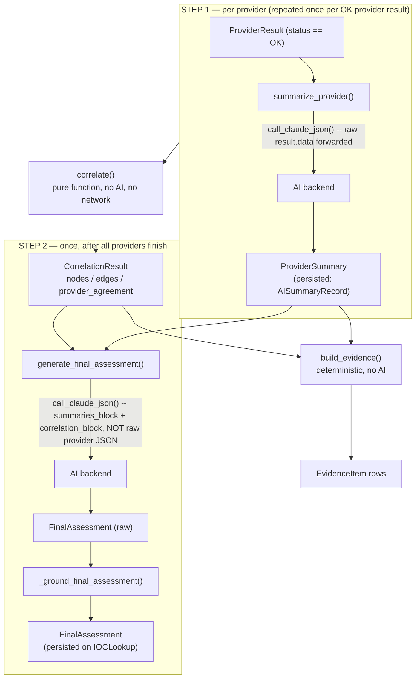
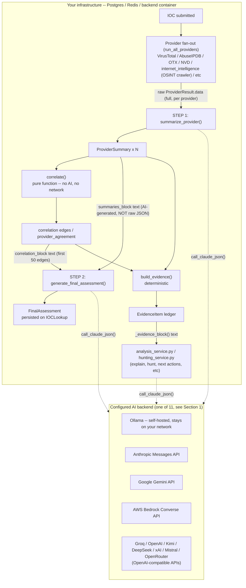

# AI Engine

How the platform turns raw provider data into an AI-written `FinalAssessment`,
which backend actually receives your data, and the specific mechanisms that
stop a local or cloud LLM from hallucinating facts into a security verdict.

Source: `backend/app/ai/` (`service.py`, `schemas.py`, `schema_utils.py`,
`ollama_client.py`, `anthropic_client.py`, `gemini_client.py`,
`bedrock_client.py`, `groq_client.py`, `openai_client.py`, `kimi_client.py`,
`deepseek_client.py`, `xai_client.py`, `mistral_client.py`,
`openrouter_client.py`, `analysis_service.py`, `hunting_service.py`), plus the
call sites in `backend/app/api/routes/lookup.py` and the deterministic
`backend/app/correlation/engine.py` and `backend/app/evidence/builder.py`
that produce everything the AI is grounded in. See also
[ARCHITECTURE.md](ARCHITECTURE.md) for the full request lifecycle,
[PROVIDERS.md](PROVIDERS.md) for the connector contract, and
[DATA_MODEL.md](DATA_MODEL.md) for the tables mentioned below.

## 1. Backend selection: `_get_ai_client()`

`backend/app/ai/service.py:211-283`. Which of **eleven** client modules
handles a given AI call is resolved by `_get_ai_client()`: primarily from the
runtime-configurable *active* backend (set from the AI Providers panel,
persisted via `app/core/runtime_config.py`, takes effect on the next call
with no restart), falling back to the `ai_backend` setting below only if no
runtime config has been seeded yet at all:

```python
# backend/app/core/config.py
ai_backend: str = "ollama"  # "ollama", "anthropic", "gemini", "bedrock", "groq", "openai", "kimi", "deepseek", "xai", "mistral", or "openrouter"
```

| `ai_backend` value | Client module | `is_configured` check | Notes |
|---|---|---|---|
| `"ollama"` (default, **and any unrecognized value on the legacy settings-fallback path**) | `app/ai/ollama_client.py` | `bool(base_url and model)` — true out of the box because both have non-empty defaults | Self-hosted, no API key, no cloud cost |
| `"anthropic"` | `app/ai/anthropic_client.py` | `bool(settings.anthropic_api_key)` | Direct Anthropic Messages API |
| `"gemini"` | `app/ai/gemini_client.py` | `bool(settings.gemini_api_key)` | Google Gemini API |
| `"bedrock"` | `app/ai/bedrock_client.py` | `bool(settings.bedrock_api_key or (aws_access_key_id and aws_secret_access_key))` | AWS Bedrock Converse API |
| `"groq"` | `app/ai/groq_client.py` | `bool(settings.groq_api_key)` | Groq (OpenAI-compatible) |
| `"openai"` | `app/ai/openai_client.py` | `bool(settings.openai_api_key)` | OpenAI chat completions |
| `"kimi"` | `app/ai/kimi_client.py` | `bool(settings.kimi_api_key)` | Moonshot AI Kimi (OpenAI-compatible) |
| `"deepseek"` | `app/ai/deepseek_client.py` | `bool(settings.deepseek_api_key)` | DeepSeek (OpenAI-compatible) |
| `"xai"` | `app/ai/xai_client.py` | `bool(settings.xai_api_key)` | xAI Grok (OpenAI-compatible) |
| `"mistral"` | `app/ai/mistral_client.py` | `bool(settings.mistral_api_key)` | Mistral (OpenAI-compatible tool-calling) |
| `"openrouter"` | `app/ai/openrouter_client.py` | `bool(settings.openrouter_api_key)` | OpenRouter (OpenAI-compatible, routes to many underlying models) |

If the resolved client's `is_configured` is `False`, `_get_ai_client()` raises
`RuntimeError(f"AI backend '{backend}' is not configured (missing API key/URL/model) -- configure it from the AI Providers panel or check .env")`.
Note the fallback behavior: on the legacy settings-only path (no runtime
config seeded), `_build_client()` only branches on the literal backend
strings above — **any other value (including typos) silently falls through
to Ollama**. An unrecognized `backend_override` (the AI-comparison
"re-analyze with a different backend" path), by contrast, is validated
against the same backend list `set_active_ai_backend()` uses and raises
`ValueError` instead of silently defaulting to Ollama.

### Model defaults per backend

| Backend | Model setting | Default | Max tokens setting | Default |
|---|---|---|---|---|
| Ollama | `ollama_model` | `llama3.2:3b` | `ollama_max_tokens` | `8192` |
| Anthropic | `anthropic_model_id` | `claude-sonnet-4-5-20250929` | `anthropic_max_tokens` | `8192` |
| Gemini | `gemini_model_id` | `gemini-2.0-flash` | `gemini_max_tokens` | `8192` |
| Bedrock | `bedrock_model_id` | `global.anthropic.claude-sonnet-4-5-20250929-v1:0` | `bedrock_max_tokens` | `4096` |
| Groq | `groq_model_id` | `llama-3.3-70b-versatile` | `groq_max_tokens` | `8192` |
| OpenAI | `openai_model_id` | `gpt-4o-mini` | `openai_max_tokens` | `8192` |
| Kimi | `kimi_model_id` | `kimi-k2.5` | `kimi_max_tokens` | `8192` |
| DeepSeek | `deepseek_model_id` | `deepseek-v4-flash` | `deepseek_max_tokens` | `8192` |
| xAI | `xai_model_id` | `grok-4.6` | `xai_max_tokens` | `8192` |
| Mistral | `mistral_model_id` | `mistral-small-2506` | `mistral_max_tokens` | `8192` |
| OpenRouter | `openrouter_model_id` | `openai/gpt-4o` | `openrouter_max_tokens` | `8192` |

Ollama also defaults `ollama_base_url` to `http://host.docker.internal:11434`
(reaches the host machine's Ollama server from inside the backend
container).

### Structured-output mechanism per backend

All eleven clients expose the same method, `call_claude_json(system_prompt,
user_prompt, json_schema, tool_name, max_tokens=...)`, but force valid JSON
out of the model in backend-specific ways:

| Backend | Mechanism | Schema `$ref`/`$defs` handling | Retry policy |
|---|---|---|---|
| Ollama | `POST {base_url}/api/chat` with `format: <json schema>` — grammar-constrained decoding (server 0.5+) | Flattened first via `inline_refs()` (llama.cpp does not resolve `$ref`) | **None** — single attempt; `httpx.ConnectError` → `RuntimeError("Could not reach Ollama at {base_url} -- is it running?")`; `TimeoutException` (default 300s, `ollama_timeout_seconds`/`OLLAMA_TIMEOUT_SECONDS`) → `RuntimeError("Ollama did not respond within {timeout}s...")` |
| Anthropic | `POST /v1/messages` with `tools=[{name, input_schema}]` + forced `tool_choice={"type":"tool","name":...}`; payload extracted from the matching `tool_use` block | Sent as-is — Anthropic's Messages API resolves standard JSON Schema `$ref`/`$defs` natively | **None** — single attempt |
| Gemini | `generateContent` with `responseMimeType: application/json`, `responseSchema: <flat schema>`, `temperature: 0.1` | Flattened via `inline_refs()` (Gemini's OpenAPI-3.0-style `responseSchema` doesn't resolve `$ref`) | **None** — single attempt |
| Bedrock | Converse API with `toolConfig` forcing `toolChoice={"tool":{"name":...}}`; payload from the `toolUse` block | Sent as-is (native tool-use) | **Yes, but only at the HTTP layer**: `boto3` client constructed with `BotoConfig(retries={"max_attempts":3,"mode":"adaptive"})` — this is botocore retrying transport-level failures, not the AI service retrying on validation failure |
| Groq / OpenAI / Kimi / DeepSeek / xAI / Mistral / OpenRouter | OpenAI-compatible `POST /chat/completions` with `tools=[{type:"function",...}]` + forced `tool_choice={"type":"function","function":{"name":...}}`; payload parsed from the matching `tool_calls` entry | Flattened via `inline_refs()`, same defensive flattening as Ollama/Gemini | **None** — single attempt each (an `httpx.TimeoutException`/`HTTPError` raises a backend-specific `RuntimeError`, no resampling) |

> **PARTIALLY IMPLEMENTED:** `app/ai/schemas.py`'s module docstring claims
> "the AI service retries once with the validation error appended to the
> prompt" for malformed output. `generate_final_assessment()` (§2) now does
> retry once, but only on a Pydantic `ValidationError` from its own call
> (not on network/HTTP failures, which break out of the loop immediately) —
> and the retry resends the identical prompt rather than literally appending
> the validation error text to it. `summarize_provider()`, every function in
> `analysis_service.py`, and both `hunting_service.py` functions still go
> straight from any exception to a static fallback object on the **first**
> failure, with no retry at all. Bedrock's automatic retry (above) is a
> botocore transport retry, unrelated to schema validation.

### The Ollama grammar-compiler gotcha (confirmed, live bug)

`backend/app/ai/schemas.py:72-82`, on `MitreMapping.technique_id`:

> "No `pattern=` here on purpose: Ollama's grammar compiler (llama.cpp
> json-schema-to-grammar, observed on server 0.32.6) fails to compile a
> regex `pattern` constraint into decoding grammar and returns HTTP 400
> 'failed to parse grammar', which breaks every `generate_final_assessment()`
> call."

This is not scoped to just that one field — **Ollama compiles the entire
JSON Schema into a single decoding grammar**, so one unsupported constraint
anywhere in `FinalAssessment`'s schema fails the whole compile with HTTP 400
and takes down every call using that schema, not just the offending field.
The fix in place is to never use Pydantic's `pattern=` on any field whose
schema is sent to Ollama; a malformed `technique_id` is tolerated because
`_ground_final_assessment` (below) only checks it for *membership* against
real correlation-graph technique IDs, not format, so loose typing costs
nothing downstream. Field `description=` text is kept anyway because it
still guides cloud models (Claude/Gemini/Bedrock), which don't compile
schemas into a grammar.

**Practical rule for anyone editing `app/ai/schemas.py`:** don't add
`pattern=` (or any other constraint `llama.cpp`'s grammar compiler doesn't
support) to any field — it will silently break the whole Ollama backend, not
just fail one field, and the failure mode is an opaque HTTP 400 from Ollama's
side, not a Pydantic error.

## 2. The two-call pipeline

`app/ai/service.py` has exactly two AI entry points, called from the SSE
lookup stream (`backend/app/api/routes/lookup.py`) in this order:



### STEP 1 — `summarize_provider(ioc_value, ioc_type, result)`

- **Skips the AI backend entirely** if `result.status != ProviderStatus.OK`
  or `result.data` is empty — returns a degraded `ProviderSummary`
  (`what_it_knows="No data returned by this provider for this IOC."`,
  `reputation="unknown"`, `detection_status="no data"`, `threat_level="none"`,
  `confidence="low"`, `caveats=result.error_message`) with **zero** network
  calls.
- Otherwise builds a prompt from `_provider_result_to_prompt(result)` —
  provider name, id, category, status, `source_url`, and the **full raw
  `result.data` dict** for that one provider — and calls
  `call_claude_json(system_prompt=_PROVIDER_SUMMARY_SYSTEM_PROMPT, ...,
  json_schema=ProviderSummary.model_json_schema(), tool_name="emit_provider_summary")`.
- Sets `payload["provider_id"] = result.provider_id` before validating (the
  model never has to get the ID right).
- On **any** exception: logs a warning, returns a degraded `ProviderSummary`
  with `caveats=repr(exc)`.

### STEP 2 — `generate_final_assessment(ioc_value, ioc_type, provider_summaries, correlation)`

- Runs **once**, after every provider has reported and `correlate()` has run.
- Prompt is built primarily from two blocks — **not** raw provider JSON,
  which keeps prompt size bounded as the number of providers grows:
  - `summaries_block`: per-provider `reputation` / `threat_level` /
    `confidence` / `what_it_knows` / findings / relationships, from the
    already-AI-generated `ProviderSummary` objects.
  - `correlation_block`: the `provider_agreement` dict, `deduplicated_facts`,
    and up to the **first 50** `correlation.edges`, each formatted as
    `"source --relationship--> target [provenance]"`.
  - Two further blocks are appended when applicable: an
    `unavailable_block` listing providers that applied to this IOC type but
    returned nothing this run (so the model doesn't treat "unavailable" as
    "found nothing"), and a `scoring_block` giving the deterministic
    `overall_risk_score`/`confidence_score`/`malicious_probability`/`severity`
    already computed by `app/scoring/engine.py` as GIVEN facts — the model is
    told to echo these verbatim into `risk` (and `generate_final_assessment`
    overwrites them there regardless, before persisting).
- Calls `call_claude_json(system_prompt=_FINAL_ASSESSMENT_SYSTEM_PROMPT, ...,
  json_schema=FinalAssessment.model_json_schema(),
  tool_name="emit_final_assessment", max_tokens=8192)` — `max_tokens` is
  hardcoded to `8192` for this call regardless of the backend's configured
  default.
- Sets `payload["ioc_value"]`/`payload["ioc_type"]` before validating, then
  calls `_ground_final_assessment(assessment, correlation, known_provider_ids)`
  (§4) before returning.
- **Retries once** if `FinalAssessment.model_validate()` raises a Pydantic
  `ValidationError` (e.g. the verdict/risk consistency validator in §3
  rejecting a self-contradictory response) — same prompt, a fresh sample
  from the model. Any other exception (network/HTTP failure, etc.) breaks
  out of the loop immediately with **no** retry. Only after both attempts
  fail (or a non-`ValidationError` exception on the first): logs a warning,
  returns a fallback `FinalAssessment` with every summary/text field stating
  generation failed,
  `risk=RiskAssessment(overall_risk_score=0, confidence_score=0,
  severity="none", reputation="unknown", malicious_probability=0,
  analyst_confidence="low")`, `final_verdict="unknown"`, and
  `verdict_rationale` citing the exception's `repr()`.

Both system prompts (`_PROVIDER_SUMMARY_SYSTEM_PROMPT`,
`_FINAL_ASSESSMENT_SYSTEM_PROMPT`, `service.py:286-373`) explicitly instruct
the model to **never fabricate** and to state that
`overall_risk_score`/`confidence_score`/`malicious_probability` are always on
a **0-100 scale**, never a 0-1 fraction — with an instruction to multiply by
100 if the model was about to think in probability terms.

## 3. `FinalAssessment` — full field reference

`backend/app/ai/schemas.py:155-225`. This is the only object persisted onto
`IOCLookup` and rendered as the platform's final verdict.

| Field | Type | Notes |
|---|---|---|
| `ioc_value` | `str` | Overwritten by `service.py` before validation, not trusted from the model |
| `ioc_type` | `str` | Same |
| `executive_summary` | `str`, min length 1 | |
| `technical_summary` | `str`, min length 1 | |
| `threat_assessment` | `str`, min length 1 | |
| `supporting_evidence` | `list[str]` | |
| `agreeing_providers` | `list[str]` | Filtered by `_ground_final_assessment` |
| `disagreeing_providers` | `list[str]` | Filtered by `_ground_final_assessment` |
| `relationships_summary` | `str`, min length 1 | |
| `mitre_mappings` | `list[MitreMapping]` | `grounded` field relabeled by `_ground_final_assessment` |
| `risk` | `RiskAssessment` | See below |
| `detection_rules` | `list[DetectionRule]` | `format` is one of 9 `Literal` values: `sigma, yara, splunk_spl, sentinel_kql, elastic, qradar_aql, suricata, snort, zeek` |
| `recommended_actions` | `list[str]` | |
| `investigation_priorities` | `list[str]` | |
| `incident_response_recommendations` | `list[str]` | |
| `final_verdict` | `Verdict` enum | See values below |
| `verdict_rationale` | `str` | |
| `ai_backend` | `Optional[str]` | Overwritten by `service.py` after validation with the real backend actually invoked, never trusted from the model |
| `ai_model` | `Optional[str]` | Same, for the model id actually invoked |
| `ai_outcome` | `Optional[Literal["success", "failed", "skipped_no_evidence"]]` | Set by `service.py` at each of `generate_final_assessment`'s three return sites |

**`RiskAssessment`** (`schemas.py:111-152`):

| Field | Type | Range/enum | Notes |
|---|---|---|---|
| `overall_risk_score` | `float` | 0-100 | "NOT a 0-1 probability"; overwritten with `app/scoring/engine.py`'s deterministic score before persisting |
| `confidence_score` | `float` | 0-100 | "NOT a 0-1 probability"; same overwrite |
| `severity` | `Literal` | `none, low, medium, high, critical` | Same overwrite |
| `reputation` | `Literal` | `malicious, suspicious, clean, unknown, no data` | |
| `malicious_probability` | `float` | 0-100 | e.g. `50`, not `0.5`; same overwrite |
| `analyst_confidence` | `Literal` | `low, medium, high` | |
| `scoring_engine_version` | `Optional[str]` | | Set by the platform from `ScoringResult` after generation, not filled in by the model |
| `scoring_breakdown` | `dict[str, float]` | | Same |

**`MitreMapping`** (`schemas.py:71-103`): `technique_id: str` (no regex
constraint — see the Ollama gotcha above), `technique_name: str`, `tactic`
(`Literal` of the 14 ATT&CK tactic slugs), `kill_chain_stage:
Optional[str]`, `rationale: str`, `grounded: bool = True` (overwritten by
`_ground_final_assessment`, not trusted from the model).

**`Verdict` enum** (`backend/app/models/lookup.py:22-34`) — the exact set of
values `final_verdict` can take: `highly_malicious`, `malicious`,
`suspicious`, `unknown`, `likely_benign`, `benign`, `scanner`,
`tor_exit_node`, `vpn`, `cdn`, `cloud_infrastructure`,
`dormant_infrastructure`.

### Verdict/risk consistency enforcement

`FinalAssessment._verdict_must_agree_with_risk` (`model_validator`,
`schemas.py:227-248`) raises `ValueError` if:

- `final_verdict` is `malicious`/`highly_malicious` **and**
  `risk.malicious_probability < 30`, or
- `final_verdict` is `benign`/`likely_benign` **and**
  `risk.malicious_probability > 50`.

Two further `model_validator`s on `FinalAssessment` enforce related
consistency checks the same way (raise `ValueError` on violation):
`_substantive_threat_assessment_must_cite_supporting_evidence`
(`schemas.py:250-281`) rejects a `threat_assessment` over 80 characters that
cites specific findings while `supporting_evidence` is empty; and
`_threat_assessment_bare_verdict_must_agree_with_final_verdict`
(`schemas.py:283-321`) rejects a `threat_assessment` that is a bare
`Verdict` value (e.g. just the word `"malicious"`) contradicting
`final_verdict`'s malicious/benign category.

This validator raising is the actual enforcement mechanism — the exception
propagates into `generate_final_assessment`'s retry-once-on-`ValidationError`
logic (§2), and only becomes the degraded fallback assessment if the retry
also fails. Comment in the code notes this targets llama3.2:3b's observed
behavior of emitting `final_verdict="malicious"` alongside
`malicious_probability=0`.

### The 0-1 vs 0-100 rescue

`RiskAssessment._reject_0_to_1_scale` (`field_validator`, applied to
`overall_risk_score`, `confidence_score`, `malicious_probability`): if
`0 < value < 1`, **rescales** it (`value * 100`) instead of rejecting it.
Comment cites the observed bug directly: `llama3.2:3b` returning `0.5` for
"50% confidence" despite the field description.

## 4. Grounding / anti-hallucination mechanisms

Four independent, code-level (not prompt-level) grounding mechanisms exist.
None of them ask the model to double-check itself — they all recompute
membership against real, already-persisted data and discard or relabel
whatever the model claimed that doesn't match.

### `_ground_final_assessment(assessment, correlation, known_provider_ids)` — `service.py:376-429`

Runs after every successful `generate_final_assessment` call, before the
`FinalAssessment` is returned:

1. Builds `real_provider_ids` = the union of provider IDs parsed out of
   `correlation.edges[].provenance` (comma-split strings), the provider
   lists in `correlation.provider_agreement.values()`, **and**
   `known_provider_ids` — every `provider_id` that actually returned a
   per-provider summary this run, passed in by `generate_final_assessment`.
   That third source matters for providers like `internet_intelligence`
   (the OSINT crawler), which return real data but produce no relationship
   edge or provider-agreement fact the correlation engine recognizes — without
   it, a correct citation of such a provider would be indistinguishable from
   a hallucinated one and get stripped below.
2. Filters `assessment.agreeing_providers` and `assessment.disagreeing_providers`
   to only IDs present in `real_provider_ids`. **Caveat:** if
   `real_provider_ids` is empty, the model's claimed list is passed through
   **unfiltered** (a ternary fallback in `_filter_providers`, not a stricter
   check).
3. Builds `grounded_technique_ids` from `correlation.edges` where
   `relationship == "uses_technique"`, taking
   `edge.target.split(":", 1)[1].upper()`.
4. For every entry in `assessment.mitre_mappings`, **overwrites**
   `mapping.grounded = (mapping.technique_id.upper() in grounded_technique_ids)`
   — regardless of what the model set. It does **not** remove ungrounded
   mappings, only relabels the boolean.

It does **not** touch `risk`, `executive_summary`, `supporting_evidence`,
`detection_rules`, or `final_verdict` — grounding here is scoped strictly to
provider-agreement lists and MITRE mapping labels.

### `_strip_invalid_evidence_ids` — `analysis_service.py:71-87`

Used by the 10 analyst-facing "explain the evidence" functions (§5), which
are grounded against a real `EvidenceItem` ledger rather than correlation
edges:

- Recursively walks a validated Pydantic model. Any field **literally named**
  `evidence_ids` (the only name checked — `_EVIDENCE_ID_FIELDS = ("evidence_ids",)`)
  that is a list gets filtered in place (`setattr`, models aren't frozen) to
  only IDs present in `real_ids`.
- `real_ids` is built from the actual `EvidenceItem` ledger passed into the
  call (`{str(item.id) for item in evidence}`) — **never** from the AI's own
  output.
- Recurses into nested `BaseModel` fields and into `BaseModel` items inside
  any list field, so a nested `evidence_ids` field is also caught.

Before that stripping step, `_backfill_evidence_ids_from_prose`
(`analysis_service.py:90-128`) runs first: if a model narrates a citation in
a prose field (e.g. `most_reliable_evidence` containing a literal
`"[id=<uuid>] ..."` copied from the evidence ledger) without also listing
that id in the adjacent structured `evidence_ids` array, this scans every
other string field on the object for any real id appearing as a substring
and appends it — only ever drawing from `real_ids`, so it can recover a
citation the model already made correctly in prose but never invents one.

`_call_and_ground()` (`analysis_service.py:131-155`) wraps every one of these
10 functions: call the model → validate into the function's schema → run
`_backfill_evidence_ids_from_prose` → run `_strip_invalid_evidence_ids` → on
**any** exception, return the caller-specific `fallback` model instance for
that function (e.g. `WhyMaliciousExplanation(verdict_restated=..., reasons=[], caveat=...)`).

### `hunting_service.py` grounding — different mechanism, no shared helper

`generate_hunting_package()` (`hunting_service.py:44-80`) does **not**
import or use `_strip_invalid_evidence_ids`. Instead it filters
`package.expansion_targets` to only entries whose `related_ioc_value.lower()`
is present in `real_values = {node.value.lower() for node in correlation.nodes}`
— i.e. grounded against real correlation-graph node values, not an evidence
ledger. `HuntingPackage.expansion_targets`'s schema description states these
must be "drawn ONLY from the supplied correlation edges — never invented."
On failure, returns an empty `HuntingPackage()`.

`generate_detection_rule()` (`hunting_service.py:83-113`) has **no grounding
step at all** — it operates on a single seed IOC with no expansion targets
to invent. On failure, returns a fallback `DetectionRuleDraft(title=f"Detection rule unavailable for {ioc_value}", rule="# Generation failed -- see platform logs.", severity="none")`.

`analysis_service.compare_iocs()` (lines 450-479) uses yet another bespoke
check — `most_dangerous_ioc_value` is restricted to the set of IOC value
strings actually supplied for comparison — since it operates on comparison
row dicts, not an `EvidenceItem` ledger, so it doesn't go through
`_call_and_ground`/`_strip_invalid_evidence_ids` either.

### Schema design as a grounding tool

- **`Literal`/enum instead of free-text `description=`** for every field the
  frontend keys off exact string values (`final_verdict`, `reputation`,
  `threat_level`, `confidence`, `severity`, detection rule `format`). Two
  independent reasons this matters (per `schemas.py`'s module docstring):
  (1) backends that compile the schema into a decoding grammar (Ollama) only
  enforce real `enum` constraints, not description hints; (2) the frontend's
  badge-color logic is a hardcoded switch on exact lowercase values — an
  off-spec string like `"Critical"` doesn't error, it just silently falls
  through to a default/muted style.
- **`inline_refs()`** (`app/ai/schema_utils.py:9-25`) recursively replaces
  `{"$ref": "#/$defs/X"}` with the resolved definition and strips `$defs`
  keys. Used by `ollama_client.py`, `gemini_client.py`, and all seven
  OpenAI-compatible clients (`groq_client.py`, `openai_client.py`,
  `kimi_client.py`, `deepseek_client.py`, `xai_client.py`,
  `mistral_client.py`, `openrouter_client.py`) — only Anthropic and Bedrock
  resolve standard `$ref`/`$defs` natively via their tool-use APIs and skip
  it.

## 5. Downstream AI-assisted analyst features

Beyond the two-call core pipeline, `analysis_service.py` exposes 10 grounded
functions (all via `_get_ai_client()` + `_call_and_ground()` +
`_strip_invalid_evidence_ids`, all consuming the real `EvidenceItem` ledger
via `_evidence_block()`): `explain_why_malicious`, `explain_what_is_this`,
`explain_disagreement`, `assess_false_positive`, `challenge_verdict`,
`suggest_next_actions`, `identify_intelligence_gaps`, `explain_score`,
`answer_copilot_question`, and `compare_iocs` (bespoke grounding, see §4).

`hunting_service.py` exposes 2 functions: `generate_hunting_package`
(hunt queries + correlation-grounded expansion targets, `max_tokens=8192`)
and `generate_detection_rule` (single-IOC detection rule draft,
`max_tokens=4096`, ungrounded).

These are all invoked against **already-completed** lookups, rebuilding a
`CorrelationResult` from persisted `CorrelationEdgeRecord` rows via
`app/evidence/loaders.py`'s `correlation_from_records()` rather than
re-running `correlate()` — used by the `analysis` and `hunting` route
modules (`backend/app/api/routes/analysis.py`, `hunting.py`).

`app/evidence/pivot.py`'s `rank_pivots()` (behind
`GET /api/v1/lookup/{lookup_id}/pivots`, permission `lookup:read`) is worth
noting by contrast: it is **deliberately not AI-generated** — a pure sort
over real, persisted correlation edges touching the seed IOC, so a pivot
suggestion can never be hallucinated. It ranks by corroborating-provider
count then confidence, clamps the result count to `[0, 50]` (a
caller-requested `limit=0` deliberately returns zero pivots rather than being
bumped up to 1).

## 6. What data actually leaves the platform (privacy / data-flow)



Concretely, per call:

- **STEP 1 (`summarize_provider`)** sends the **raw `result.data` dict** for
  one provider — every normalized field it populated (see
  [PROVIDERS.md](PROVIDERS.md)) plus any provider-specific extra fields —
  along with the IOC value/type, provider name/id/category/status, and
  `source_url`. `_prune_for_prompt()` caps any individual field's rendered
  length before it reaches the prompt (2000 chars for a `str` field, 800 for
  a `list`/`dict` field, e.g. NVD's oversized `configurations`/`references`
  blobs), so this is bounded per field rather than a truly unbounded dump.
  For the `internet_intelligence` provider specifically, this includes
  **verbatim third-party text** scraped from GitHub, Reddit, RSS feeds, and
  Pastebin dumps (titles, snippets, URLs — see §7) that mention the IOC.
- **STEP 2 (`generate_final_assessment`)** sends only the **AI-generated
  provider summaries** (reputation/threat_level/confidence/findings text)
  and a **correlation edge digest** (up to 50 edges, plus
  `provider_agreement`/`deduplicated_facts`) — the raw per-provider JSON is
  *not* resent, bounding prompt size.
- **Downstream analyst features** (`analysis_service.py`, `hunting_service.py`)
  send formatted `EvidenceItem` claims/interpretations and, for hunting,
  correlation node values — derived data, not raw provider payloads.
- **If `ai_backend` is `"ollama"` (the default):** none of the above leaves
  the host machine — Ollama is reached over `OLLAMA_BASE_URL`, typically
  `http://host.docker.internal:11434`.
- **If `ai_backend` is any of the other ten backends** (`"anthropic"`,
  `"gemini"`, `"bedrock"`, `"groq"`, `"openai"`, `"kimi"`, `"deepseek"`,
  `"xai"`, `"mistral"`, `"openrouter"`): the IOC value, provider data
  (including any scraped OSINT text), and AI-generated summaries above are
  transmitted to that vendor's API over the public internet, subject to
  that vendor's own data-handling terms. See
  [SECURITY.md](SECURITY.md) for the platform's own security posture; the
  vendor's data handling for API traffic is outside this platform's control.

## 7. The OSINT crawler as an AI data source

`backend/app/crawler/collector.py` implements the `internet_intelligence`
provider (`ProviderCategory.OSINT`, no key required, always
`configured=True`) — its output flows through the exact same STEP 1/STEP 2
AI pipeline as every other provider, which is why it matters for the privacy
picture in §6.

- **Supported IOC types:** domain, IPv4, malware family, threat actor,
  campaign, CVE, file name (`_SUPPORTED_TYPES`) — raw network atoms like
  JA3/mutex are excluded as free-text search noise.
- **Four source modules**, fanned out concurrently via `asyncio.gather`
  (exceptions captured, not raised): `github.py`, `reddit.py`,
  `rss_news.py`, `pastebin_search.py`.
- **Rate limiting is inconsistent by design**, not a bug in one module —
  only `github.py` and `reddit.py` use an in-process
  `AsyncMinIntervalLimiter` (process-local, **not** Redis-backed, unlike
  `app/core/cache.py`'s rate limiter) and raise `SourceRateLimitedError` on
  HTTP 403/429 (GitHub) or 429 (Reddit). `rss_news.py` (8 fixed security-blog
  feeds) and `pastebin_search.py` (`psbdmp.ws`, unofficial/unauthenticated)
  have **no limiter at all** and never raise `SourceRateLimitedError` — any
  failure there is swallowed and returns an empty list.
- **Result status:** `collector.py` reports `RATE_LIMITED` only if merged
  findings are empty *and* at least one source was rate-limited (so it can
  in practice only ever be triggered by GitHub or Reddit); otherwise `OK` if
  any findings were found, else `NO_DATA`.
- **Findings are capped**: `crawler_max_results_per_source` (default `5`) ×
  4 sources = 20 total findings max per IOC, deduped by URL.
- **Scheduled refresh:** Celery beat (`app/workers/celery_app.py`) runs
  `crawl-osint-sources-hourly` on a plain **3600-second interval** (not a
  cron expression — no `crontab(...)` usage exists anywhere in
  `celery_app.py`), which re-crawls up to 25 recently-looked-up IOCs
  (`_MAX_IOCS_PER_RUN`, from the last 24 hours, `_LOOKBACK_HOURS`) and writes
  results into the same Redis cache the interactive lookup path reads.

> **Config gotcha:** `GITHUB_TOKEN` (raises GitHub's unauthenticated 10
> req/min ceiling to 30 req/min) is read via `os.getenv("GITHUB_TOKEN")` in
> `github.py`, but is **intentionally not a field in `Settings`**
> (`app/core/config.py`) — it only works if set directly in the process
> environment, not via the platform's normal `.env` mechanism used for every
> other provider key.

## 8. Configuration reference

| Env var | Default | Used by |
|---|---|---|
| `AI_BACKEND` | `ollama` | `_get_ai_client()` — `ollama`, `anthropic`, `gemini`, `bedrock`, `groq`, `openai`, `kimi`, `deepseek`, `xai`, `mistral`, or `openrouter` |
| `OLLAMA_BASE_URL` | `http://host.docker.internal:11434` | `ollama_client.py` |
| `OLLAMA_MODEL` | `llama3.2:3b` | `ollama_client.py` |
| `OLLAMA_MAX_TOKENS` | `8192` | `ollama_client.py` |
| `OLLAMA_TIMEOUT_SECONDS` | `300` | `ollama_client.py` — CPU-only inference + possible cold model reload |
| `ANTHROPIC_API_KEY` | *(unset)* | `anthropic_client.py` — `<your-key-here>` |
| `ANTHROPIC_MODEL_ID` | `claude-sonnet-4-5-20250929` | `anthropic_client.py` |
| `ANTHROPIC_MAX_TOKENS` | `8192` | `anthropic_client.py` |
| `GEMINI_API_KEY` | *(unset)* | `gemini_client.py` — `<your-key-here>` |
| `GEMINI_MODEL_ID` | `gemini-2.0-flash` | `gemini_client.py` |
| `GEMINI_MAX_TOKENS` | `8192` | `gemini_client.py` |
| `BEDROCK_API_KEY` | *(unset)* | `bedrock_client.py` — bearer token, preferred over IAM keys; `<configure securely>` |
| `AWS_ACCESS_KEY_ID` / `AWS_SECRET_ACCESS_KEY` | *(unset)* | `bedrock_client.py` — alternative to `BEDROCK_API_KEY`; `<configure securely>` |
| `AWS_REGION` | `us-east-1` | `bedrock_client.py` |
| `BEDROCK_MODEL_ID` | `global.anthropic.claude-sonnet-4-5-20250929-v1:0` | `bedrock_client.py` |
| `BEDROCK_MAX_TOKENS` | `4096` | `bedrock_client.py` |
| `GROQ_API_KEY` | *(unset)* | `groq_client.py` |
| `GROQ_MODEL_ID` | `llama-3.3-70b-versatile` | `groq_client.py` |
| `GROQ_MAX_TOKENS` | `8192` | `groq_client.py` |
| `OPENAI_API_KEY` | *(unset)* | `openai_client.py` |
| `OPENAI_MODEL_ID` | `gpt-4o-mini` | `openai_client.py` |
| `OPENAI_MAX_TOKENS` | `8192` | `openai_client.py` |
| `KIMI_API_KEY` | *(unset)* | `kimi_client.py` |
| `KIMI_MODEL_ID` | `kimi-k2.5` | `kimi_client.py` |
| `KIMI_MAX_TOKENS` | `8192` | `kimi_client.py` |
| `DEEPSEEK_API_KEY` | *(unset)* | `deepseek_client.py` |
| `DEEPSEEK_MODEL_ID` | `deepseek-v4-flash` | `deepseek_client.py` |
| `DEEPSEEK_MAX_TOKENS` | `8192` | `deepseek_client.py` |
| `XAI_API_KEY` | *(unset)* | `xai_client.py` |
| `XAI_MODEL_ID` | `grok-4.6` | `xai_client.py` |
| `XAI_MAX_TOKENS` | `8192` | `xai_client.py` |
| `MISTRAL_API_KEY` | *(unset)* | `mistral_client.py` |
| `MISTRAL_MODEL_ID` | `mistral-small-2506` | `mistral_client.py` |
| `MISTRAL_MAX_TOKENS` | `8192` | `mistral_client.py` |
| `OPENROUTER_API_KEY` | *(unset)* | `openrouter_client.py` |
| `OPENROUTER_MODEL_ID` | `openai/gpt-4o` | `openrouter_client.py` |
| `OPENROUTER_MAX_TOKENS` | `8192` | `openrouter_client.py` |
| `GITHUB_TOKEN` | *(unset, process env only — not in `Settings`)* | `crawler/sources/github.py`, raises GitHub API rate limit from 10 to 30 req/min |
| `CRAWLER_USER_AGENT` | `HorizonGrid/1.0` | all 4 crawler source modules |
| `CRAWLER_REQUEST_TIMEOUT_SECONDS` | `15` | crawler HTTP calls |
| `CRAWLER_MAX_RESULTS_PER_SOURCE` | `5` | `collector.py` |

Full settings list: `backend/app/core/config.py`. See
[CONFIGURATION.md](CONFIGURATION.md) for the platform-wide env var reference
and [DEPLOYMENT.md](DEPLOYMENT.md) for `docker-compose.yml` wiring.

## 9. Known gaps (explicitly NOT IMPLEMENTED)

- **Retry-with-validation-error-appended**, as claimed in `schemas.py`'s
  module docstring, does not exist as described anywhere: `generate_final_assessment()`
  does retry once, but only on a `ValidationError`, and resends the identical
  prompt rather than appending the validation error text to it.
  `summarize_provider()` and every function in `analysis_service.py`/
  `hunting_service.py` still fall back to a static object on the first
  failure with no retry at all. (§1)
- **No retry/backoff inside any of the eleven clients' `call_claude_json()`**
  — each makes exactly one HTTP attempt. Only Bedrock has any retry, and
  it's `botocore`'s transport-level retry, not application logic. (§1)
- **`rss_news.py` and `pastebin_search.py` have no rate limiter** and never
  raise `SourceRateLimitedError`, despite `collector.py`'s status logic being
  written generically for all 4 sources. (§7)
- **Celery beat's schedule is a plain interval (3600.0 seconds), not a cron
  expression** — there is no `crontab(...)` usage in `celery_app.py`. (§7)
- **`GITHUB_TOKEN` is not part of `Settings`** — cannot be configured via the
  platform's standard `.env` mechanism like every other API key; it must be
  present in the actual process environment. (§7)
- **`GraphNode.labels`** (`app/correlation/engine.py`) is defined but never
  populated anywhere in `correlate()` — always an empty list in practice.
  Not an AI-service field, but it is part of the correlation output the AI
  and evidence builder consume.
- **Neo4j mirroring of correlation edges**, described in code comments
  (`engine.py`'s module docstring, `CorrelationEdgeRecord`'s docstring) as
  intended, has **no actual implementation** — no Neo4j driver import,
  session, or write/query call exists anywhere in the codebase read for this
  document. `CorrelationEdgeRecord` rows in Postgres are the sole persisted
  source that `_ground_final_assessment`, `correlation_from_records()`, and
  every downstream analyst feature actually read.

## Related documentation

- [ARCHITECTURE.md](ARCHITECTURE.md) — full SSE request lifecycle, plugin
  contract, datastore roles.
- [PROVIDERS.md](PROVIDERS.md) — connector contract and the normalized
  `ProviderResult.data` fields the AI and correlation engine depend on.
- [DATA_MODEL.md](DATA_MODEL.md) — `AISummaryRecord`, `CorrelationEdgeRecord`,
  `EvidenceItem`, `IOCLookup` table shapes.
- [CONFIGURATION.md](CONFIGURATION.md) — full environment variable reference.
- [SECURITY.md](SECURITY.md) — platform security posture; vendor-side data
  handling for cloud AI backends is outside this platform's control.
