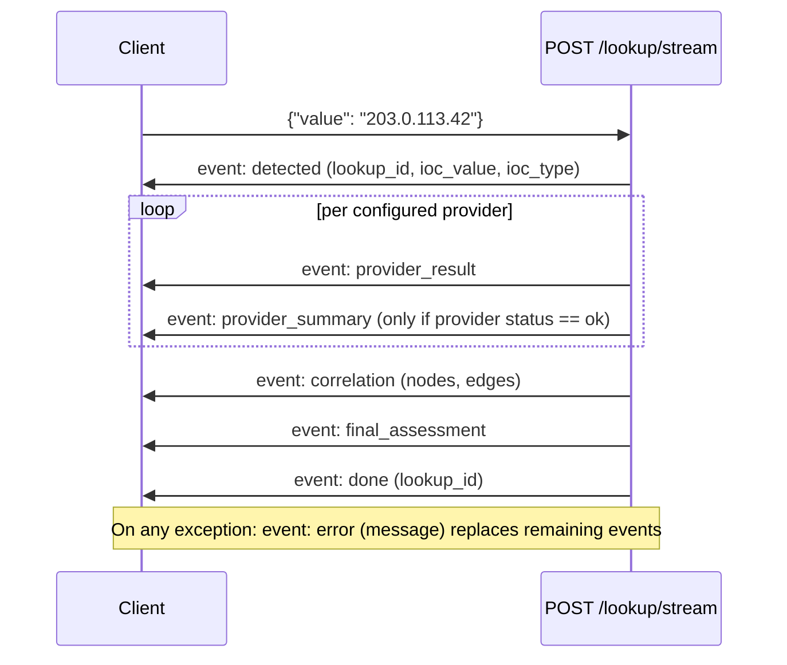

# API Documentation

Complete REST/SSE reference for the HORIZON GRID backend (FastAPI, `backend/app/`).

Source of truth: `backend/app/api/routes/*.py`, `backend/app/schemas/*.py`, `backend/app/ai/analysis_schemas.py`,
`backend/app/auth/rbac.py`, `backend/app/models/*.py`.

See also: [ARCHITECTURE.md](ARCHITECTURE.md) for how these routes fit into the overall system,
[DATA_MODEL.md](DATA_MODEL.md) for the underlying tables, and [PROVIDERS.md](PROVIDERS.md) for the
provider connectors fanned out to by the lookup endpoint.

---

## 1. Base URL, versioning, docs

| Item | Value |
|---|---|
| API prefix | `/api/v1` (`backend/app/core/config.py` — `api_v1_prefix`, all routers mounted with this prefix in `backend/app/main.py:37-44`) |
| OpenAPI JSON | `/api/v1/openapi.json` |
| Interactive docs (Swagger UI) | `/docs` |
| Health check (unversioned, no auth) | `GET /health` → `{"status": "ok", "service": "<app_name>"}` |
| Metrics (Prometheus, unversioned) | `GET /metrics` |

All request/response bodies below use the app's default base URL of `http://localhost:8000` in
examples; substitute your deployment's actual host.

---

## 2. Authentication

All endpoints except `/auth/register`, `/auth/login`, `/auth/refresh`, `/health`, and `/metrics`
require an `Authorization: Bearer <access_token>` header. Tokens are JWTs (HS256, `python-jose`),
signed with `JWT_SECRET_KEY`, containing `sub` (email), `role`, `token_version`, `type`
(`access`|`refresh`), `iat`, `exp`. Access tokens expire after `ACCESS_TOKEN_EXPIRE_MINUTES` (default
30); refresh tokens after `REFRESH_TOKEN_EXPIRE_DAYS` (default 7).

`token_version` (`backend/app/models/user.py`) is an integer bumped by
`POST /api/v1/admin/users/{id}/reset-password`. `get_current_user()` and `POST /auth/refresh` both
compare the token's `token_version` against the user's current column value and reject the request
(`401`) on a mismatch — this is what makes an administrator-initiated password reset immediately
invalidate every access/refresh token already issued to that user, rather than leaving them valid
until they naturally expire. A token minted before this feature existed has no `token_version` claim
at all; it's treated as `0`, matching every user's initial column value, so this shipped with zero
forced logouts.

`HTTPBearer(auto_error=False)` is used instead of `OAuth2PasswordBearer` because `/auth/login`
accepts a JSON body, not OAuth2 form-encoded fields (`backend/app/auth/rbac.py:14-18`).

### Role/permission model

Three roles (`backend/app/models/user.py:11-14`): `admin`, `analyst`, `viewer`.

| Permission | admin | analyst | viewer |
|---|---|---|---|
| `lookup:create` | Yes | Yes | No |
| `lookup:read` | Yes | Yes | Yes |
| `lookup:export` | Yes | Yes | No |
| `evidence:read` | Yes | Yes | Yes |
| `analysis:generate` | Yes | Yes | No |
| `hunting:generate` | Yes | Yes | No |
| `copilot:query` | Yes | Yes | No |
| `basket:manage` | Yes | Yes | No |
| `case:create` | Yes | Yes | No |
| `case:read` | Yes | Yes | Yes |
| `case:write` | Yes | Yes | No |
| `case:close` | Yes | Yes | No |
| `provider:manage` | Yes | No | No |
| `user:manage` | Yes | No | No |
| `audit:read` | Yes | No | No |

`provider:manage` gates `backend/app/api/routes/runtime.py` (the runtime provider/AI configuration
API). `user:manage` gates every route in `backend/app/api/routes/admin.py` (§3.5) — full user
CRUD, enable/disable, and password reset, all admin-only. `audit:read` gates
`GET /api/v1/runtime/audit-log`, which now also carries every `user.*`/`auth.*` event admin.py
writes (§3.5), not just provider/AI configuration changes — one shared, append-only audit table
(`config_audit_log`), never a credential or password value.

The first user ever registered on a fresh database automatically becomes `admin` (bootstrap logic,
`backend/app/api/routes/auth.py:26-35`). Every registration attempt after that is rejected outright
with `403 Forbidden` — it no longer falls back to creating an `analyst` account. Once at least one
administrator exists, they can create additional accounts of any role directly via
`POST /api/v1/admin/users` (§3.5), and can promote/demote/enable/disable any existing user via
`PATCH`/`POST /api/v1/admin/users/{id}` — both of these require `user:manage` (admin-only), unlike
the public bootstrap-only self-registration route.

### Error responses common to every authenticated route

| Status | Trigger |
|---|---|
| `401 Could not validate credentials` | Missing `Authorization` header, undecodable/expired JWT, wrong token `type` (e.g. a refresh token used where an access token is required), or the user no longer exists / `is_active=False`. Response includes header `WWW-Authenticate: Bearer`. |
| `403 Role '<role>' lacks permission '<permission>'` | Token is valid but the user's role does not have the specific permission the route requires. |

---

## 3. Auth routes (`/api/v1/auth`)

### POST /api/v1/auth/register

Public. No permission required. **Bootstrap-only**: succeeds only while the `users` table is
empty; every account created this way is `role: admin`.

Request body:
```json
{ "email": "analyst@example.com", "password": "<your-password>", "full_name": "Jane Analyst" }
```
`full_name` is optional (defaults to `""`). The backend enforces **no minimum password length** —
the frontend's 8-character minimum (`frontend/app/register/page.tsx:72`) is client-side only.

Response `201` (only on an empty `users` table):
```json
{ "id": "b3f1...-uuid", "email": "analyst@example.com", "full_name": "Jane Analyst", "role": "admin" }
```

```bash
curl -sS -X POST http://localhost:8000/api/v1/auth/register \
  -H "Content-Type: application/json" \
  -d '{"email":"analyst@example.com","password":"<your-password>","full_name":"Jane Analyst"}'
```

**Errors:** `400 Email already registered` if the email exists; `403 Self-registration is closed.
Ask an administrator to create your account from the Administration page.` if at least one user
already exists in the database (use `POST /api/v1/admin/users` instead — §3.5).

### POST /api/v1/auth/login

Public. No permission required.

```bash
curl -sS -X POST http://localhost:8000/api/v1/auth/login \
  -H "Content-Type: application/json" \
  -d '{"email":"analyst@example.com","password":"<your-password>"}'
```

Response `200`:
```json
{ "access_token": "<jwt>", "refresh_token": "<jwt>", "token_type": "bearer" }
```

**Errors:** `401 Invalid email or password` (user not found or bad password); `403 Account disabled`
(`user.is_active == False`).

### POST /api/v1/auth/refresh

Public (token-based, no `Authorization` header needed — the refresh token is the body).

```bash
curl -sS -X POST http://localhost:8000/api/v1/auth/refresh \
  -H "Content-Type: application/json" \
  -d '{"refresh_token":"<your-refresh-token>"}'
```

Response `200`: a **new** `TokenResponse` (both access and refresh tokens rotated).

**Errors:** `401 Invalid refresh token` if the token is undecodable, not of `type=refresh`, or the
user is missing/inactive.

### GET /api/v1/auth/me

Requires a valid access token (`Depends(get_current_user)`), no specific permission string.

```bash
curl -sS http://localhost:8000/api/v1/auth/me \
  -H "Authorization: Bearer <your-access-token>"
```

Response `200`:
```json
{ "id": "b3f1...-uuid", "email": "analyst@example.com", "full_name": "Jane Analyst", "role": "admin" }
```

---

## 3.5 Admin routes (`/api/v1/admin`)

The user-management API behind the frontend's Administration console
(`frontend/app/admin/page.tsx`). Every route below requires `require_permission("user:manage")` —
admin-only, enforced server-side regardless of what the frontend shows or hides.

### GET /api/v1/admin/users

Query params: `search` (matches email or full name, case-insensitive substring), `role`
(`admin`|`analyst`|`viewer`), `is_active` (`true`|`false`), `page` (default `1`), `page_size`
(default `25`, max `100`), `sort_by` (`email`|`full_name`|`role`|`created_at`|`last_login_at`,
default `created_at`), `sort_dir` (`asc`|`desc`, default `desc`).

Response `200`:
```json
{
  "items": [
    { "id": "...", "email": "analyst@example.com", "full_name": "Jane Analyst", "role": "analyst",
      "is_active": true, "created_at": "2026-08-14T...", "last_login_at": "2026-08-14T..." }
  ],
  "total": 12, "page": 1, "page_size": 25
}
```

### GET /api/v1/admin/users/stats

Response `200`:
```json
{ "total_users": 12, "active_users": 11, "disabled_users": 1,
  "by_role": { "admin": 2, "analyst": 9, "viewer": 1 },
  "recent_logins": [ { "email": "analyst@example.com", "last_login_at": "2026-08-14T..." } ] }
```

### GET /api/v1/admin/roles

Read-only view of the fixed `ROLE_PERMISSIONS` matrix (§2) — never editable at runtime, so the
frontend's Roles & Permissions tab can't drift out of sync with the actual enforced matrix.

Response `200`: `[ { "role": "admin", "permissions": ["audit:read", "case:close", ...] }, ... ]`

### POST /api/v1/admin/users

Body: `{ "email": "...", "password": "...", "full_name": "...", "role": "analyst" }` (`role`
optional, defaults to `analyst`; password minimum 8 characters). Response `201`: the created user
(same shape as a list item). **Errors:** `409` if the email is already registered.

### PATCH /api/v1/admin/users/{id}

Body: `{ "full_name": "...", "role": "..." }` (both optional; only changed fields are written, and
only actual changes are audit-logged). **Errors:** `400` if an administrator tries to change their
own role (must be done by a different administrator); `409` if this would remove the ADMIN role
from the last remaining active administrator; `404` if the user doesn't exist.

### POST /api/v1/admin/users/{id}/active

Body: `{ "is_active": true|false }`. Takes effect immediately — a disabled user's already-issued,
still-unexpired tokens stop working on their very next request (`get_current_user()` re-checks
`is_active` from the database every time, never from the JWT). **Errors:** `409` if this would
disable the last remaining active administrator; `404` if the user doesn't exist.

### POST /api/v1/admin/users/{id}/reset-password

Body: `{ "new_password": "..." }` (minimum 8 characters). Also bumps the user's `token_version`
(§2), immediately invalidating every access/refresh token already issued to them — they must sign
in again with the new password. **Errors:** `404` if the user doesn't exist.

---

## 3.6 Security Assessment routes (`/api/v1/security-assessment`)

Active checks (Nmap/DNS/TLS/HTTP-header) against an investigation's own target. See
[SECURITY_ASSESSMENT_TOOLKIT.md](SECURITY_ASSESSMENT_TOOLKIT.md) for the full tool/profile/
severity writeup. `GET` routes require `security_assessment:read` (`admin`/`analyst`/`viewer`); the
one `POST` route requires `security_assessment:create` (`admin`/`analyst` only).

### GET /api/v1/security-assessment/profiles

Lists every tool + profile combination, with a human description — the frontend never hardcodes
this list. Response `200`: `[ { "tool_id": "nmap", "tool_name": "Nmap Port/Service Scan", "profile_id": "quick", "name": "Quick scan", "description": "...", "supported_types": ["ipv4", "ipv6", "domain", "hostname", "cidr"] }, ... ]`

### GET /api/v1/security-assessment/tool-health

Per-tool availability (e.g. whether the `nmap` binary is actually installed). Response `200`:
`[ { "tool_id": "nmap", "tool_name": "...", "available": true }, ... ]`

### POST /api/v1/security-assessment/{lookup_id}/run

Body: `{ "tool_ids": ["nmap"], "profile": "quick", "target_confirmation": "<must exactly match the lookup's own ioc_value>", "authorization_confirmed": true }`.

The mandatory scope/authorization gate: rejects (`400`) unless `target_confirmation` exactly
matches the investigation's seed value and `authorization_confirmed` is `true` — checked before any
`SecurityAssessmentRun` row is created, before any tool runs. Also rejects (`400`) an IOC type with
no network-addressable target (a CVE, malware-family, etc. seed), an unknown tool id, a tool that
doesn't support the lookup's IOC type, or a CIDR target larger than `/28` (16 addresses).

Response `200`: `{ "run_id": "...", "status": "pending" }` — returns immediately; the run executes
in the background (poll `GET .../runs/{run_id}` for completion). **Errors:** `404` if the lookup
doesn't exist; `400` for any scope/authorization rejection above.

### GET /api/v1/security-assessment/{lookup_id}/runs

Every run for a lookup, newest first, each with its findings inlined.

### GET /api/v1/security-assessment/runs/{run_id}

One run's full detail (status, target, tool_ids, profile, timestamps, error_message if failed, and
every `SecurityAssessmentFinding` — id/tool_id/finding_type/severity/title/description/
target_detail/cve_ids/evidence). **Errors:** `404` if the run doesn't exist.

---

## 4. Lookup routes (`/api/v1/lookup`)

The core investigation pipeline: detect the IOC type, fan out to every configured provider in
parallel, stream results over SSE as each provider finishes, then run correlation and AI
summarization. See [AI_ENGINE.md](AI_ENGINE.md) for the summarization/assessment pipeline and
[PROVIDERS.md](PROVIDERS.md) for the provider list.

### POST /api/v1/lookup/stream

Permission: `lookup:create`.

Request body (`LookupCreateRequest`):
```json
{ "value": "203.0.113.42", "ioc_type_hint": null }
```
`ioc_type_hint` is optional; when omitted the backend auto-detects the type. Valid `IOCType` values
(`backend/app/ioc/types.py`): `ipv4`, `ipv6`, `domain`, `url`, `hostname`, `email`, `md5`, `sha1`,
`sha256`, `sha512`, `tls_certificate`, `ja3`, `ja4`, `asn`, `cidr`, `malware_family`,
`threat_actor`, `campaign`, `cve`, `cwe`, `capec`, `mitre_technique`, `file_name`, `registry_key`,
`process_name`, `mutex`, `windows_service`, `file_path`, `user_agent`, `crypto_wallet`,
`yara_rule`, `sigma_rule`, `unknown`.

Response: `StreamingResponse`, `media_type: text/event-stream`. Event sequence (per the route's own
docstring, `backend/app/api/routes/lookup.py:51-53`):

```
detected -> N x provider_result -> N x provider_summary -> correlation -> final_assessment -> done
```

or an `error` event in place of the remaining sequence if an exception occurs mid-stream.



```bash
curl -N -X POST http://localhost:8000/api/v1/lookup/stream \
  -H "Authorization: Bearer <your-access-token>" \
  -H "Content-Type: application/json" \
  -d '{"value":"203.0.113.42"}'
```

Sample `provider_result` event data shape (fields per `ProviderResultResponse`):
```json
{
  "provider_id": "abuseipdb",
  "provider_name": "AbuseIPDB",
  "category": "reputation",
  "status": "ok",
  "data": { "...": "..." },
  "source_url": "https://www.abuseipdb.com/check/203.0.113.42",
  "error_message": null,
  "latency_ms": 412
}
```

**Errors:**

| Status | Trigger |
|---|---|
| `429 Rate limit exceeded: max <N> lookups per <W>s` | `RateLimiter` (per user, key `lookup_create:{user.id}`) rejects the call. Defaults: `LOOKUP_RATE_LIMIT_MAX_CALLS=10`, `LOOKUP_RATE_LIMIT_WINDOW_SECONDS=60`. |
| `422 Could not determine IOC type; pass ioc_type_hint.` | `detect_ioc_type()` returns `unknown` and no `ioc_type_hint` was supplied. |

The generator that streams events opens its **own** database session (`new_session()`) rather than
reusing the request-scoped `Depends(get_db)` session — the latter is torn down as soon as the route
returns the `StreamingResponse`, before the generator body runs, which would silently drop the final
`lookup.status` mutation (comment, `lookup.py:87-94`).

### GET /api/v1/lookup/{lookup_id}

Permission: `lookup:read`.

```bash
curl -sS http://localhost:8000/api/v1/lookup/3fa85f64-5717-4562-b3fc-2c963f66afa6 \
  -H "Authorization: Bearer <your-access-token>"
```

Response `200` (`LookupDetailResponse` shape): `id`, `ioc_value`, `ioc_type`, `status`,
`final_verdict`, `risk_score`, `confidence_score`, `final_assessment`, `provider_results[]`
(`provider_id`, `provider_name`, `category`, `status`, `data`, `source_url`, `error_message`,
`latency_ms`), `ai_summaries[]`, `created_at`.

**Errors:** `404 Lookup not found`.

### GET /api/v1/lookup

Permission: `lookup:read`. Lookups are **shared across the whole SOC team** — any user with
`lookup:read` sees every lookup, not just their own (comment, `lookup.py:250-252`).

Query params: `limit` (int, default `50`, silently clamped to `[1, 200]`).

```bash
curl -sS "http://localhost:8000/api/v1/lookup?limit=25" \
  -H "Authorization: Bearer <your-access-token>"
```

Response `200`: array of `LookupSummary` (`id`, `ioc_value`, `ioc_type`, `status`,
`final_verdict`, `risk_score`, `confidence_score`, `created_at`).

**Errors:** none beyond the common 401/403.

---

## 5. Export — NOT IMPLEMENTED

The frontend (`frontend/components/dashboard/ExportMenu.tsx:136`) issues:

```
POST /api/v1/lookup/{lookup_id}/export?format=pdf|csv
```

**This route does not exist in the backend.** A repository-wide search of
`backend/app/api/routes/` for `/export` returns zero matches — no server-side PDF or CSV export was
ever implemented, and the `lookup:export` permission (see §2) is defined but never checked by any
route.

The frontend already degrades gracefully: `handleServerExport()` treats an HTTP `404` response
(and any network/fetch failure) identically, showing the user the message **"Export format not yet
available."** (`ExportMenu.tsx:140-152`) rather than crashing. Do not rely on this endpoint in
integrations.

**What actually works today** is two purely client-side exports built from data already fetched
into the browser (no backend round-trip):

- `handleExportJson()` — downloads the current `assessment` object as `.json`.
- `handleExportMarkdown()` — downloads a Markdown rendering of the same `assessment` object as `.md`.

If a real server-side export endpoint is added later, it should be documented here under a new
`POST /api/v1/lookup/{lookup_id}/export` heading with request/response shapes and gated behind the
already-reserved `lookup:export` permission.

---

## 6. Analysis routes (`/api/v1/lookup/{lookup_id}/analysis`)

AI-generated, evidence-grounded explanations over an **already-completed** lookup. Every route
except `GET /evidence` requires permission `analysis:generate` (the copilot route requires
`copilot:query` instead). All routes in this group call an internal `_load_lookup()` helper that
raises:

| Status | Trigger |
|---|---|
| `404 Lookup not found` | `lookup_id` does not exist. |
| `409 Lookup is not completed yet (status=<status>)` | `lookup.status` is not `completed` (i.e. `pending`, `running`, or `failed`). |

This 404/409 pair applies to **every** route in this section.

### GET /api/v1/lookup/{lookup_id}/analysis/evidence

Permission: `evidence:read`. No AI involved — powers "Show Receipts" / the Evidence tab.

```bash
curl -sS http://localhost:8000/api/v1/lookup/3fa85f64-5717-4562-b3fc-2c963f66afa6/analysis/evidence \
  -H "Authorization: Bearer <your-access-token>"
```

Response `200`: array of evidence items — `id`, `evidence_type` (`detection`, `reputation`,
`relationship`, `malware_association`, `threat_actor_association`, `campaign_association`,
`mitre_technique`, `infrastructure`, `other`), `source_label`, `provider_id`, `claim`,
`interpretation`, `confidence` (0-100), `related_ioc_type`, `related_ioc_value`, `source_url`,
`observed_at`, `created_at`.

### POST /api/v1/lookup/{lookup_id}/analysis/why

Permission: `analysis:generate`. Response model `WhyMaliciousExplanation`: `verdict_restated`,
`reasons[]` (`{reason, evidence_ids[]}`), `caveat`.

```bash
curl -sS -X POST http://localhost:8000/api/v1/lookup/3fa85f64-5717-4562-b3fc-2c963f66afa6/analysis/why \
  -H "Authorization: Bearer <your-access-token>"
```

### POST /api/v1/lookup/{lookup_id}/analysis/what-is-this

Permission: `analysis:generate`. Response model `WhatIsThisIOC`: `plain_language_summary`,
`technical_explanation`, `evidence_ids[]`, `confidence_narrative`, `related_infrastructure[]`.

### POST /api/v1/lookup/{lookup_id}/analysis/disagreement

Permission: `analysis:generate`. Response model `DisagreementSummary`: `agreement`, `conflict`,
`missing_data`, `most_reliable_evidence`, `evidence_ids[]`.

### POST /api/v1/lookup/{lookup_id}/analysis/false-positive

Permission: `analysis:generate`. Response model `FalsePositiveAssessment`: `likely_false_positive`
(bool), `candidate_categories[]` (one of `cdn`, `cloud_provider`, `shared_hosting`, `nat`, `vpn`,
`proxy`, `security_scanner`, `search_crawler`, `monitoring_system`,
`legitimate_business_infrastructure`, `none`), `explanation`, `evidence_ids[]`.

### POST /api/v1/lookup/{lookup_id}/analysis/challenge

Permission: `analysis:generate`. Response model `ChallengeVerdict`: `supporting_evidence[]`,
`contradictory_evidence[]` (both `{reason, evidence_ids[]}`), `missing_evidence[]`,
`alternative_explanation`, `final_confidence` (`low`|`medium`|`high`),
`final_confidence_rationale`.

### POST /api/v1/lookup/{lookup_id}/analysis/next-actions

Permission: `analysis:generate`. Also loads the lookup's correlation edges. Response model
`SmartNextActions`: `actions[]`, each `{action, target_ioc_value, target_ioc_type, rationale,
priority (low|medium|high)}`.

### POST /api/v1/lookup/{lookup_id}/analysis/gaps

Permission: `analysis:generate`. Splits the lookup's `ProviderResultRecord` rows into
providers that returned data (`status == "ok"`) vs. those that didn't. Response model
`IntelligenceGaps`: `gaps[]`, each `{gap, how_to_close}`.

### POST /api/v1/lookup/{lookup_id}/analysis/score-explanation

Permission: `analysis:generate`. Response model `ScoreExplanation`: `components[]`
(`{component, contribution, evidence_ids[]}`), `summary`.

### POST /api/v1/lookup/{lookup_id}/analysis/copilot

Permission: `copilot:query`. Also loads correlation edges. Request body (raw dict, not a formal
schema):
```json
{ "question": "Is this IP linked to any known malware family?", "notes": ["optional analyst note"] }
```

```bash
curl -sS -X POST http://localhost:8000/api/v1/lookup/3fa85f64-5717-4562-b3fc-2c963f66afa6/analysis/copilot \
  -H "Authorization: Bearer <your-access-token>" \
  -H "Content-Type: application/json" \
  -d '{"question":"Is this IP linked to any known malware family?"}'
```

Response model `CopilotAnswer`: `answer`, `evidence_ids[]`, `suggested_follow_ups[]` (max 4).

**Errors (in addition to the 404/409 above):** `422 question is required` if `question` is missing
or blank after stripping whitespace.

---

## 7. Hunting routes (`/api/v1/lookup/{lookup_id}`)

Permission: `hunting:generate` for both routes. Unlike the analysis routes, the local `_load_lookup`
helper here (`backend/app/api/routes/hunting.py:26-30`) **only checks existence, not
`status == completed`** — it raises `404 Lookup not found` if the lookup doesn't exist, but does not
return `409` for an incomplete lookup.

### POST /api/v1/lookup/{lookup_id}/hunt

Query param: `formats` (repeatable, default list = `sigma`, `splunk_spl`, `sentinel_kql`,
`elastic`, `qradar_aql`, `chronicle_yara_l`, `suricata`, `snort`, `zeek`).

```bash
curl -sS -X POST "http://localhost:8000/api/v1/lookup/3fa85f64-5717-4562-b3fc-2c963f66afa6/hunt?formats=sigma&formats=splunk_spl" \
  -H "Authorization: Bearer <your-access-token>"
```

Response model `HuntingPackage`: `exact_match_queries[]` (`{format, query, detects}`),
`expansion_targets[]` (`{related_ioc_value, related_ioc_type, rationale}`, drawn only from real
correlation edges), `broader_queries[]` (same shape as `exact_match_queries`).

### POST /api/v1/lookup/{lookup_id}/detection

Query param: `format` (required, no default — must be one of `sigma`, `yara`, `splunk_spl`,
`sentinel_kql`, `elastic`, `qradar_aql`, `chronicle_yara_l`, `suricata`, `snort`, `zeek`).

```bash
curl -sS -X POST "http://localhost:8000/api/v1/lookup/3fa85f64-5717-4562-b3fc-2c963f66afa6/detection?format=sigma" \
  -H "Authorization: Bearer <your-access-token>"
```

Response model `DetectionRuleDraft`: `format`, `title`, `rule`, `detection_objective`,
`data_source`, `logic_explanation`, `false_positive_considerations`, `severity`
(`none`|`low`|`medium`|`high`|`critical`), `mitre_technique_ids[]`.

**Errors:** `404 Lookup not found`. (`422 Unprocessable Entity` from FastAPI's own query-param
validation if `format` is omitted, since it has no default.)

---

## 8. Pivot route (`/api/v1/lookup/{lookup_id}/pivots`)

Permission: `lookup:read`. Deliberately **not** AI-generated — a deterministic sort over real
correlation-graph edges, so it can never hallucinate a pivot target (module docstring,
`backend/app/api/routes/pivot.py:1-8`). Complementary to the AI-generated `/analysis/next-actions`.

### GET /api/v1/lookup/{lookup_id}/pivots

Query param: `limit` (int, default `10`; internally clamped to `[1, 50]` inside `rank_pivots`).

```bash
curl -sS "http://localhost:8000/api/v1/lookup/3fa85f64-5717-4562-b3fc-2c963f66afa6/pivots?limit=5" \
  -H "Authorization: Bearer <your-access-token>"
```

Response `200`: array of pivot candidates, each `{ioc_value, ioc_type, relationship, confidence
(0-100), corroborating_providers, provenance, relevance (low|medium|high)}`, sorted by
corroborating-provider count then confidence, descending.

**Errors:** `404 Lookup not found`.

---

## 9. Providers route (`/api/v1/providers`)

### GET /api/v1/providers/health

Permission: `lookup:read`. No request body/params.

```bash
curl -sS http://localhost:8000/api/v1/providers/health \
  -H "Authorization: Bearer <your-access-token>"
```

Response `200`: array of `{provider_id, provider_name, category, configured, requires_key,
supported_types[]}` — one entry per registered connector (see [PROVIDERS.md](PROVIDERS.md) for the
full connector list and their configuration).

**Errors:** none beyond the common 401/403 (no explicit error handling in this route).

---

## 10. Basket routes (`/api/v1/basket`)

Permission `basket:manage` on every route. The basket is **per-analyst private scratch space**
(scoped to `BasketItem.owner_id == user.id`), unlike lookups/cases, which are shared team-wide.

### GET /api/v1/basket

```bash
curl -sS http://localhost:8000/api/v1/basket \
  -H "Authorization: Bearer <your-access-token>"
```

Response `200`: array of `{id, ioc_value, ioc_type, note, latest_lookup_id, created_at}`, scoped to
the caller.

### POST /api/v1/basket

```bash
curl -sS -X POST http://localhost:8000/api/v1/basket \
  -H "Authorization: Bearer <your-access-token>" \
  -H "Content-Type: application/json" \
  -d '{"ioc_value":"203.0.113.42","note":"seen in phishing email"}'
```

Request body (`BasketAddRequest`): `ioc_value` (str), `ioc_type_hint` (optional `IOCType`), `note`
(optional str). Response `201`: the created (or, if already present for this owner+ioc_value,
the pre-existing) basket item — adding a duplicate is idempotent, returns `200`-shaped body with
status `201`, and does **not** raise a `409`. If a completed lookup already exists for that exact
`ioc_value`, its id is best-effort attached as `latest_lookup_id`.

**Errors:** `422 Could not determine IOC type; pass ioc_type_hint.` if type detection fails and no
hint was supplied.

### DELETE /api/v1/basket/{item_id}

```bash
curl -sS -X DELETE http://localhost:8000/api/v1/basket/3fa85f64-5717-4562-b3fc-2c963f66afa6 \
  -H "Authorization: Bearer <your-access-token>"
```

Response `204`. **Errors:** `404 Basket item not found` if no such item owned by the caller exists.

### DELETE /api/v1/basket

Clears the caller's entire basket. No body/params.

```bash
curl -sS -X DELETE http://localhost:8000/api/v1/basket \
  -H "Authorization: Bearer <your-access-token>"
```

Response `204`. No documented error codes.

### POST /api/v1/basket/compare

Request body (raw dict): `{"lookup_ids": ["<uuid>", "<uuid>", ...]}` — each id must reference an
already-**completed** lookup.

```bash
curl -sS -X POST http://localhost:8000/api/v1/basket/compare \
  -H "Authorization: Bearer <your-access-token>" \
  -H "Content-Type: application/json" \
  -d '{"lookup_ids":["3fa85f64-5717-4562-b3fc-2c963f66afa6","7c9e6679-7425-40de-944b-e07fc1f90ae7"]}'
```

Response `200`: `{"rows": [...], "narrative": {...}}`. Each row: `ioc_value`, `ioc_type`,
`verdict`, `risk_score`, `confidence_score`, `asn[]`, `malware_families[]`, `threat_actors[]`,
`related_domains[]`, `first_seen`. `narrative` is `IOCComparisonNarrative`:
`most_dangerous_ioc_value`, `narrative`, `key_differences[]`.

**Errors:**

| Status | Trigger |
|---|---|
| `422 Provide at least 2 lookup_ids to compare` | Fewer than 2 ids supplied. |
| `422 Cannot compare more than 10 IOCs at once` | More than 10 ids supplied. |
| `422 Fewer than 2 of the given lookup_ids resolved to completed lookups` | After resolving ids to lookups, fewer than 2 valid/completed rows remained. |

---

## 11. Case routes (`/api/v1/cases`)

Case visibility mirrors lookups — **shared across the whole SOC team** for anyone with the
relevant permission, unlike the private basket (module docstring, `backend/app/api/routes/cases.py:1-6`).

`CaseStatus` values (`backend/app/models/case.py:16-22`): `open`, `investigating`, `contained`,
`resolved`, `false_positive`, `closed`.
`CaseSeverity` values (`case.py:25-29`): `low`, `medium`, `high`, `critical`.

### GET /api/v1/cases

Permission: `case:read`. Query params: `status_filter` (optional str — compared directly against
`Case.status` as a raw string, **not validated against the `CaseStatus` enum** before the query
runs), `limit` (default `50`, clamped to `[1, 200]`).

```bash
curl -sS "http://localhost:8000/api/v1/cases?status_filter=open&limit=25" \
  -H "Authorization: Bearer <your-access-token>"
```

Response `200`: array of `{id, title, severity, status, tags, created_at}`.

### POST /api/v1/cases

Permission: `case:create`.

```bash
curl -sS -X POST http://localhost:8000/api/v1/cases \
  -H "Authorization: Bearer <your-access-token>" \
  -H "Content-Type: application/json" \
  -d '{"title":"Phishing campaign - Aug 2026","severity":"high","tags":["phishing"]}'
```

Request body (`CaseCreateRequest`): `title` (1-255 chars), `description` (optional), `severity`
(default `medium`), `tags` (default `[]`). `analyst_id` is set to the caller automatically.
Response `201`: full serialized case (see shape under GET `/{case_id}` below).

### GET /api/v1/cases/{case_id}

Permission: `case:read`. **Errors:** `404 Case not found`.

```bash
curl -sS http://localhost:8000/api/v1/cases/3fa85f64-5717-4562-b3fc-2c963f66afa6 \
  -H "Authorization: Bearer <your-access-token>"
```

Response `200`:
```json
{
  "id": "...", "title": "...", "description": null, "analyst_id": "...",
  "severity": "high", "status": "open", "tags": ["phishing"],
  "created_at": "...", "updated_at": "...",
  "iocs": [{"id": "...", "ioc_value": "...", "ioc_type": "...", "lookup_id": null, "added_by": "...", "created_at": "..."}],
  "notes": [{"id": "...", "author_id": "...", "body": "...", "anchor_type": null, "anchor_ref": null, "created_at": "..."}],
  "reports": [{"id": "...", "report_type": "...", "title": "...", "generated_by": "...", "created_at": "..."}]
}
```

### PATCH /api/v1/cases/{case_id}

Permission: `case:write`. Body (`CaseUpdateRequest`, all fields optional): `title`, `description`,
`severity`, `status`, `tags`. Only fields actually supplied are applied
(`model_dump(exclude_unset=True)`). **Errors:** `404 Case not found`.

```bash
curl -sS -X PATCH http://localhost:8000/api/v1/cases/3fa85f64-5717-4562-b3fc-2c963f66afa6 \
  -H "Authorization: Bearer <your-access-token>" \
  -H "Content-Type: application/json" \
  -d '{"status":"investigating"}'
```

### POST /api/v1/cases/{case_id}/close

Permission: `case:close`. No body. Sets `status = closed`. **Errors:** `404 Case not found`.

```bash
curl -sS -X POST http://localhost:8000/api/v1/cases/3fa85f64-5717-4562-b3fc-2c963f66afa6/close \
  -H "Authorization: Bearer <your-access-token>"
```

### POST /api/v1/cases/{case_id}/iocs

Permission: `case:write`. Body (`CaseIOCAddRequest`): `ioc_value`, `ioc_type` (plain str, not
validated against `IOCType`), `lookup_id` (optional str). `added_by` set to caller. **Errors:**
`404 Case not found`.

```bash
curl -sS -X POST http://localhost:8000/api/v1/cases/3fa85f64-5717-4562-b3fc-2c963f66afa6/iocs \
  -H "Authorization: Bearer <your-access-token>" \
  -H "Content-Type: application/json" \
  -d '{"ioc_value":"203.0.113.42","ioc_type":"ipv4"}'
```

### DELETE /api/v1/cases/{case_id}/iocs/{ioc_id}

Permission: `case:write`. **Errors:** `404 Case IOC not found` if no matching row for that
`case_id` + `ioc_id`.

```bash
curl -sS -X DELETE http://localhost:8000/api/v1/cases/3fa85f64-5717-4562-b3fc-2c963f66afa6/iocs/7c9e6679-7425-40de-944b-e07fc1f90ae7 \
  -H "Authorization: Bearer <your-access-token>"
```

### POST /api/v1/cases/{case_id}/notes

Permission: `case:write`. Body (`CaseNoteCreateRequest`): `body` (min length 1), `anchor_type`
(optional), `anchor_ref` (optional). `author_id` set to caller. **Errors:** `404 Case not found`.

```bash
curl -sS -X POST http://localhost:8000/api/v1/cases/3fa85f64-5717-4562-b3fc-2c963f66afa6/notes \
  -H "Authorization: Bearer <your-access-token>" \
  -H "Content-Type: application/json" \
  -d '{"body":"Escalated to IR team."}'
```

---

## 12. Consolidated error reference

| Status | Meaning | Where it fires |
|---|---|---|
| `400` | `Email already registered` | `POST /auth/register` |
| `401` | `Invalid email or password` / `Could not validate credentials` / `Invalid refresh token` | Login, any protected route with a bad/missing/expired token, refresh |
| `403` | `Account disabled` / `Role '<role>' lacks permission '<permission>'` | Login for inactive users; any route when the caller's role lacks the required permission |
| `404` | `Lookup not found` / `Case not found` / `Basket item not found` / `Case IOC not found` | Any route keyed on a path-param id that doesn't resolve to a row (also applies to any row not owned by the caller, for basket routes) |
| `409` | `Lookup is not completed yet (status=<status>)` | Any `/analysis/*` route when the target lookup's `status` is not `completed` |
| `422` | `Could not determine IOC type; pass ioc_type_hint.` | `POST /lookup/stream`, `POST /basket` when IOC-type auto-detection fails |
| `422` | `question is required` | `POST /analysis/{id}/copilot` with an empty/missing `question` |
| `422` | `Provide at least 2 lookup_ids to compare` / `Cannot compare more than 10 IOCs at once` / `Fewer than 2 of the given lookup_ids resolved to completed lookups` | `POST /basket/compare` |
| `422` | FastAPI request-validation errors | Any route, for malformed JSON bodies or missing required query params (e.g. `format` on `POST /detection`) |
| `429` | `Rate limit exceeded: max <N> lookups per <W>s` | `POST /lookup/stream`, per-user, per `LOOKUP_RATE_LIMIT_MAX_CALLS`/`LOOKUP_RATE_LIMIT_WINDOW_SECONDS` |

---

## 13. Route inventory (quick reference)

| Method | Path | Permission |
|---|---|---|
| POST | `/api/v1/auth/register` | public |
| POST | `/api/v1/auth/login` | public |
| POST | `/api/v1/auth/refresh` | public |
| GET | `/api/v1/auth/me` | any valid access token |
| POST | `/api/v1/lookup/stream` | `lookup:create` |
| GET | `/api/v1/lookup/{lookup_id}` | `lookup:read` |
| GET | `/api/v1/lookup` | `lookup:read` |
| POST | `/api/v1/lookup/{lookup_id}/export` | **NOT IMPLEMENTED** |
| GET | `/api/v1/lookup/{lookup_id}/analysis/evidence` | `evidence:read` |
| POST | `/api/v1/lookup/{lookup_id}/analysis/why` | `analysis:generate` |
| POST | `/api/v1/lookup/{lookup_id}/analysis/what-is-this` | `analysis:generate` |
| POST | `/api/v1/lookup/{lookup_id}/analysis/disagreement` | `analysis:generate` |
| POST | `/api/v1/lookup/{lookup_id}/analysis/false-positive` | `analysis:generate` |
| POST | `/api/v1/lookup/{lookup_id}/analysis/challenge` | `analysis:generate` |
| POST | `/api/v1/lookup/{lookup_id}/analysis/next-actions` | `analysis:generate` |
| POST | `/api/v1/lookup/{lookup_id}/analysis/gaps` | `analysis:generate` |
| POST | `/api/v1/lookup/{lookup_id}/analysis/score-explanation` | `analysis:generate` |
| POST | `/api/v1/lookup/{lookup_id}/analysis/copilot` | `copilot:query` |
| POST | `/api/v1/lookup/{lookup_id}/hunt` | `hunting:generate` |
| POST | `/api/v1/lookup/{lookup_id}/detection` | `hunting:generate` |
| GET | `/api/v1/lookup/{lookup_id}/pivots` | `lookup:read` |
| GET | `/api/v1/providers/health` | `lookup:read` |
| GET | `/api/v1/basket` | `basket:manage` |
| POST | `/api/v1/basket` | `basket:manage` |
| DELETE | `/api/v1/basket/{item_id}` | `basket:manage` |
| DELETE | `/api/v1/basket` | `basket:manage` |
| POST | `/api/v1/basket/compare` | `basket:manage` |
| GET | `/api/v1/cases` | `case:read` |
| POST | `/api/v1/cases` | `case:create` |
| GET | `/api/v1/cases/{case_id}` | `case:read` |
| PATCH | `/api/v1/cases/{case_id}` | `case:write` |
| POST | `/api/v1/cases/{case_id}/close` | `case:close` |
| POST | `/api/v1/cases/{case_id}/iocs` | `case:write` |
| DELETE | `/api/v1/cases/{case_id}/iocs/{ioc_id}` | `case:write` |
| POST | `/api/v1/cases/{case_id}/notes` | `case:write` |
| GET | `/health` | none |
| GET | `/metrics` | none |

This table predates the admin/provider-management API and is incomplete: `user:manage` gates
every route in `backend/app/api/routes/admin.py` (§3.5, `/api/v1/admin/*`), `provider:manage`
gates `backend/app/api/routes/runtime.py`, and `audit:read` gates `GET /api/v1/runtime/audit-log`
— see §2's "Role/permission model" above for the full breakdown. The `/api/v1/security-assessment/*`
routes (§8) are also missing from this table.
