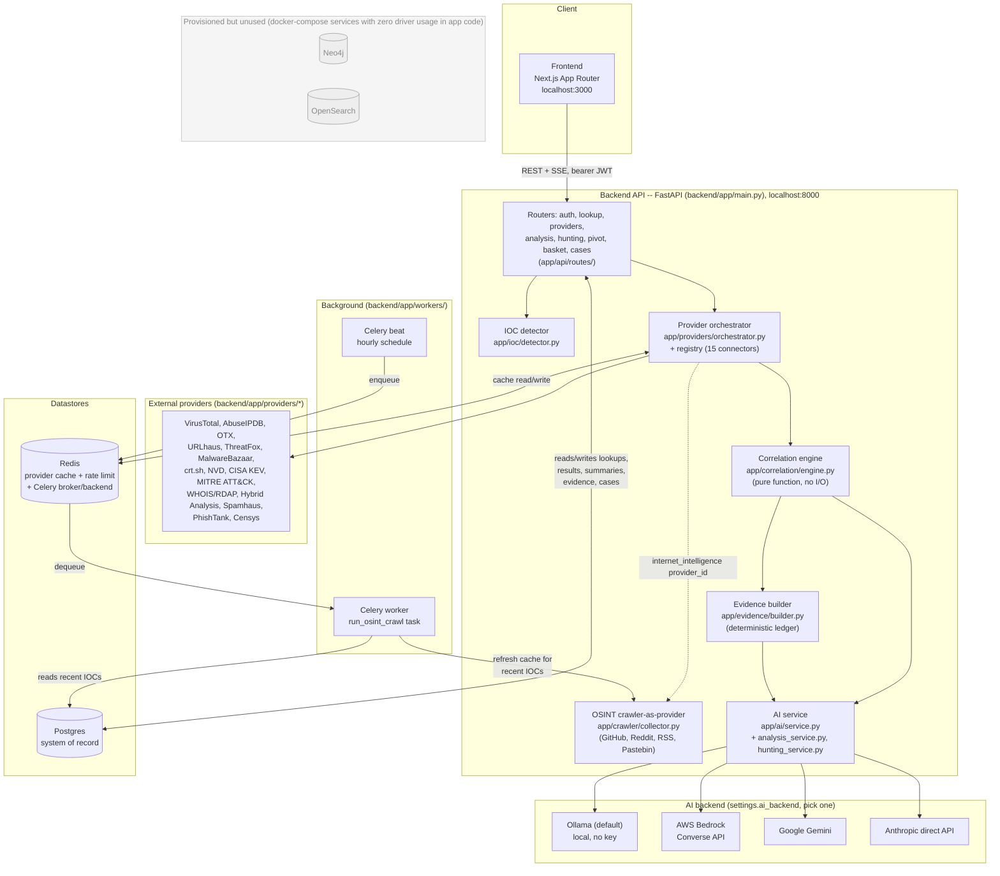
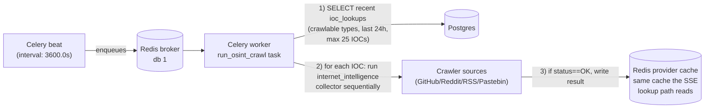

# Architecture

System design for HORIZON GRID: a single-search threat-intelligence
workbench that fans one indicator of compromise (IOC) out to many providers in
parallel, correlates the results, and produces an AI-generated assessment.

Related docs: [PROVIDERS.md](PROVIDERS.md) (every connector in depth),
[DATA_MODEL.md](DATA_MODEL.md) (full schema/ERD), [AI_ENGINE.md](AI_ENGINE.md)
(prompting/grounding detail), [API.md](API.md) (REST/SSE reference).

---

## Component diagram



**Neo4j and OpenSearch are provisioned in `docker-compose.yml` but are dead
infrastructure today** — `neo4j_uri`/`opensearch_url` exist as `Settings` fields
(`backend/app/core/config.py`), and both services start as containers, but **no code
path anywhere in `backend/app/` calls a Neo4j driver or an OpenSearch client**.
`correlation_edges` in Postgres is, in practice, the sole store for the correlation
graph, despite a model docstring (`app/models/lookup.py:101-103`) describing edges as
"mirrored into Neo4j." This is called out explicitly rather than drawn as an active
path — see [DATA_MODEL.md](DATA_MODEL.md#known-gaps--not-implemented) for the
model-level detail. **NOT IMPLEMENTED.**

---

## Components

### Frontend

Next.js App Router app (`frontend/app/`). A search-box home page (`app/page.tsx`)
routes to `/lookup/new?value=...`, which opens the SSE stream via `lib/api.ts`
(`streamLookup` — a manual `fetch` + stream reader, **not** the browser
`EventSource` API, because `EventSource` cannot send an `Authorization` header and
the stream endpoint requires a bearer token) and renders incoming events into state.
`app/lookup/[id]/page.tsx` shows a previously-completed lookup via a plain `GET`.
Other routes: `app/basket/`, `app/cases/`, `app/login/`, `app/register/`.

### Backend API (FastAPI)

`backend/app/main.py` builds the FastAPI app, mounts Prometheus instrumentation at
`/metrics`, and includes routers under `settings.api_v1_prefix` (`/api/v1`):
`auth`, `lookup`, `providers`, `analysis`, `hunting`, `pivot`, `basket`, `cases`
(`backend/app/api/routes/`). A plain `GET /health` exists outside the versioned
prefix. OpenAPI/Swagger UI is auto-served at `/docs`. See [API.md](API.md) for the
full route reference.

### IOC detector

`backend/app/ioc/detector.py` (`detect_ioc_type`) classifies the raw input string
into an `IOCType` enum value, or the caller can override via `ioc_type_hint`.

### Provider orchestrator + registry

`backend/app/providers/base.py` defines the `BaseProvider` plugin contract.
`backend/app/providers/registry.py` is the single place that imports every concrete
connector and lists it in `_ALL_PROVIDERS` (15 connector modules, ordered as declared:
VirusTotal, AbuseIPDB, OTX, URLhaus, ThreatFox, MalwareBazaar, crt.sh, NVD, CISA KEV,
MITRE ATT&CK, WHOIS/RDAP, Hybrid Analysis, Spamhaus, PhishTank, Censys, plus the
`internet_intelligence` crawler-as-provider as the 16th/last entry) — the orchestrator
never imports a concrete provider directly. `backend/app/providers/orchestrator.py`
(`run_all_providers` / `run_all_providers_collected`) fans one IOC out to every
provider whose `supported_types` includes the detected type, concurrently, over one
shared `httpx.AsyncClient`, with a Redis cache check first, then a per-attempt
`asyncio.wait_for` timeout plus `tenacity` retry for connection-level failures. See
[PROVIDERS.md](PROVIDERS.md) for the full fan-out diagram and every connector's
detail.

### OSINT crawler (`internet_intelligence` provider)

`backend/app/crawler/collector.py`'s `InternetIntelligenceCollector` is itself a
`BaseProvider` (category `osint`, no key required) that fans out to 4 source modules
(`app/crawler/sources/`: `github.py`, `reddit.py`, `rss_news.py`,
`pastebin_search.py`) concurrently via `asyncio.gather(..., return_exceptions=True)`,
dedupes findings by URL, and caps the merged result at
`crawler_max_results_per_source * 4`. Supports `DOMAIN`, `IPV4`, `MALWARE_FAMILY`,
`THREAT_ACTOR`, `CAMPAIGN`, `CVE`, `FILE_NAME` only (raw network atoms like JA3/mutex
are excluded — free-text search on them is noise). Only `github.py` and `reddit.py`
self-throttle via a process-local `AsyncMinIntervalLimiter` (6.0s / 1.1s minimum
interval, not Redis-backed); `rss_news.py` and `pastebin_search.py` have no limiter
and never raise `SourceRateLimitedError`.

### Correlation engine

`backend/app/correlation/engine.py` (`correlate`) — a **pure function, no I/O** —
takes the full list of `ProviderResult`s for one lookup and:

1. Extracts typed relationships (IP resolutions, related hashes/URLs, certificates,
   ASN, malware families, threat actors, campaigns, MITRE techniques, CVEs) into
   `GraphEdge`s, driven by the normalized `data` keys (see
   [PROVIDERS.md](PROVIDERS.md) for the field → edge mapping).
2. Deduplicates edges asserted identically by multiple providers, merging provenance
   into one edge (comma-joined provider IDs).
3. Tracks provider agreement/disagreement on verdict/reputation
   (`provider_agreement`) and deduplicates scalar facts (`detection_ratio`,
   `malicious_count`, `total_engines`, `first_seen`, `last_seen`).
4. Produces a `CorrelationResult` (`nodes`, `edges`, `deduplicated_facts`,
   `provider_agreement`) that feeds the SSE `correlation` event, the evidence
   builder, and the AI service's final-assessment prompt.

Edges are persisted as `CorrelationEdgeRecord` rows in Postgres (not, despite the
model docstring, mirrored to Neo4j — see the component diagram above).

### Evidence builder

`backend/app/evidence/builder.py` (`build_evidence`) builds `EvidenceItem` rows
**deterministically** from `provider_results` + `provider_summaries` + the
correlation result — never from a raw AI call. This ledger is what every later
AI-generated explanation (WHY malicious, Score Explanation, Challenge Verdict,
Copilot answers) cites by `evidence_id`, so the analysis endpoints can strip any
`evidence_id` the model invents that doesn't correspond to a real row
(`app/ai/analysis_service.py`'s `_strip_invalid_evidence_ids`). See
[DATA_MODEL.md](DATA_MODEL.md#evidence_items) for the table.

### AI service

`backend/app/ai/service.py` owns the two-step lookup-time prompting flow;
`app/ai/analysis_service.py` and `app/ai/hunting_service.py` own the on-demand,
evidence-grounded explanation/hunting endpoints. Four interchangeable backends are
selected via `settings.ai_backend` (`ollama` default, `bedrock`, `gemini`,
`anthropic`), all exposing an identical `call_claude_json()` method. Full prompting,
grounding, and schema-validation detail is in [AI_ENGINE.md](AI_ENGINE.md).

### Auth / RBAC

`backend/app/auth/security.py` issues/decodes JWTs; `backend/app/auth/rbac.py`'s
`require_permission(<permission>)` dependency factory gates every route by checking
the current user's role against `ROLE_PERMISSIONS` (`backend/app/models/user.py`) —
three roles: `admin`, `analyst`, `viewer`. See
[DATA_MODEL.md](DATA_MODEL.md#users) for the full permission matrix.

### Celery workers

`backend/app/workers/celery_app.py` defines a Celery app (`ioc_intel_platform`,
broker `redis://redis:6379/1`, result backend `redis://redis:6379/2`) for
**background** work only — today, exclusively the scheduled OSINT crawl refresh
(`run_osint_crawl`, `backend/app/workers/tasks.py`). `docker-compose.yml` runs a
`celery_worker` service and a `celery_beat` service alongside the API. See "Celery
beat: scheduled crawl refresh" below for the full task flow.

### Datastore roles

| Store | Role | Status |
|---|---|---|
| **Postgres** | System of record: `users`, `ioc_lookups`, `provider_results`, `ai_summaries`, `correlation_edges`, `evidence_items`, `basket_items`, `cases`, `case_iocs`, `case_notes`, `case_reports`. Async via SQLAlchemy + `asyncpg`; schema managed by Alembic. | Active |
| **Redis** | Provider result cache (`app/core/cache.py`, keyed `provider_cache:{provider_id}:{ioc_type}:{sha256(ioc_value)}`, TTL `provider_cache_ttl_seconds`, default 3600s); fixed-window rate limiter for lookup *creation* (`lookup_rate_limit_max_calls`, default 10/60s); Celery broker (db 1) and result backend (db 2). | Active |
| **Neo4j** | `docker-compose.yml` runs a `neo4j:5-community` container and `Settings.neo4j_uri`/`neo4j_user`/`neo4j_password` exist, but **no Neo4j driver call exists anywhere in the codebase**. | **NOT IMPLEMENTED** — dead infra |
| **OpenSearch** | `docker-compose.yml` runs an `opensearchproject/opensearch:2.17.0` container and `Settings.opensearch_url` exists, but **no OpenSearch client call exists anywhere in the codebase read for this platform**. | **NOT IMPLEMENTED** — dead infra |

---

## Request lifecycle: a lookup (SSE)

Driven by `POST /api/v1/lookup/stream` (`backend/app/api/routes/lookup.py`,
`stream_lookup`, requires permission `lookup:create`). Returns a
`text/event-stream` response and emits SSE events in this exact order:

```mermaid
sequenceDiagram
    participant FE as Frontend
    participant API as stream_lookup()
    participant DET as IOC detector
    participant ORCH as Orchestrator + providers
    participant AI as AI service
    participant CORR as Correlation engine
    participant EVID as Evidence builder
    participant PG as Postgres

    FE->>API: POST /api/v1/lookup/stream {value, ioc_type_hint?}
    API->>DET: detect_ioc_type(value)
    API->>PG: INSERT ioc_lookups (status=running)
    API-->>FE: event: detected {lookup_id, ioc_value, ioc_type}

    loop for each provider supporting ioc_type, as each finishes
        ORCH->>ORCH: cache check -> fetch() -> timeout/retry
        API->>PG: INSERT provider_results row
        API-->>FE: event: provider_result {...}
        alt status == "ok"
            API->>AI: summarize_provider(ioc_value, ioc_type, result)
            API->>PG: INSERT ai_summaries row (provider_id set)
            API-->>FE: event: provider_summary {...}
        end
    end

    API->>CORR: correlate(ioc_value, ioc_type, all provider_results)
    API->>PG: INSERT correlation_edges rows
    API-->>FE: event: correlation {nodes, edges}

    API->>PG: SELECT ai_summaries for this lookup
    API->>AI: generate_final_assessment(ioc_value, ioc_type, summaries, correlation)
    API->>PG: UPDATE ioc_lookups (status=completed, final_verdict, risk_score, confidence_score, final_assessment)
    API->>EVID: build_evidence(provider_results, summaries, correlation)
    API->>PG: INSERT evidence_items rows
    API-->>FE: event: final_assessment {...}
    API-->>FE: event: done {lookup_id}

    Note over API,FE: On any unhandled exception after streaming starts:<br/>UPDATE ioc_lookups (status=failed); event: error {message}<br/>replaces final_assessment/done.
```

Step by step:

1. **`detected`** — the raw input is classified by `detect_ioc_type()` (or overridden
   via `ioc_type_hint`); an `IOCLookup` row is created with `status=running`. `422` if
   the type can't be determined and no hint was given.
2. **`provider_result` × N** — `run_all_providers` fans the IOC out to every
   provider whose `supported_types` includes the detected type, concurrently, over a
   shared `httpx.AsyncClient`. Each result streams the instant that provider finishes
   (`asyncio.as_completed` order, not registration order) and is persisted as a
   `ProviderResultRecord`.
3. **`provider_summary` × N** — for every `provider_result` with `status == "ok"`,
   `summarize_provider()` is called synchronously inside the same loop iteration
   (before moving to the next provider event), persisted as an `AISummaryRecord`
   (`provider_id` set), and streamed. Providers that returned anything other than
   `ok` (error/timeout/rate_limited/not_configured/unsupported_ioc/no_data) get **no**
   AI summary call at all.
4. **`correlation`** — once every provider has reported, `correlate()` runs over the
   full result set; its edges are persisted as `CorrelationEdgeRecord` rows and the
   node/edge graph is streamed. This event's payload is **not** persisted verbatim —
   `GET /api/v1/lookup/{id}` does not return nodes/edges at all.
5. **`final_assessment`** — all persisted `AISummaryRecord` rows for the lookup are
   re-loaded and re-validated into `ProviderSummary` objects (unparseable rows are
   skipped, logged, and don't sink the whole assessment), then
   `generate_final_assessment()` runs once over that list plus the correlation
   output (never over raw provider JSON directly — bounds prompt size). The
   `IOCLookup` row is updated to `completed` with `final_verdict`, `risk_score`,
   `confidence_score`, and the full `FinalAssessment` JSON. The deterministic
   `evidence_items` ledger is built and persisted in the same step, from
   `provider_results`/`provider_summaries`/`correlation` only — never from the final
   assessment's own AI output.
6. **`done`** — `{lookup_id}`, terminates the stream successfully.

On any unhandled exception during the stream, the lookup row is marked `failed` and
an `error` event (`{message}`) is emitted instead of `final_assessment`/`done`.

Full event JSON shapes are documented in [API.md](API.md#post-apiv1lookupstream--the-core-sse-endpoint).

**Important**: this SSE request path deliberately does **not** go through Celery —
it runs in-process `async` inside the FastAPI worker so the UI gets live per-provider
updates. The generator opens its **own** `AsyncSession` via `new_session()` rather
than reusing the route's `Depends(get_db)` session, because that session is torn down
as soon as the route function returns the `StreamingResponse` (before the generator
body actually runs).

---

## Celery beat: scheduled crawl refresh

The only currently-scheduled background job. `celery_app.py`'s `beat_schedule`
defines `crawl-osint-sources-hourly` as a plain interval (`3600.0` seconds — **not**
a cron expression) running `app.workers.tasks.run_osint_crawl`.



Flow (`backend/app/workers/tasks.py`):

1. `_recent_crawlable_iocs()` selects `(ioc_value, ioc_type)` from `ioc_lookups`
   where `ioc_type` is one of the crawlable types (`domain`, `ipv4`,
   `malware_family`, `threat_actor`, `campaign`, `cve`, `file_name` — mirrors the
   crawler's own `_SUPPORTED_TYPES`) and `created_at` is within the last 24 hours,
   ordered most-recent-first, deduplicated in Python, capped at 25 IOCs per run.
2. `_run_osint_crawl_async()` opens one shared `httpx.AsyncClient` and calls
   `_crawl_one()` **sequentially** per target (not concurrently); any per-target
   exception is caught and logged so one bad target doesn't abort the run.
3. `_crawl_one()` runs the `internet_intelligence` provider for that IOC; if the
   result status is `OK`, it writes the result into the **same Redis provider-result
   cache** the interactive SSE lookup path reads from (`set_cached_result`) — so a
   fresh interactive lookup for a recently-seen IOC can serve warmed OSINT findings
   from cache instead of re-crawling.
4. `run_osint_crawl()` is the actual Celery task (sync entrypoint, wraps the async
   flow in `asyncio.run(...)` since Celery workers are sync processes); its return
   value is the count of IOCs refreshed.

This path is entirely separate from the interactive SSE lookup — it exists to keep
the provider cache warm with OSINT findings for IOCs that have already been looked
up recently, not to run new lookups from scratch.

---

## Plugin contract: `BaseProvider`

Defined in `backend/app/providers/base.py`. Every connector subclasses `BaseProvider`
and sets `provider_id`, `provider_name`, `category` (`ProviderCategory`:
`threat_intel`, `sandbox`, `passive_dns`, `certificate_intel`, `whois`,
`vulnerability`, `osint`), `supported_types: set[IOCType]`, `requires_key: bool`, a
`configured: bool` computed from settings, and implements
`async def fetch(self, ioc_value, ioc_type, client) -> ProviderResult`.

`BaseProvider.run()` (not overridden by connectors) wraps `fetch()` with timing and
short-circuits: unsupported IOC types return `UNSUPPORTED_IOC` without calling
`fetch`; not-configured providers return `NOT_CONFIGURED` without calling `fetch`.
**Connectors must not implement their own retry/timeout loop** — the orchestrator
wraps every `run()` call in `asyncio.wait_for` (`provider_timeout_seconds`, default
20s) plus a `tenacity` retry (`provider_max_retries`, default 2, exponential backoff)
for connection-level failures, and owns Redis result caching. Full connector-by-
connector detail, the fan-out diagram, and "how to add a provider" steps are in
[PROVIDERS.md](PROVIDERS.md).

---

## Deployment topology

`docker-compose.yml` services: `postgres` (5433→5432 host mapping), `redis` (6379),
`neo4j` (7475/7688, provisioned but unused — see above), `opensearch` (9200,
provisioned but unused), `backend` (8000, runs `alembic upgrade head` then
`uvicorn --reload`), `celery_worker`, `celery_beat`, `frontend` (3000, `npm run dev`).
The `backend` service's `environment:` block explicitly sets `OLLAMA_BASE_URL` to
`http://host.docker.internal:11434` — the default AI backend runs on the **host**,
not in a container, per a `docker-compose.yml` comment explaining that a large local
model's mmap load is dramatically slower through Docker Desktop's WSL2 volume-mount
layer than direct host filesystem access. (`celery_worker`/`celery_beat` don't
override `OLLAMA_BASE_URL` in `docker-compose.yml`, but land on the same value via
`Settings`' own default.)

See [DATA_MODEL.md](DATA_MODEL.md) for the full schema/ERD and migration history,
and [AI_ENGINE.md](AI_ENGINE.md) for how the AI backends, grounding, and schema
validation work.
