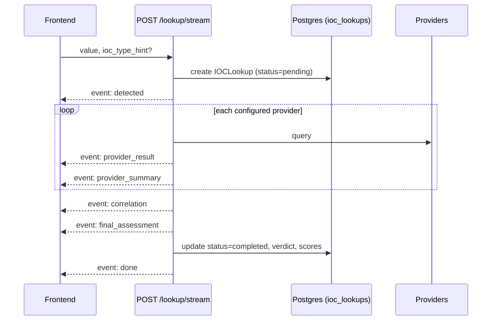

# Changelog (feature snapshot)

> **This is a snapshot, not the real release history.** It was originally
> written at a point when this tree wasn't tracked as a git repo, hence the
> single "Unreleased" entry below describing the feature set as it existed
> at that time, compiled by reading the backend/frontend code directly
> rather than from commit logs. That's no longer true -- a real git history
> with tagged releases and a real, incrementally-maintained changelog exists
> now: see the repository root's own `CHANGELOG.md` for the accurate,
> version-by-version history (currently through v0.3.9). This file is kept
> as a supplementary point-in-time feature inventory, not as the changelog
> of record.

For endpoint-level detail see [API_DOCUMENTATION.md](API_DOCUMENTATION.md); for
schema detail see [DATA_MODEL.md](DATA_MODEL.md); for the AI subsystem see
[AI_ENGINE.md](AI_ENGINE.md); for provider integrations see
[PROVIDERS.md](PROVIDERS.md).

---

## [Unreleased] — current snapshot

Snapshot date basis: the most recent Alembic migration in the tree
(`a6d3ad2bb63c_add_evidence_basket_and_case_management_.py`) carries a create
date of 2026-08-08, so the schema/feature set below reflects that point in
the codebase's life.

### Subsystems present in this snapshot

| Subsystem | Status | Entry point(s) |
|---|---|---|
| Authentication & RBAC | Implemented | `POST /api/v1/auth/register`, `/login`, `/refresh`, `GET /me` |
| IOC lookup pipeline (SSE) | Implemented | `POST /api/v1/lookup/stream`, `GET /api/v1/lookup/{id}`, `GET /api/v1/lookup` |
| Provider health | Implemented | `GET /api/v1/providers/health` |
| Evidence ledger | Implemented | `GET /api/v1/lookup/{id}/analysis/evidence` |
| AI verdict analysis | Implemented | `POST /api/v1/lookup/{id}/analysis/*` (8 sub-routes) |
| Pivoting (deterministic) | Implemented | `GET /api/v1/lookup/{id}/pivots` |
| Hunting / detection content | Implemented | `POST /api/v1/lookup/{id}/hunt`, `/detection` |
| Basket (per-analyst scratch space) | Implemented | `GET/POST/DELETE /api/v1/basket`, `/basket/compare` |
| Case management | Implemented | `GET/POST/PATCH /api/v1/cases`, notes, IOCs, close |
| Server-side export (PDF/CSV) | **NOT IMPLEMENTED** | frontend calls a route that does not exist on the backend |
| Provider/user/audit admin API | **NOT IMPLEMENTED** | permission strings exist, no routes use them |

---

### Added — Authentication & RBAC

- Self-registration at `POST /api/v1/auth/register`, but **bootstrap-only**:
  the **first user ever registered becomes `admin`**; every registration
  attempt after that is rejected with `403 Forbidden` ("Self-registration is
  closed. Ask an administrator to create your account from the
  Administration page.") rather than falling back to creating an `analyst`
  account. This is a deliberate bootstrap mechanism (no manual DB edit needed
  to get an initial admin) — see comment in `auth.py`. Every account after
  the first admin must be created by an existing admin via
  `POST /api/v1/admin/users` or the `/admin` frontend page, which lets the
  admin pick the new user's role up front.
- JSON login (`POST /api/v1/auth/login`) issuing a JWT access + refresh token
  pair (`TokenResponse`), and `POST /api/v1/auth/refresh` to rotate the access
  token from a refresh token.
- `GET /api/v1/auth/me` returns the current user, but note: it currently
  hardcodes `full_name` to an empty string in the response rather than
  returning the stored value.
- Three roles: `admin`, `analyst`, `viewer`, enforced via a permission-string
  RBAC layer (`require_permission("<resource>:<action>")`) rather than
  role-name checks directly on routes.
  - `viewer` is read-only: `lookup:read`, `evidence:read`, `case:read`.
  - `analyst` has all working operational permissions (create lookups,
    generate AI analysis, manage basket, manage cases, run hunts).
  - `admin` has everything `analyst` has, plus three permission strings —
    `provider:manage`, `user:manage`, `audit:read` — that are defined but
    **not wired to any route** (see Known Gaps below).
- Bearer-token auth via `HTTPBearer` (not OAuth2 password flow), matching the
  JSON-body login contract.

### Added — IOC lookup pipeline

- `POST /api/v1/lookup/stream` accepts an IOC value (+ optional
  `ioc_type_hint`) and streams progress as **Server-Sent Events**:
  `detected` → N × `provider_result` → N × `provider_summary` → `correlation`
  → `final_assessment` → `done` (or `error`).
- Per-user rate limiting on lookup creation (default: 10 calls / 60s window,
  configurable — see [CONFIGURATION.md](CONFIGURATION.md)).
- Returns `422` if the IOC type cannot be auto-detected and no
  `ioc_type_hint` was supplied.
- `GET /api/v1/lookup/{id}` returns the full record: provider results, AI
  summaries, correlation-derived assessment, verdict, risk/confidence scores.
- `GET /api/v1/lookup` lists recent lookups (default 50, capped at 200).
  Lookups are **shared across the whole SOC team** — any user with
  `lookup:read` sees everyone's lookups, unlike the basket (see below).



### Added — Provider health

- `GET /api/v1/providers/health` reports live provider status from the
  in-process provider registry. No request body/params.

### Added — Evidence ledger

- `GET /api/v1/lookup/{id}/analysis/evidence` returns a deterministic,
  **non-AI** list of evidence items (claim, interpretation, confidence,
  source, related IOC) built by `app/evidence/builder.py` from provider
  summaries and correlation edges. This powers the "Show Receipts" / Evidence
  tab in the UI and is explicitly the layer AI outputs are meant to be
  checkable against.
- Both this route and every AI analysis route below require the target
  lookup to exist (`404 Lookup not found`) **and** to have
  `status == completed` (`409 Lookup is not completed yet`).

### Added — AI verdict analysis

Eight generation endpoints under `POST /api/v1/lookup/{id}/analysis/*`,
each gated by permission `analysis:generate` (except `copilot`, gated by
`copilot:query`):

| Route | Response model |
|---|---|
| `/why` | `WhyMaliciousExplanation` |
| `/what-is-this` | `WhatIsThisIOC` |
| `/disagreement` | `DisagreementSummary` |
| `/false-positive` | `FalsePositiveAssessment` |
| `/challenge` | `ChallengeVerdict` |
| `/next-actions` | `SmartNextActions` (also reads correlation edges) |
| `/gaps` | `IntelligenceGaps` (splits providers into with/without data) |
| `/score-explanation` | `ScoreExplanation` |
| `/copilot` | `CopilotAnswer` — free-form `{"question": str, "notes": [str]?}`, `422` if question is blank |

### Added — Pivoting

- `GET /api/v1/lookup/{id}/pivots` — a deliberately **non-AI**, deterministic
  ranking of related IOCs from stored correlation edges (`limit` query param,
  default 10). Positioned as the factual complement to the AI-generated
  `/next-actions` route.

### Added — Hunting & detection content generation

- `POST /api/v1/lookup/{id}/hunt` generates a `HuntingPackage` across
  multiple formats via a `formats` query param, defaulting to all nine
  supported: `sigma`, `splunk_spl`, `sentinel_kql`, `elastic`, `qradar_aql`,
  `chronicle_yara_l`, `suricata`, `snort`, `zeek`.
- `POST /api/v1/lookup/{id}/detection` generates a single `DetectionRuleDraft`
  for one required `format` query param.
- Both require permission `hunting:generate` and only check that the lookup
  *exists* (`404`) — unlike the analysis routes, there is **no 409 check** for
  lookup completion status on these two routes.

### Added — Basket (per-analyst scratch space)

- Private to each analyst: every route scopes to `owner_id == current user`.
  Contrast with cases and lookups, which are shared team-wide.
- `GET /api/v1/basket`, `POST /api/v1/basket` (idempotent — re-adding an
  existing `(owner, ioc_value)` pair returns the existing item, no `409`),
  `DELETE /api/v1/basket/{item_id}`, `DELETE /api/v1/basket` (clear all).
- `POST /api/v1/basket/compare` compares 2–10 lookups at once
  (`422` outside that range, or if fewer than 2 resolve to completed
  lookups), returning per-IOC rows plus an AI narrative.
- By design, `BasketItem` has no status/workflow field — that responsibility
  belongs to `Case`.

### Added — Case management

- Cases are shared team-wide (any `case:read` holder sees all cases),
  mirroring lookup visibility, not basket visibility.
- `GET /api/v1/cases` (filterable by `status_filter`, limit capped at 200 —
  note: the filter is a raw string compare, not validated against the
  `CaseStatus` enum), `POST /api/v1/cases`, `GET /api/v1/cases/{id}`,
  `PATCH /api/v1/cases/{id}` (partial update via `exclude_unset`),
  `POST /api/v1/cases/{id}/close`.
- IOC attachment: `POST /api/v1/cases/{id}/iocs`,
  `DELETE /api/v1/cases/{id}/iocs/{ioc_id}`.
- Notes: `POST /api/v1/cases/{id}/notes`, with a deliberately loose
  `anchor_type`/`anchor_ref` string pair (not a foreign key) so a note can
  point at a graph node, timeline event, evidence item, IOC, or provider
  result without a dedicated join table per type.
- `CaseSeverity`: `low`, `medium`, `high`, `critical`.
  `CaseStatus`: `open`, `investigating`, `contained`, `resolved`,
  `false_positive`, `closed`.

### Added — Data model & migrations

Two Alembic revisions make up the full schema history in this snapshot:

```
660d2aa3bc20  initial_schema
  └─ users, ioc_lookups, provider_results, ai_summaries, correlation_edges

a6d3ad2bb63c  add_evidence_basket_and_case_management
  └─ evidence_items, basket_items, cases, case_iocs, case_notes, case_reports
```

Run migrations with:

```bash
cd backend
alembic upgrade head
```

See [DATA_MODEL.md](DATA_MODEL.md) for full table/column detail.

### Added — Operational endpoints

- `GET /health` — plain health check, not under the `/api/v1` prefix.
- `GET /metrics` — Prometheus metrics via `Instrumentator`.
- `GET /api/v1/openapi.json`, interactive docs at `GET /docs`.

---

### Known gaps in this snapshot

Documented explicitly per project convention — these are confirmed absent
from the codebase, not omissions from this changelog:

- **NOT IMPLEMENTED: server-side export.** The frontend
  (`ExportMenu.tsx`) calls `POST /api/v1/lookup/{id}/export?format=pdf|csv`,
  but no backend route registers this path anywhere. The frontend already
  defensively handles the failure with "Export format not yet available."
  Only **client-side** JSON and Markdown export (built from data already
  loaded in the browser) currently work.
- **NOT IMPLEMENTED: admin/provider-management API.** The permission strings
  `provider:manage`, `user:manage`, and `audit:read` exist in the `admin`
  role's permission set, and `lookup:export` exists for `admin`/`analyst`,
  but none of these four permission strings are referenced by any route in
  the backend. There is currently no admin console API, no user-management
  API, and no audit-log API — only the permission scaffolding for them.
- **NOT IMPLEMENTED (by design): basket workflow state.** `BasketItem`
  intentionally has no status/workflow fields; use a `Case` if you need to
  track investigation state for an IOC.
- **NOT IMPLEMENTED: Neo4j graph mirror.** The `correlation_edges` table
  docstring states edges are "mirrored into Neo4j for graph traversal," but
  there is no Neo4j driver usage anywhere in the codebase. Postgres is
  currently the sole store for correlation/graph data.
- **NOT IMPLEMENTED: soft deletes.** No model has an `is_deleted` column;
  all deletes are hard deletes via SQLAlchemy `cascade="all, delete-orphan"`.

---

## Template for future entries

Once real commit/release history is available, prefer this format going
forward instead of a single snapshot block:

```markdown
## [x.y.z] - YYYY-MM-DD

### Added
### Changed
### Fixed
### Removed
```
