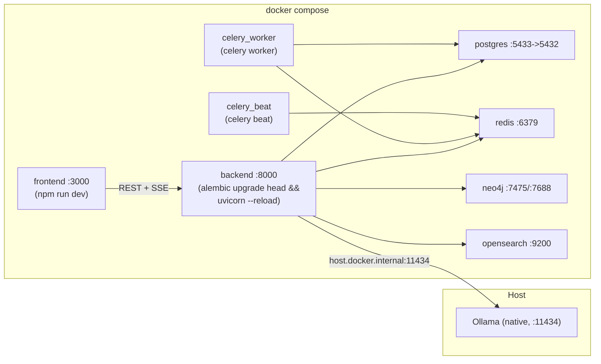
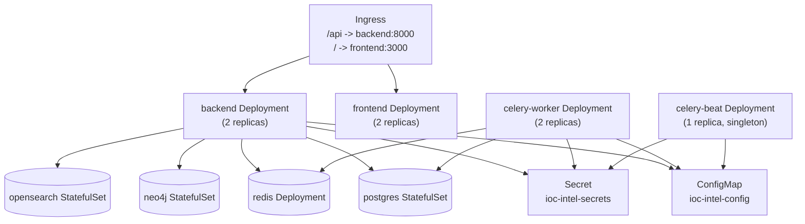

# Deployment

Two deployment paths exist in this repo: **Docker Compose** (the only path that is
fully wired up end-to-end and is what the rest of the docs assume) and a set of
**Kubernetes manifests** under `k8s/base/` (a direct, hand-written translation of the
compose file — not templated with Helm, and not wired to any CI/CD). There is **no
CI/CD pipeline** in this repo (no `.github/workflows/`, no `Makefile`, no other
pipeline config) — building and pushing images, and running `kubectl apply`, is a
manual/operator step. TLS termination is likewise **NOT IMPLEMENTED** anywhere in the
repo; it's explicitly left to the operator (see below).

For the environment variables referenced throughout this doc, see
[CONFIGURATION.md](CONFIGURATION.md). For the auth/JWT and secrets-handling model, see
[SECURITY.md](SECURITY.md). For system design, see [ARCHITECTURE.md](ARCHITECTURE.md).

## Deployment options

| Path | Status | Use case |
|---|---|---|
| Docker Compose (`docker-compose.yml`) | Fully working, dev-mode commands (`--reload`, `npm run dev`, bind-mounted source) | Local development, the only path exercised by the test suite / docs |
| Kubernetes (`k8s/base/`) | Manifests exist and are internally consistent; **not** production-hardened out of the box (see gaps below) | Reference starting point for a real cluster deployment |
| CI/CD pipeline | **NOT IMPLEMENTED** | N/A — build/push/apply is manual |
| TLS termination | **NOT IMPLEMENTED** (commented out in `k8s/base/ingress.yaml`) | Operator must supply cert-manager config or their own certs |

## 1. Docker Compose

### Services

All defined in `docker-compose.yml` at the repo root:

| Service | Image / build | Ports (host:container) | Healthcheck | Depends on |
|---|---|---|---|---|
| `postgres` | `postgres:16-alpine` | `5433:5432` | `pg_isready -U ioc` (5s interval, 10 retries) | — |
| `redis` | `redis:7-alpine` | `6379:6379` | `redis-cli ping` (5s interval, 10 retries) | — |
| `neo4j` | `neo4j:5-community` (+ `apoc` plugin) | `7475:7474` (HTTP), `7688:7687` (Bolt) | none defined | — |
| `opensearch` | `opensearchproject/opensearch:2.17.0`, single-node, security plugin disabled | `9200:9200` | none defined | — |
| `backend` | built from `backend/Dockerfile` | `8000:8000` | none defined (k8s manifests probe `/health`; compose does not) | `postgres` (healthy), `redis` (healthy) |
| `celery_worker` | same build as `backend` | — (no exposed ports) | none | `postgres` (healthy), `redis` (healthy) |
| `celery_beat` | same build as `backend` | — (no exposed ports) | none | `redis` (healthy) |
| `frontend` | built from `frontend/Dockerfile` | `3000:3000` | none | `backend` (started, not healthy) |

Named volumes: `postgres_data`, `neo4j_data`, `opensearch_data`. There is no automated
backup of these volumes — **NOT IMPLEMENTED**; back them up with whatever
volume-snapshot tooling your host provides.

Note the non-default host ports: Postgres is `5433` and Neo4j is `7475`/`7688` on the
host side (container-internal ports are the standard `5432`/`7474`/`7687`) — this
avoids clashing with any natively-installed Postgres/Neo4j on the dev machine.

### Startup command

```bash
cp .env.example .env
# edit .env: JWT_SECRET_KEY, provider API keys, OLLAMA_MODEL, etc. -- see CONFIGURATION.md

docker compose up --build
```

The `backend` container's command runs migrations automatically before starting the
API — there is no separate migration step to run by hand:

```
sh -c "alembic upgrade head && uvicorn app.main:app --host 0.0.0.0 --port 8000 --reload"
```

`celery_worker` runs `celery -A app.workers.celery_app worker --loglevel=info`;
`celery_beat` runs `celery -A app.workers.celery_app beat --loglevel=info` (this is the
schedule source for the hourly OSINT crawl — see ARCHITECTURE.md). `frontend` runs
`npm run dev` against the bind-mounted source tree.

### AI backend dependency (Ollama)

The default AI backend (`AI_BACKEND=ollama`) expects **Ollama running natively on the
host**, not in a container — the `backend` service is pointed at it via
`OLLAMA_BASE_URL=http://host.docker.internal:11434` (resolves to the host machine from
inside the container on Docker Desktop for Windows/Mac). This is intentional: a large
model's mmap load was observed to be dramatically slower through Docker Desktop's WSL2
volume-mount layer than direct NTFS access on the host. Install Ollama on the host and
`ollama pull <model>` before starting the stack, or switch `AI_BACKEND` to `bedrock`,
`gemini`, or `anthropic` in `.env` (see CONFIGURATION.md / ARCHITECTURE.md for the
client details).

### First-run bootstrap

No seed admin user exists. Register the first user via the API — the first user ever
registered is automatically granted the `admin` role. Every registration attempt after
that is rejected with `403 Forbidden`; every account after the first admin must be
created by that admin via `POST /api/v1/admin/users` or the `/admin` frontend page:

```bash
curl -X POST http://localhost:8000/api/v1/auth/register \
  -H "Content-Type: application/json" \
  -d '{"email":"you@example.com","password":"<configure securely>","full_name":"Your Name"}'
```

Then obtain a token pair via `POST /api/v1/auth/login`.

### Verifying the deployment

```bash
curl http://localhost:8000/health
# {"status": "ok", "service": "HORIZON GRID"}
```

- Frontend: <http://localhost:3000>
- Backend Swagger UI: <http://localhost:8000/docs>
- Backend Prometheus metrics: <http://localhost:8000/metrics> (mounted via
  `prometheus-fastapi-instrumentator`; no Prometheus/Grafana server is bundled or
  configured to scrape it — **NOT IMPLEMENTED**, bring your own if you want dashboards)

Picking up a changed `.env` value (e.g. adding a provider API key) requires recreating
the container, not just restarting it:

```bash
docker compose up -d backend
```

### Applying a config/secret change without a rebuild

`docker compose restart backend` is **not** sufficient for `.env` changes — Compose
only re-reads `.env` when a container is created. Use `docker compose up -d backend`
instead (see above).

### Not production-hardened as shipped

The compose file runs dev-mode commands throughout: `uvicorn --reload` with the
backend source bind-mounted (`./backend:/app`), `npm run dev` with the frontend source
bind-mounted, Postgres/Neo4j/OpenSearch with default or hardcoded credentials
(`ioc`/`ioc`, `neo4j`/`changeme-neo4j`), and OpenSearch's security plugin explicitly
disabled. Treat this compose file as a development/demo environment; harden
credentials, disable `--reload`/bind mounts, and re-enable OpenSearch security before
exposing it beyond localhost. Note that "beyond localhost" here still means the
trusted local network the LAN-access feature targets (see `docs/SECURITY.md` §4's
CORS policy and `docs/INSTALL.md`'s "Accessing From Another Device" section) --
not the public internet, which this platform is not designed to be exposed to
regardless of hardening.



## 2. Kubernetes

`k8s/base/` is a plain-YAML, kustomize-compatible set of manifests — no Helm, no
templating — mirroring the compose services one-for-one. Documented in full in
`k8s/README.md`; summarized here.

### Layout

```
k8s/base/
  namespace.yaml                    # ioc-intel-platform namespace
  configmap.yaml                    # non-secret config (hosts, ports, URLs)
  secret.example.yaml               # placeholder only -- NOT applied, NOT referenced by kustomization.yaml
  postgres-statefulset.yaml         # + headless Service + PVC (via volumeClaimTemplates)
  redis-deployment.yaml             # + Service
  neo4j-statefulset.yaml            # + headless Service + PVC
  opensearch-statefulset.yaml       # + headless Service + PVC
  backend-deployment.yaml           # + Service, /health probes, resources
  celery-worker-deployment.yaml     # same image as backend, runs the Celery worker
  celery-beat-deployment.yaml       # same image as backend, runs Celery beat (1 replica, singleton)
  frontend-deployment.yaml          # + Service
  ingress.yaml                      # /api -> backend, / -> frontend
  kustomization.yaml                # ties it all together
```

### ConfigMap vs. Secret split

| Object | Contents |
|---|---|
| `ioc-intel-config` (ConfigMap) | Non-sensitive: `POSTGRES_HOST`/`PORT`/`DB`, `REDIS_URL`, `CELERY_BROKER_URL`, `CELERY_RESULT_BACKEND`, `NEO4J_URI`, `NEO4J_PLUGINS`, `OPENSEARCH_URL`/`JAVA_OPTS`/discovery settings, `AWS_REGION`, `BEDROCK_MODEL_ID`, `BEDROCK_MAX_TOKENS`, `ENVIRONMENT`, `DEBUG`, `NEXT_PUBLIC_API_URL` |
| `ioc-intel-secrets` (Secret, **not** committed with real values) | `POSTGRES_USER`, `POSTGRES_PASSWORD`, `DATABASE_URL` (embeds the Postgres password), `NEO4J_USER`, `NEO4J_PASSWORD`, `JWT_SECRET_KEY`, `AWS_ACCESS_KEY_ID`/`AWS_SECRET_ACCESS_KEY`, and every provider API key from `.env.example` (VirusTotal, AbuseIPDB, OTX, NVD, abuse.ch, Hybrid Analysis, Censys, PhishTank) |

`backend`, `celery-worker`, and `celery-beat` all consume both via `envFrom`
(`configMapRef` + `secretRef`), mirroring how compose merges service-level
`environment:` with `env_file: .env`.

`k8s/base/secret.example.yaml` documents the Secret's required keys with empty-string
placeholders; it is **intentionally not listed** in `kustomization.yaml`'s `resources:`
so it can never be applied by accident, and is safe to commit as-is. Never fill it in
and commit the filled-in copy.

### Creating the namespace and the real Secret

```bash
kubectl create namespace ioc-intel-platform --dry-run=client -o yaml | kubectl apply -f -

# from your local .env (must also include POSTGRES_USER, POSTGRES_PASSWORD,
# DATABASE_URL, NEO4J_USER, NEO4J_PASSWORD -- these are compose service-level
# environment: values, not in .env.example, so add them to .env first)
kubectl create secret generic ioc-intel-secrets \
  --namespace ioc-intel-platform \
  --from-env-file=.env
```

Alternatively, copy `secret.example.yaml`, fill in real values, and `kubectl apply -f`
it directly (do not add it back into `kustomization.yaml`, do not commit the filled-in
copy).

### Applying

```bash
kubectl apply -k k8s/base

kubectl -n ioc-intel-platform get pods
kubectl -n ioc-intel-platform rollout status deployment/backend
```

Preview rendered manifests without applying:

```bash
kubectl kustomize k8s/base
```

### Probes and replicas

| Workload | Replicas | Probe |
|---|---|---|
| `backend` | 2 | HTTP `GET /health` on :8000 (readiness: 10s initial delay/10s period; liveness: 20s/15s, both 6 failure threshold) |
| `frontend` | 2 | TCP :3000 (readiness 10s/10s, liveness 20s/15s, 6 failure threshold) |
| `celery-worker` | 2 | none defined |
| `celery-beat` | 1 (kept as a singleton — running more than one replica would duplicate scheduled task dispatches) | none defined |
| `postgres` | 1 (StatefulSet) | exec `pg_isready -U ioc` |
| `neo4j` | 1 (StatefulSet) | TCP :7687 |
| `opensearch` | 1 (StatefulSet) | TCP :9200 |
| `redis` | 1 | exec `redis-cli ping` |

PVC sizes (`volumeClaimTemplates`): Postgres 5Gi, Neo4j 5Gi, OpenSearch 10Gi — starting
points only; size for your real data volume and set `storageClassName` if your
cluster's default isn't what you want.



### Gaps to close before using this for real

- **Images**: the Deployments reference `ioc-intel-platform/backend:latest` and
  `ioc-intel-platform/frontend:latest`, which must be built and pushed to a registry
  your cluster can pull from, then the manifests updated to point at that registry and
  a pinned tag (not `latest`).
  - `backend/Dockerfile` (`python:3.12-slim`, `pip install -r requirements.txt`, `CMD
    uvicorn app.main:app --host 0.0.0.0 --port 8000`) is usable as-is for the k8s
    image — the Deployment's own `command` overrides `CMD` anyway to add `alembic
    upgrade head` first.
  - `frontend/Dockerfile` (`node:20-alpine`, `npm install`, `CMD npm run dev`) is a
    **dev-mode Dockerfile only**. `frontend-deployment.yaml` runs `command: ["npm",
    "start"]`, which requires a production `next build` output (`.next`) that this
    Dockerfile never produces (it only ever runs `npm run dev`). Building a real
    production image (`npm run build && npm start`, per `k8s/README.md`) requires a
    **separate/modified Dockerfile — NOT IMPLEMENTED** in this repo as of this
    writing.
- **Ingress** (`ingress.yaml`): uses the legacy `kubernetes.io/ingress.class: "nginx"`
  annotation and a placeholder host `ioc-intel.example.com`. Update the host, and
  switch to `spec.ingressClassName: nginx` if your ingress-nginx version expects that
  instead.
- **TLS**: intentionally commented out in `ingress.yaml`. **NOT IMPLEMENTED** — fill in
  a real `tls:` block plus a cert-manager `ClusterIssuer` annotation
  (`cert-manager.io/cluster-issuer: ...`), or your own pre-provisioned secret, before
  exposing this outside a trusted network.
- **CI/CD**: **NOT IMPLEMENTED**. There is no pipeline that builds images, runs tests,
  or applies these manifests — every step above (`docker build`, `docker push`,
  `kubectl apply`) is manual.

## Health and observability

| Endpoint | Purpose |
|---|---|
| `GET /health` | Plain liveness check (`{"status": "ok", "service": ...}`), outside `/api/v1`. Used by the k8s readiness/liveness probes; not checked by a compose healthcheck. |
| `GET /docs` | FastAPI/Swagger UI (auto-generated). |
| `GET /metrics` | Prometheus-format metrics via `prometheus-fastapi-instrumentator`. No Prometheus server, scrape config, Grafana dashboards, or alerting are provided in this repo — **NOT IMPLEMENTED**, bring your own if needed. |
| `GET /api/v1/providers/health` | Application-level check of which providers are `configured` (has an API key) vs. not — not an infra health check. |

Structured logging is configured via `structlog` (JSON renderer) in
`backend/app/main.py`; there is no shipped log-aggregation config (ELK/Loki/etc.) —
left to the operator.

## Related docs

- [CONFIGURATION.md](CONFIGURATION.md) — full environment variable reference
- [SECURITY.md](SECURITY.md) — JWT/auth model, secrets handling, RBAC
- [ARCHITECTURE.md](ARCHITECTURE.md) — system design, request lifecycle, datastore roles
- [PROVIDERS.md](PROVIDERS.md) — which provider API keys are real vs. stub connectors
- [TESTING.md](TESTING.md) — running the test suite, including the Docker-dependent integration tests
- [TROUBLESHOOTING.md](TROUBLESHOOTING.md) — common runtime issues (AI backend not responding, `not_configured` providers, 401/403s)
