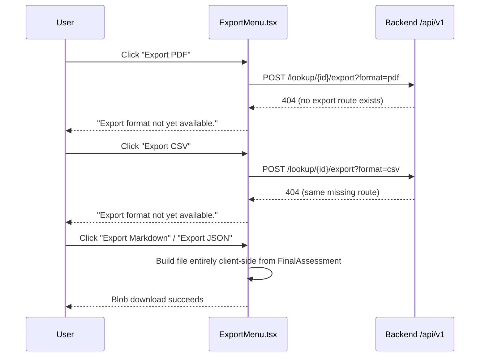

# Documentation Gaps & Known Limitations

This document is the honest counterpart to the rest of `docs/`. Every other
guide in this set ([README.md](../README.md), [USER_GUIDE.md](USER_GUIDE.md),
[SOC_ANALYST_GUIDE.md](SOC_ANALYST_GUIDE.md),
[THREAT_INTELLIGENCE_GUIDE.md](THREAT_INTELLIGENCE_GUIDE.md),
[ADMIN_GUIDE.md](ADMIN_GUIDE.md), [DEVELOPER_GUIDE.md](DEVELOPER_GUIDE.md),
[API_DOCUMENTATION.md](API_DOCUMENTATION.md), [PROVIDERS.md](PROVIDERS.md),
[AI_ENGINE.md](AI_ENGINE.md), [ARCHITECTURE.md](ARCHITECTURE.md)) describes
what the platform **does**. This document describes what it **does not**
do yet, what is only partially built, and what could not be verified from
source code alone.

Everything below was checked directly against the backend/frontend source
(routes, components, `lib/api.ts`, provider connectors, test suite) as of
this audit. Anything not confirmed in source is labeled **NOT IMPLEMENTED**,
**PARTIAL**, or **UNDETERMINED** rather than assumed.

---

## 1. Frontend pages/views that do not exist

The full frontend route tree is: `/`, `/login`, `/register`, `/lookup/new`,
`/lookup/[id]`, `/basket`, `/cases`, `/cases/[id]`. Nothing else exists under
`frontend/app/`.

| Feature | Status | Notes |
|---|---|---|
| Threat Actor profile page | **NOT IMPLEMENTED** | Threat-actor data appears only as an evidence type (`threat_actor_association` in `EvidencePanel`) and as free-text fields inside a `FinalAssessment`. There is no page to browse/search actors across lookups. |
| Malware family profile page | **NOT IMPLEMENTED** | Same as above — malware family shows up as an evidence type (`malware_association`) and a basket-comparison column, not a dedicated browsable entity page. |
| Campaign view | **NOT IMPLEMENTED** | `campaign_association` exists only as an evidence type on a single lookup; no cross-lookup campaign aggregation page. |
| Infrastructure clustering | **NOT IMPLEMENTED** | `RelationshipGraph` renders the correlation graph (nodes/edges) for **one lookup only**, from `GET /lookup/{id}` correlation data produced during the SSE run. There is no engine that clusters infrastructure across multiple, unrelated lookups. |
| Watchlists | **NOT IMPLEMENTED** | No route, component, or API client function references a watchlist concept anywhere. |
| Bulk IOC analysis / upload | **NOT IMPLEMENTED** | The only lookup entry points are the single-value search box (`app/page.tsx`) and `/lookup/new?value=<one value>`. No file-upload or multi-value submission UI or endpoint exists. |
| IOC graph diff / compare-over-time | **NOT IMPLEMENTED** (partial adjacent feature exists) | The Basket's "Compare Selected" (`compareBasketIOCs`, `frontend/app/basket/page.tsx`) compares **multiple different IOCs' latest lookups** side by side in a table. There is no feature that re-runs the same IOC over time and diffs the two results, and no lookup-history/versioning view. |
| Dedicated ATT&CK navigator page | **NOT IMPLEMENTED** (partial adjacent feature exists) | `MitreMatrix` renders ATT&CK tactic/technique columns, but only for the mappings attached to **one lookup's** `FinalAssessment`. There is no standalone/global ATT&CK matrix browsing page independent of a lookup. |
| Admin user-management UI | **IMPLEMENTED** | An `/admin` Administration console exists in `frontend/app/admin/page.tsx` (user list/create/enable/disable/reset-password, roles & permissions view, audit log), backed by `POST /api/v1/admin/users` and the rest of `backend/app/api/routes/admin.py`, all gated on `require_permission('user:manage')`. `register/page.tsx` now states that self-registration only works on a brand-new install with no existing admin, and points everyone else at this Administration page. |

---

## 2. Backend/API gaps

| Feature | Status | Notes |
|---|---|---|
| PDF export | **NOT IMPLEMENTED** | `frontend/components/dashboard/ExportMenu.tsx` calls `POST /api/v1/lookup/{lookupId}/export?format=pdf` directly. No `export` route exists anywhere in `backend/app/api/routes/*.py` (confirmed by grep). The call always 404s; the UI catches this and shows "Export format not yet available." |
| CSV export | **NOT IMPLEMENTED** | Same missing route, `format=csv`. Only client-side **Markdown** and **JSON** export actually work (built entirely in-browser from the already-fetched `FinalAssessment`, no backend call). |
| ATT&CK ingestion beyond `mitre_attack.py` | **NOT IMPLEMENTED** | `backend/app/providers/mitre_attack.py` fetches the public STIX bundle and answers single `MITRE_TECHNIQUE` IOC lookups (with a 1-hour in-memory cache). There is no ingestion pipeline that loads the full ATT&CK framework into the database, no technique/tactic browsing API, and no scheduled sync job beyond that per-process cache. |
| Per-provider rate limiting / circuit breakers | **NOT IMPLEMENTED** | `ProviderStatus.RATE_LIMITED` exists and is reachable (HTTP 429/403/509 mapped in `base.py`), but no connector proactively self-throttles. The only place `core/cache.py`'s `RateLimiter` is actually instantiated is the per-user lookup-creation limiter in `backend/app/api/routes/lookup.py` (`lookup_create:{user.id}`, 10/60s default) — nothing per-provider, and no exponential-backoff/circuit-breaker logic inside individual connector files (all retry/timeout logic lives in `orchestrator.py`). |
| MFA (multi-factor authentication) | **NOT IMPLEMENTED** *(frontend-confirmed; backend not directly inspected for this audit — see §4)* | `frontend/app/login/page.tsx` is a plain email+password form. `frontend/lib/api.ts` exposes only `login`, `register`, and `refreshAccessToken` for auth — no MFA-related function, route, or UI element anywhere in the frontend. |
| Password reset / "forgot password" | **NOT IMPLEMENTED** *(same caveat as above)* | No forgot-password link, route, or API client function exists anywhere in `frontend/app/login/` or `frontend/lib/api.ts`. |

---

## 3. Testing gaps

See [TESTING.md](TESTING.md) for how to actually run what exists. Gaps:

| Gap | Status | Notes |
|---|---|---|
| Frontend automated tests | **NOT IMPLEMENTED** | `frontend/package.json` wires up `"test": "vitest run"` and lists `vitest@2.1.1` as a dependency, but there are **zero** `*.test.*` / `*.spec.*` files anywhere under `frontend/app`, `frontend/components`, or `frontend/lib`, and no `vitest.config.*`. Running `npm test` executes vitest with nothing to collect. |
| Shared pytest fixtures (`conftest.py`) | **NOT IMPLEMENTED** | No `conftest.py` exists anywhere in the backend. `test_lookup_flow.py` and `test_lookup_stream_persistence.py` each independently reimplement very similar Postgres/Redis-override and connection-pool-disposal fixtures instead of sharing one. |
| Auth endpoint tests | **NOT IMPLEMENTED** | No test file exercises `POST /api/v1/auth/register` or `/login` as HTTP requests. Auth is only exercised indirectly, by constructing `User` rows and tokens directly inside `test_lookup_stream_persistence.py`'s fixtures. |
| Pytest config file | **NOT IMPLEMENTED** | No `pytest.ini`, `pyproject.toml`, `setup.cfg`, or `tox.ini` exists. Tests run with pytest defaults; inferred invocation (from `.pytest_cache` node IDs) is `cd backend && pytest` (or `pytest app/tests`), run from the `backend/` directory. |

### Known local test-run issues (not code bugs in the app itself)

- **bcrypt/passlib version mismatch**: `backend/app/auth/security.py` builds a `passlib` `CryptContext(schemes=["bcrypt"])`. In an environment with `bcrypt>=4.1` (reproduced against `backend/.venv_test`, which has `bcrypt==5.0.0`), passlib's bcrypt handler reads `bcrypt.__about__.__version__`, which no longer exists, and its self-test then hits bcrypt 5.x's stricter 72-byte password check — both raise. The main `backend/.venv` pins `bcrypt==4.0.1` (matching `requirements.txt`) and does not exhibit this. **Two separate backend venvs exist (`.venv`, `.venv_test`) with drifted dependency versions**, and it is unclear from any repo doc/comment which one is meant to be the canonical test environment.
- **"Event loop is closed" under pytest-asyncio**: documented directly in test fixture docstrings (`test_lookup_flow.py`, `test_lookup_stream_persistence.py`). Redis and Postgres connection pools are opened lazily and bound to whichever asyncio event loop was running at first use; since pytest-asyncio gives each test function its own loop, reusing a pool across tests raises `RuntimeError: Event loop is closed`. Both integration files work around this with an autouse fixture that disposes the pools after every test.
- Two integration tests require live infrastructure and self-skip otherwise: `test_lookup_flow.py` needs Redis at `localhost:6379` (`docker compose up -d redis`); `test_lookup_stream_persistence.py` needs Postgres at `localhost:5433` and Redis at `localhost:6379` (`docker compose up -d postgres redis`).

---

## 4. Features that exist but could be mistaken for something they're not

- **"Ask AI" popup (`AskAiPanel.tsx`) is not the platform's AI engine.** It builds a prompt client-side (`frontend/lib/aiPrompt.ts`) and opens `https://gemini.google.com/app` in a popup for the analyst to paste into manually, because Google blocks iframing Gemini. This is a copy/paste convenience against the analyst's *own* Gemini account — there is no server-side Gemini call. The platform's actual AI features (WHY/Score Explanation/Copilot/etc., documented in [AI_ENGINE.md](AI_ENGINE.md)) are separate and go through `backend/app/ai/analysis_service.py` and `hunting_service.py`.
- **`PivotPanel`'s "What should I do next?" and "What don't we know?" are manual, not automatic.** They only call `getNextActions()` / `getIntelligenceGaps()` on explicit button click, unlike the rest of the lookup page which streams in automatically over SSE. The Recommended Pivots list itself (`backend/app/evidence/pivot.py`) is a deterministic sort, not AI-generated.
- **`frontend/app/lookup/new/page.tsx` carries a stale docstring.** The module comment describes itself as a "composition root" with placeholder components "until those land," but every real dashboard component (`ThreatScoreGauge`, `ProviderCardGrid`, `FinalAssessmentPanel`, `RelationshipGraph`, `MitreMatrix`, etc.) is already wired in. The comment predates the current code and should not be read as a to-do list.
- **`frontend/app/lookup/[id]/page.tsx` never shows a correlation graph on reload.** Its own docstring states `GET /api/v1/lookup/{id}` does not return correlation edges, so `correlation` is hardcoded to `null` on that page. The relationship graph is only populated during the live SSE run at `/lookup/new`, not when revisiting a completed lookup by ID.

---

## 5. Undeterminable / out of scope for a source-only audit

These could not be confirmed or denied from the code alone:

| Item | Why it's undetermined |
|---|---|
| Whether currently configured provider API keys (VirusTotal, AbuseIPDB, OTX, abuse.ch, Censys, Hybrid Analysis, PhishTank) are free-tier or paid-tier | Each connector docstring only states the *free*-tier limits it was written against (e.g. VirusTotal "4 req/min, 500/day"); none of the connector code branches on a paid-vs-free flag. Actual account-level tier/pricing is external to the codebase and wasn't verified against any live provider account. See [PROVIDERS.md](PROVIDERS.md). |
| External provider rate limits/pricing in general | Same reasoning — these are third-party services (VirusTotal, AbuseIPDB, OTX, URLhaus/ThreatFox/MalwareBazaar, Censys, Hybrid Analysis, PhishTank, NVD, CISA KEV, MITRE, crt.sh, Spamhaus). Only what each connector's docstring claims was checked; no external pricing pages were consulted. |
| Backend auth implementation details (MFA, password reset, session/token lifetime edge cases) | No dedicated research pass covered `backend/app/auth/` route/config internals for this document. The MFA/password-reset conclusions above are based on the **absence of any corresponding frontend UI or API client call**, not on a direct reading of the backend auth routes. Refer to [SECURITY.md](SECURITY.md) and [API_DOCUMENTATION.md](API_DOCUMENTATION.md) for what was verified there. |
| Whether `get_provider_health()`'s `configured` field updates without a process restart | Each provider computes `self.configured` once, from `get_settings()`, at module-import time (e.g. `virustotal_provider = VirusTotalProvider()` runs at import). Whether adding a key to `.env` after backend startup retroactively flips `configured` without a restart was not independently tested. |
| Why two backend virtualenvs (`.venv`, `.venv_test`) exist with drifted versions | No comment, README, or config file explains this split; `bcrypt`, `asyncpg`, and `pytest`/`pytest-asyncio` versions differ between them and from `requirements.txt`'s pinned versions. |
| Whether `GET /api/v1/lookup` (list) is used anywhere in the frontend | `frontend/lib/api.ts` exports `listLookups()`, but no page read during this audit appears to call it — it may be unused frontend API surface, not confirmed either way. |
| Exact prompt content built by `frontend/lib/aiPrompt.ts` | Referenced by `AskAiPanel.tsx` but not read in full during this audit. |

---

## 6. Why the export gap matters (concrete flow)

**Practical guidance:** until a server-side `/lookup/{id}/export` route is added,
document PDF/CSV export as unavailable in any user-facing guide, and point
analysts to the working Markdown/JSON export buttons instead.

---

## 7. Summary table

| Area | Verdict |
|---|---|
| Threat Actor / Malware / Campaign dedicated pages | NOT IMPLEMENTED |
| Infrastructure clustering across lookups | NOT IMPLEMENTED |
| Watchlists | NOT IMPLEMENTED |
| Bulk IOC analysis/upload | NOT IMPLEMENTED |
| IOC diff/compare over time (same IOC, different runs) | NOT IMPLEMENTED (cross-IOC basket compare exists instead) |
| Dedicated/global ATT&CK navigator | NOT IMPLEMENTED (per-lookup MitreMatrix exists instead) |
| Admin user-management UI | NOT IMPLEMENTED (backend permission strings exist, no UI) |
| Server-side PDF export | NOT IMPLEMENTED |
| Server-side CSV export | NOT IMPLEMENTED |
| Full ATT&CK framework ingestion | NOT IMPLEMENTED (single-technique-lookup connector only) |
| Per-provider rate limiting/circuit breakers | NOT IMPLEMENTED |
| MFA | NOT IMPLEMENTED (frontend-confirmed) |
| Password reset | NOT IMPLEMENTED (frontend-confirmed) |
| Frontend automated tests | NOT IMPLEMENTED (vitest configured, unused) |
| Backend `conftest.py` / shared fixtures | NOT IMPLEMENTED |
| Backend auth endpoint tests | NOT IMPLEMENTED |
| Server-side Gemini/AI "second opinion" integration | NOT IMPLEMENTED (client-side popup workflow only) |
