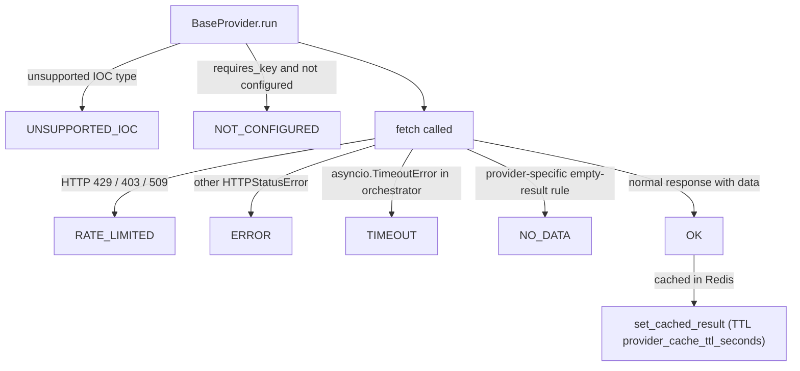

# FAQ

Answers to the questions that come up most once you're actually running
lookups. Every answer here is grounded in the current source code — where
something looks like a feature but isn't wired up, it's labeled
**NOT IMPLEMENTED** rather than glossed over.

See also: [TROUBLESHOOTING.md](TROUBLESHOOTING.md) for step-by-step fixes,
[ARCHITECTURE.md](ARCHITECTURE.md) for the full request lifecycle,
[SECURITY.md](SECURITY.md) for RBAC/auth details, and
[PROVIDERS.md](PROVIDERS.md) for per-provider specifics.

---

## 1. Why does a provider show `not_configured` instead of a result?

Every connector sets `requires_key` (usually `True`) and computes a
`configured` flag once, at process start, from `app/core/config.py` settings
— e.g. `self.configured = bool(get_settings().virustotal_api_key)`.
`BaseProvider.run()` checks this **before** calling `fetch()`:

```
requires_key=True and configured=False
  → ProviderStatus.NOT_CONFIGURED
    error_message = "<name> is not configured (missing API key/credentials)."
```

No network call is made at all. Set the corresponding env var in `.env` and
restart the backend — `configured` is computed once at import time, so a key
added after startup does not take effect without a restart. Full var list in
[PROVIDERS.md](PROVIDERS.md) and [CONFIGURATION.md](CONFIGURATION.md).

Providers that need **no** key (`requires_key=False`, always `configured=True`):
crt.sh, NVD (key optional, just raises the rate ceiling), CISA KEV, MITRE
ATT&CK, WHOIS/RDAP, PhishTank, Spamhaus, and the internet-intelligence
crawler.

## 2. Why is a provider's status `no_data` instead of `error`?

`no_data` means the provider was reachable and answered successfully, but
had nothing to say about this specific IOC — this is a deliberate,
provider-specific mapping, not a generic fallback:

| Provider | `no_data` trigger |
|---|---|
| VirusTotal | HTTP 404 on the object lookup |
| AbuseIPDB | HTTP 200 with an empty `data` payload |
| OTX | HTTP 200 with `pulse_count == 0` |
| ThreatFox / MalwareBazaar | `query_status == "ok"` but zero entries returned (explicitly *not* treated as an error — "ok with zero entries is a genuine empty result") |
| URLhaus | non-`"ok"` `query_status`, via the shared abuse.ch status mapper |
| PhishTank | `results.in_database == False` |

By contrast, an abuse.ch **auth failure** (`no_api_key`, `invalid_api_key`,
`unauthorized`) is deliberately mapped to `ERROR`, not `NO_DATA` — because the
UI renders `NO_DATA` as "nothing malicious found," and a misconfigured key
must never look like a clean verdict (`backend/app/providers/abusech.py`).

## 3. Why did a provider come back `rate_limited`?

`BaseProvider.run()` catches `httpx.HTTPStatusError` and maps status codes
**429, 403, or 509** to `ProviderStatus.RATE_LIMITED` (509 is PhishTank's
documented over-limit code). The OSINT crawler's own GitHub source module
separately raises the same signal on HTTP 403 or 429, per a comment noting
GitHub's Search API uses 403 for rate limiting, not only for auth failures.
Any other HTTP error status becomes `ERROR`.

No connector self-throttles proactively — there is no per-provider
`RateLimiter` instance anywhere in `app/providers/*.py`. The Redis-backed
`RateLimiter` class (`app/core/cache.py`) isn't provider-specific at all: it
backs per-user lookup creation (`lookup_create:<user_id>`, 10 calls / 60s by
default, in `app/api/routes/lookup.py`) and, separately, per-account login
throttling and per-email registration throttling in `app/api/routes/auth.py`
(10 attempts / 60s by default each) — none of it is per-provider throttling.
The OSINT crawler is the exception — see Q13.

## 4. What's the difference between `overall_risk_score`, `confidence_score`, and `malicious_probability`?

All three are floats on a **0–100 scale**, never a 0–1 fraction
(`app/ai/schemas.py`'s `RiskAssessment`):

| Field | Meaning |
|---|---|
| `overall_risk_score` | 0 (no risk) to 100 (maximum risk) |
| `confidence_score` | How confident the assessment is, as a percentage |
| `malicious_probability` | Probability the IOC is malicious, as a percentage (e.g. `50`, not `0.5`) |

They answer different questions: risk score is "how bad is this," confidence
is "how sure is the model," and malicious probability feeds the verdict
check in Q6. A `field_validator` (`_reject_0_to_1_scale`) rescales any value
`0 < v < 1` by multiplying by 100 rather than rejecting it — this exists
because smaller local models (the comment cites `llama3.2:3b`) have been
observed literally returning `0.5` when asked for "50% confidence."

## 5. Why do the AI provider summary and the raw provider data seem to disagree?

`summarize_provider()` (`app/ai/service.py`) is grounded **only** in that one
provider's own `result.data` — it never sees other providers' output. If
`result.status != OK` or `result.data` is empty, the AI backend isn't even
called: a degraded `ProviderSummary` is returned directly
(`reputation="unknown"`, `detection_status="no data"`, `threat_level="none"`,
`confidence="low"`). Every system prompt instructs the model to say "no
data"/"not observed" rather than infer, so a summary that looks sparse or
literal is the anti-hallucination control working as intended, not a bug.

## 6. Why did the final assessment "fail" / come back as a generic fallback?

`generate_final_assessment()` returns a static fallback `FinalAssessment`
(all narrative fields state generation failed, `final_verdict="unknown"`,
with `overall_risk_score`/`confidence_score`/`malicious_probability`/
`severity` taken from the deterministic scoring engine rather than zeroed
out) whenever both of its attempts raise — and that includes **schema
validation failures**, not just network errors. The most common cause is
`_verdict_must_agree_with_risk`, a model validator that enforces:

- `final_verdict` in `{malicious, highly_malicious}` requires
  `malicious_probability >= 30`
- `final_verdict` in `{benign, likely_benign}` requires
  `malicious_probability <= 50`

If the model's stated verdict contradicts its own probability number, the
`ValueError` raised here triggers exactly **one** retry — `service.py`'s
`generate_final_assessment()` resends the identical prompt and gives up to
the static fallback above only if the second attempt also fails.
`app/ai/schemas.py`'s module docstring claims the AI service "retries once
with the validation error appended to the prompt" — the retry-once part now
holds for this call, but the validation error text is never actually
appended to the retried prompt, and neither `summarize_provider()` (same
file), `analysis_service.py`, nor `hunting_service.py` retry at all — they
go straight from a validation or call exception to a static fallback on the
first failure.

## 7. Why is a MITRE ATT&CK mapping marked ungrounded (or why don't ungrounded ones get removed)?

`_ground_final_assessment()` builds `grounded_technique_ids` from the real
correlation graph — specifically, every `CorrelationEdge` where
`relationship == "uses_technique"`. For each `MitreMapping` the model
returned, it overwrites `mapping.grounded` to:

```
mapping.technique_id.upper() in grounded_technique_ids
```

This **relabels** `grounded`; it does **not** delete or hide mappings the
model invented that aren't backed by a real edge — you can still see an
AI-proposed technique with `grounded=false` in the UI. That's deliberate:
the model may reasonably infer a technique from context even when no
provider explicitly surfaced it, and the platform prefers to show it
labeled honestly over silently dropping it.

Separately: `MitreMapping.technique_id` has **no regex `pattern=`
constraint** on purpose. Ollama's grammar compiler (llama.cpp's
json-schema-to-grammar) fails to compile a `pattern` constraint into a
decoding grammar and returns HTTP 400 "failed to parse grammar" — which
would break every `generate_final_assessment()` call when running on Ollama,
because the whole schema is compiled into one grammar and a single
unsupported constraint fails the entire thing. A malformed `technique_id`
isn't a safety issue since grounding only checks ID membership, not format.

## 8. Why do two providers disagree on whether an IOC is malicious?

The correlation engine tracks this explicitly rather than resolving it.
`provider_agreement` (a `dict[str, list[str]]`) buckets providers by the
verdict they reported: `result.data.get("verdict") or
result.data.get("reputation")`, lowercased, mapping that string to the list
of `provider_id`s that asserted it. If VirusTotal says `malicious` and
Spamhaus says `clean`, both buckets appear side-by-side in
`provider_agreement` — the correlation engine (a pure function, no I/O) does
not pick a winner. `generate_final_assessment` sees this and is expected to
adjudicate; its `agreeing_providers`/`disagreeing_providers` lists are
grounded by filtering to only provider IDs that actually appear in real
correlation edges/agreement data (`_ground_final_assessment`) — an
AI-invented provider name in either list is silently dropped.

Disagreement is common because providers answer fundamentally different
questions: Censys always reports `verdict="unknown"` (it surfaces exposure
data, not a malicious/clean call), Spamhaus reports a valid `OK` "clean"
result for a genuine DNSBL miss, and detection-ratio scanners like VirusTotal
can be split even internally.

## 9. Why does confidence differ from the risk/threat score?

They measure different things and can move independently:

- **Risk/threat score** (`overall_risk_score`, `severity`) — how dangerous
  the AI judges this IOC to be, given the evidence.
- **Confidence** (`confidence_score`, `analyst_confidence`) — how much
  evidence backed that judgment.

A single corroborated hit from one authoritative source (e.g. CISA KEV,
which sets `verdict="malicious"` unconditionally for any CVE in its catalog)
can justify high risk with only moderate confidence, while five providers
unanimously returning `unknown`/`no data` can justify high confidence in a
*low*-risk read. The two numbers are validated independently
(`RiskAssessment`'s `overall_risk_score` and `confidence_score` are separate
0–100 fields) and are not derived from each other.

## 10. Why is a correlation edge's confidence higher than any single provider reported?

`_CORROBORATION_BONUS_PER_PROVIDER = 0.15` in `app/correlation/engine.py`:
when two or more distinct providers assert the exact same `(source, target,
relationship)` edge, the engine takes the **max** of their base confidences
and adds `0.15 × (distinct_provider_count - 1)`, capped at `1.0`. Base
confidence per field ranges from `0.9` (e.g. `resolved_ips`, `asn`) down to
`0.5` (`malware_families`, `threat_actors`, `campaigns`) — see the full table
in [ARCHITECTURE.md](ARCHITECTURE.md#normalized-fields). So an edge that
starts at `0.5` base confidence but is corroborated by three providers can
reach `0.5 + 0.15×2 = 0.8` — higher than any one provider's contribution on
its own. This is the literal mechanism behind "Correlation Engine
(corroborated)" labels you'll see as an evidence source.

## 11. Why does the evidence panel show a confidence number different from the correlation graph edge?

The correlation engine's edge confidence is on a **0–1** scale internally.
When `build_evidence_from_correlation()` (`app/evidence/builder.py`) turns
an edge into an `EvidenceItem`, it converts: `confidence = round(edge.confidence
* 100, 1)` — so a `0.8` edge becomes an `80.0` evidence-item confidence. This
is intentional: `EvidenceItem.confidence` is documented as "0-100 scale,
matches `RiskAssessment`" specifically so evidence and risk numbers are
directly comparable in the UI without a mental conversion.

## 12. Why is a pivot suggestion ranked "high" relevance even though its confidence number looks low?

`rank_pivots()` (`app/evidence/pivot.py`) bands relevance using the
**raw 0–1** edge confidence, not the ×100 value shown in the `confidence`
field of the emitted pivot dict:

```
"high"   if provider_count > 1 or edge.confidence >= 0.85
"medium" elif edge.confidence >= 0.6
"low"    otherwise
```

So a pivot corroborated by two providers is `"high"` relevance even at, say,
`edge.confidence = 0.55` (→ displayed `confidence: 55.0`) — the
multi-provider corroboration alone qualifies it, independent of the raw
confidence number sitting next to it.

## 13. Why does the OSINT crawler sometimes report `rate_limited` with an empty result?

`InternetIntelligenceCollector.fetch()` fans out to 4 sources concurrently
(GitHub, Reddit, RSS news feeds, Pastebin/psbdmp.ws search). Only **GitHub**
and **Reddit** implement rate-limit backoff (`AsyncMinIntervalLimiter`, a
process-local — not Redis-backed — spacer: 6.0s minimum between GitHub calls,
1.1s for Reddit) and can raise `SourceRateLimitedError`. RSS feeds and
Pastebin search have no limiter and never raise that error — any failure
there just returns an empty list silently.

Collector-level status logic:

```
merged findings non-empty        → OK
merged empty, any source rate-limited → RATE_LIMITED
merged empty, nothing rate-limited     → NO_DATA
```

The `RATE_LIMITED` branch exists specifically so a rate-limited crawl run
doesn't look identical to "genuinely nothing found" in the UI. In practice
this path can only be triggered by GitHub or Reddit throttling, since the
other two sources never raise it.

## 14. Why does the "Export PDF" / "Export CSV" button show "Export format not yet available"?

For most users it shouldn't — `POST /api/v1/lookup/{lookup_id}/export?format=pdf`
and `?format=csv` are real, implemented routes (`export_lookup()` in
`backend/app/api/routes/lookup.py`) that render the investigation
server-side (ReportLab for PDF, `csv.writer` for CSV) and stream it back as
a file attachment. `frontend/components/dashboard/ExportMenu.tsx`'s
"Export format not yet available" message only fires on an actual HTTP 404
or network failure, which isn't the normal path anymore.

The one case where it still bites: the route is gated on the dedicated
`lookup:export` permission (`ROLE_PERMISSIONS` in
`backend/app/models/user.py`, granted to `admin` and `analyst`, not
`viewer`) rather than `lookup:read`. A `viewer` account gets an HTTP 403 —
surfaced by the frontend as "Export failed with status 403.", not the
"not yet available" message — instead of a file.

Client-side **JSON** and **Markdown** export still work exactly as before —
they build the file entirely in the browser from the already-fetched
`FinalAssessment` object (`handleExportJson`, `buildMarkdown` in the same
file) and never hit the network.

## 15. Why does `GET /auth/me` show a blank name?

It shouldn't anymore — this was a real bug, now fixed: the handler in
`backend/app/api/routes/auth.py` returns `full_name=current.full_name`, and
`get_current_user()` (`backend/app/auth/rbac.py`) populates that
`full_name` from the actual user record. If `/me` still shows a blank name
for a given account, the `full_name` stored for that user is genuinely
empty (e.g. it was never set at registration), not something `/me` is
failing to return.

## 16. Why can't I log out everywhere / revoke a stolen token?

You can — `POST /auth/logout` bumps the user's `token_version` column, and
both `get_current_user()` (`backend/app/auth/rbac.py`) and `/auth/refresh`
(`backend/app/api/routes/auth.py`) reject any access/refresh token whose
embedded `token_version` claim doesn't match the current value. The
frontend's `logout()` (`frontend/lib/api.ts`) calls this endpoint before
clearing `localStorage`, so logging out invalidates every access and
refresh token already issued to that user immediately — it doesn't wait for
`refresh_token_expire_days` (default 7 days) to run out. An administrator
can trigger the same invalidation for another user via
`POST /api/v1/admin/users/{id}/reset-password`, which also bumps
`token_version`. There is still no *self-service* password reset (a
locked-out user needs an administrator), no MFA, and no email verification
— see [SECURITY.md](SECURITY.md).

## 17. Why is the relationship graph missing the labels I expected on nodes?

`GraphNode.labels` (`app/correlation/engine.py`) defaults to an empty list
and **nothing in `correlate()` ever populates it** — every constructed
`GraphNode` (the seed node and every target node) omits the `labels` kwarg
entirely. It's a real field with no producer yet; don't expect anything
there today.

## 18. Why does `correlation_edges` in Postgres say it's "mirrored into Neo4j," but I don't see anything in Neo4j?

Because that mirroring is **NOT IMPLEMENTED.** `neo4j_uri`,
`neo4j_user`, and `neo4j_password` exist as settings
(`backend/app/core/config.py`), and code comments in `engine.py` and
`CorrelationEdgeRecord`'s docstring both describe edges as "mirrored into
Neo4j for graph traversal" — but there is no Neo4j driver import, session,
or query/write call anywhere in the backend. Postgres's `correlation_edges`
table is the sole, actual store for graph edges; the relationship graph the
frontend renders is read entirely from there (directly, or via
`correlation_from_records()` for previously-completed lookups). The same
applies to OpenSearch (`opensearch_url` is configured but never referenced
by the correlation/evidence subsystem). See
[ARCHITECTURE.md](ARCHITECTURE.md#datastore-roles) and
[DATA_MODEL.md](DATA_MODEL.md#known-gaps--not-implemented).

## 19. Why does switching `AI_BACKEND` change nothing until I restart?

Editing `AI_BACKEND` in `.env` and restarting doesn't actually change
anything once this install has booted at least once: `_get_ai_client()`
(`app/ai/service.py`) resolves the *active* backend from the
runtime-configured provider table (`app/core/runtime_config.py`) —
`settings.ai_backend` is only consulted as a fallback if no runtime config
row has ever been seeded (which happens automatically on first boot). Use
the AI Providers panel (or its underlying `set_active_ai_backend()`) to
change the active backend instead — that takes effect on the very next
call, with no restart. Whichever backend is active, `_get_ai_client()`
builds one of **eleven** client modules — `ollama` (default/fallback for
any unrecognized value), `anthropic`, `bedrock`, `deepseek`, `gemini`,
`groq`, `kimi`, `mistral`, `openai`, `openrouter`, `xai` — each of which
computes its own `is_configured` flag from whichever credentials it was
built with (e.g. Anthropic: `bool(api_key)`; Ollama:
`bool(base_url and model)`, true by default since both have non-empty
defaults). If the selected backend's `is_configured` is `False`, the request
raises `RuntimeError("AI backend '<name>' is not configured...")` rather
than silently falling back to another backend.

## 20. Why did an AI call fail instead of retrying?

Only `bedrock_client.py` has any transport-level retry policy, and it's not
custom code — it's `botocore`'s `BotoConfig(retries={"max_attempts": 3,
"mode": "adaptive"})`, applied at client construction. The other ten
clients (`ollama_client.py`, `anthropic_client.py`, `gemini_client.py`,
`groq_client.py`, `openai_client.py`, `kimi_client.py`, `deepseek_client.py`,
`xai_client.py`, `mistral_client.py`, `openrouter_client.py`) each make
**exactly one** HTTP attempt in `call_claude_json()` and raise a
`RuntimeError` on any failure — connection error, timeout, non-2xx status,
empty/non-JSON content, or a parsed-but-wrong-shape response.
`generate_final_assessment()` (`service.py`) is the one exception at the
application layer: it retries once, but only on a schema `ValidationError`
(not on a `RuntimeError` from a failed call), resending the identical
prompt rather than appending the validation error as the `app/ai/schemas.py`
docstring describes (see Q6). `summarize_provider()` (same file),
`analysis_service.py`, and `hunting_service.py` still catch the resulting
exception on the first failure and return a static, clearly-labeled
fallback object instead of surfacing a raw error to the UI.

---

## Quick reference: status/verdict decoder ring



Only `OK` results are cached, feed the correlation engine, and get an AI
provider summary. Everything else degrades gracefully and is visible in the
provider card / `GET /api/v1/providers/health`.
