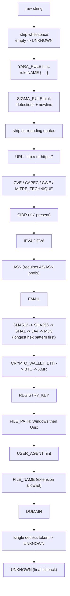

# IOC Types

This document is the authoritative reference for every `IOCType` enum value in the platform: its
wire format, how (and whether) `detect_ioc_type()` can actually produce it, a safe example value,
and which provider connectors accept it.

Source of truth: `backend/app/ioc/types.py` (enum + type-groups) and `backend/app/ioc/detector.py`
(`detect_ioc_type()`, the sole classification entry point). See also
[PROVIDERS.md](PROVIDERS.md) for full connector details and [ARCHITECTURE.md](ARCHITECTURE.md) for
how detection fits into the lookup pipeline.

## How classification works

`detect_ioc_type(raw: str) -> IOCType` (`backend/app/ioc/detector.py:61`) is the **only** place IOC
type is inferred from a raw string. There is no client-side detection: the frontend
(`frontend/app/lookup/new/page.tsx:112`) simply displays the `ioc_type` the backend already
resolved via the SSE `detected` event.



Design intent (module docstring, `detector.py:1-5`): *"Order matters -- more specific patterns
(hashes, CVEs, IPs) are checked before generic fallbacks (hostname/file_name) so ambiguous strings
resolve correctly."*

### Callers and override

Both IOC-submission endpoints run the same pattern:

```python
ioc_type = payload.ioc_type_hint or detect_ioc_type(ioc_value)
if ioc_type == IOCType.UNKNOWN:
    raise HTTPException(status_code=422, detail="Could not determine IOC type; pass ioc_type_hint.")
```

| Endpoint | File | Permission | Request field |
|---|---|---|---|
| `POST /lookup/stream` | `backend/app/api/routes/lookup.py:45-74` | `lookup:create` | `LookupCreateRequest.ioc_type_hint: Optional[IOCType]` (`backend/app/schemas/lookup.py:11`) |
| `POST /basket` | `backend/app/api/routes/basket.py:45-54` | `basket:manage` | `BasketAddRequest.ioc_type_hint: Optional[IOCType]` (`backend/app/schemas/basket.py:10`) |

`ioc_type_hint` is a generic enum override -- pass any `IOCType` value to force classification
(e.g. to disambiguate MD5 vs. JA3, or to force HOSTNAME instead of DOMAIN). There is **no**
dedicated "sandbox context" or "TLS context" hint parameter despite a code comment implying one; it
is **NOT IMPLEMENTED**.

### Type groups

`backend/app/ioc/types.py`:

```python
HASH_TYPES = {IOCType.MD5, IOCType.SHA1, IOCType.SHA256, IOCType.SHA512}

NETWORK_TYPES = {
    IOCType.IPV4, IOCType.IPV6, IOCType.DOMAIN, IOCType.URL,
    IOCType.HOSTNAME, IOCType.ASN, IOCType.CIDR,
}
```

`HASH_TYPES` is used by connectors that accept any hash algorithm (e.g. MalwareBazaar, VirusTotal,
OTX). `NETWORK_TYPES` seeds the correlation graph (see [ARCHITECTURE.md](ARCHITECTURE.md)).

---

## Reference table (all 33 enum values)

Legend for **Detectable?**: Yes = `detect_ioc_type()` can return this value from an unhinted raw
string. No (hint/other subsystem only) = the value only ever appears via `ioc_type_hint`,
correlation edges, or other code that isn't the detector.

| # | Enum value | Wire value | Detectable? | Detection position |
|---|---|---|---|---|
| 1 | `IPV4` | `ipv4` | Yes | Step 10 (`ipaddress.ip_address`) |
| 2 | `IPV6` | `ipv6` | Yes | Step 10 (`ipaddress.ip_address`) |
| 3 | `DOMAIN` | `domain` | Yes | Step 26 (`_DOMAIN_RE`) |
| 4 | `URL` | `url` | Yes | Step 4 (`http(s)://` prefix) |
| 5 | `HOSTNAME` | `hostname` | No (hint/other subsystem only) | Never returned by the detector |
| 6 | `EMAIL` | `email` | Yes | Step 12 (`_EMAIL_RE`) |
| 7 | `MD5` | `md5` | Yes | Step 17 (`_MD5_RE`, default for 32-hex) |
| 8 | `SHA1` | `sha1` | Yes | Step 15 (`_SHA1_RE`) |
| 9 | `SHA256` | `sha256` | Yes | Step 14 (`_SHA256_RE`) |
| 10 | `SHA512` | `sha512` | Yes | Step 13 (`_SHA512_RE`, checked first among hashes) |
| 11 | `TLS_CERTIFICATE` | `tls_certificate` | No (hint/other subsystem only) | Never returned by the detector |
| 12 | `JA3` | `ja3` | No (hint/other subsystem only) | Regex defined but unused -- unreachable |
| 13 | `JA4` | `ja4` | Yes | Step 16 (`_JA4_RE`) |
| 14 | `ASN` | `asn` | Yes | Step 11 (`_ASN_RE`) |
| 15 | `CIDR` | `cidr` | Yes | Step 9 (`ipaddress.ip_network`) |
| 16 | `MALWARE_FAMILY` | `malware_family` | No (hint/other subsystem only) | Never returned by the detector |
| 17 | `THREAT_ACTOR` | `threat_actor` | No (hint/other subsystem only) | Never returned by the detector |
| 18 | `CAMPAIGN` | `campaign` | No (hint/other subsystem only) | Never returned by the detector |
| 19 | `CVE` | `cve` | Yes | Step 5 (`_CVE_RE`) |
| 20 | `CWE` | `cwe` | Yes | Step 7 (`_CWE_RE`) |
| 21 | `CAPEC` | `capec` | Yes | Step 6 (`_CAPEC_RE`, checked before CWE) |
| 22 | `MITRE_TECHNIQUE` | `mitre_technique` | Yes | Step 8 (`_MITRE_TECHNIQUE_RE`) |
| 23 | `FILE_NAME` | `file_name` | Yes | Step 25 (extension allowlist) |
| 24 | `REGISTRY_KEY` | `registry_key` | Yes | Step 21 (`_REGISTRY_KEY_RE`) |
| 25 | `PROCESS_NAME` | `process_name` | No (dead code) | Step 27 guard is unreachable |
| 26 | `MUTEX` | `mutex` | No (dead code) | Regex defined but unused -- unreachable |
| 27 | `WINDOWS_SERVICE` | `windows_service` | No (not implemented) | No regex/logic exists at all |
| 28 | `FILE_PATH` | `file_path` | Yes | Steps 22-23 (Windows/Unix path regexes) |
| 29 | `USER_AGENT` | `user_agent` | Yes | Step 24 (`_USER_AGENT_HINT_RE`) |
| 30 | `CRYPTO_WALLET` | `crypto_wallet` | Yes | Steps 18-20 (ETH, BTC, XMR regexes -- all collapse to this one value) |
| 31 | `YARA_RULE` | `yara_rule` | Yes | Step 1 (`_YARA_HINT_RE`, checked first, multiline) |
| 32 | `SIGMA_RULE` | `sigma_rule` | Yes | Step 2 (`_SIGMA_HINT_RE`, checked second, multiline) |
| 33 | `UNKNOWN` | `unknown` | Yes (fallback) | Final fallback / empty input |

> Table numbering above uses the enum's declaration order (33 members, `backend/app/ioc/types.py:6-38`);
> "Detection position" step numbers reference the sequence documented in the next section, which
> does not map 1:1 to enum order since `YARA_RULE`/`SIGMA_RULE` are checked first regardless of
> declaration position.

---

## Detailed entries

Each entry gives: format/regex, detection notes (including documented historical bugs, called out
explicitly), a safe example, and providers whose `supported_types` include it.

### IPV4 / IPV6

- **Format:** any string `ipaddress.ip_address()` accepts.
- **Detection:** step 10, after CIDR is ruled out. `ip.version == 6` selects IPV6, else IPV4.
- **Example:** `8.8.8.8` (IPV4), `2001:4860:4860::8888` (IPV6, both are Google DNS, safe to publish).
- **Providers:** AbuseIPDB, OTX, ThreatFox, URLhaus, VirusTotal, WHOIS/RDAP, Censys (stub), Spamhaus
  (stub, IPV4 only), Internet Intelligence Collector (IPV4 only -- IPV6 excluded from crawler
  search per `backend/app/crawler/collector.py:36-44`).

### DOMAIN

- **Format:** `_DOMAIN_RE = r'^(?=.{1,253}$)(?:[a-zA-Z0-9](?:[a-zA-Z0-9-]{0,61}[a-zA-Z0-9])?\.)+[a-zA-Z]{2,63}$'`.
- **Detection:** step 26, only reached if the string contains a `.`, contains no space, and did not
  match the `FILE_NAME` extension allowlist first (see FILE_NAME below for why order matters --
  `shell.php` must resolve to FILE_NAME, not DOMAIN).
- **No public-suffix-list (PSL) check exists.** The detector cannot distinguish a registrable
  domain from a hostname with a subdomain; both collapse to `DOMAIN` by design (comment,
  `detector.py:144-147`).
- **Example:** `example.com`
- **Providers:** OTX, ThreatFox, URLhaus, VirusTotal, WHOIS/RDAP, crt.sh, Spamhaus (stub), Internet
  Intelligence Collector.

### URL

- **Format:** any string whose lowercased form starts with `http://` or `https://`.
- **Detection:** step 4 -- checked immediately after quote-stripping and before every other regex,
  so URLs never get misclassified as domains/paths.
- **Example:** `http://example.com/path`
- **Providers:** ThreatFox, URLhaus, VirusTotal, PhishTank (stub).

### HOSTNAME -- NOT IMPLEMENTED via detector

- **Format:** same dotted-label shape as `DOMAIN`.
- **Detection:** `detect_ioc_type()` never returns `HOSTNAME` -- there is no PSL, so every bare
  dotted string resolves to `DOMAIN` (see DOMAIN above). `HOSTNAME` is only reachable by passing
  `ioc_type_hint=hostname` explicitly.
- **Used elsewhere:** OTX provider maps it to OTX's own `"hostname"` indicator type
  (`backend/app/providers/otx.py:20,29,141`) and it is included in `NETWORK_TYPES`
  (`types.py:44-53`) for correlation-graph seeding.
- **Example:** `internal-host.example.com` (only usable via explicit hint).
- **Providers:** OTX (accepts it if hinted).

### EMAIL

- **Format:** `_EMAIL_RE = r'^[^@\s]+@[^@\s]+\.[^@\s]+$'`.
- **Detection:** step 12, checked after ASN and before the hash regexes.
- **Example:** `analyst@example.com`
- **Providers:** none of the reviewed connectors declare `EMAIL` in `supported_types`.

### MD5 / SHA1 / SHA256 / SHA512

- **Format:** hex strings of exactly 32 / 40 / 64 / 128 characters, case-insensitive.
- **Detection order (longest-first):** SHA512 (step 13) -> SHA256 (14) -> SHA1 (15) -> JA4 (16) ->
  MD5 (17). The module comment explains this is intentional: *"more specific patterns (hashes,
  CVEs, IPs) are checked before generic fallbacks"* -- and among same-shaped hex strings, the
  longest, most specific pattern wins first.
- **Historical edge case ("fixed"), ASN-vs-hash ordering:** a hex hash that happens to start with
  the letter `a` (e.g. `a1111111111111111111111111111111`, 33 chars) must **not** be
  misclassified as an ASN just because it superficially looks like `A<digits>`. The `_ASN_RE`
  pattern requires an explicit `AS`/`ASN` prefix precisely to prevent this
  (`detector.py:23-26`), and this exact case is pinned by
  `backend/app/tests/unit/test_ioc_detector.py:62-64`, which asserts the string resolves to `MD5`.
- **32-hex ambiguity (MD5 vs JA3 vs mutex):** MD5, JA3 fingerprints, and 32-character mutex-like
  tokens are all indistinguishable 32-hex-character strings. The detector **defaults to MD5** for
  all of them (`detector.py:114-117`). The code comment claims "callers with sandbox/TLS context
  can override via hint," but no such JA3-specific hint mechanism exists anywhere in the reviewed
  API schemas -- `ioc_type_hint` is a generic override, not an automatic disambiguator. See JA3
  entry below.
- **Examples:** MD5 `826f75224ddb4979721c1240f5b423b5`; SHA1 `7053eba4b69b1898302218aae3a3a49982b319e4`;
  SHA256 `71e88b019795fb624c5382163cba1e6bcea14d90713c6aedc2f9359d6a31af15`; SHA512
  `c52153a0a10bb13dfc184d8229a6f7b0d906279fa66a95eabf5c269dff6481f5d0ca52a673c4a254d00cc89c4f166b4b44d4a15853168a8a310ba9e64a70df58`
  (all fabricated/placeholder hex, not real malware hashes).
- **Providers (all via `HASH_TYPES`):** MalwareBazaar (any hash), VirusTotal (any hash), OTX (any
  hash). ThreatFox declares `MD5` and `SHA256` explicitly (not the full `HASH_TYPES` set). Hybrid
  Analysis (stub) declares **`SHA256`-only**, not the full hash set -- called out explicitly in
  `backend/app/providers/stubs/hybrid_analysis.py:10`.

### TLS_CERTIFICATE -- NOT IMPLEMENTED via detector

- **Detection:** never returned by `detect_ioc_type()`. Produced only as a correlation-graph edge
  type (`backend/app/correlation/engine.py:63`) when crt.sh returns certificate data.
- **Example:** n/a (not a user-submittable classification without a hint).
- **Providers:** crt.sh declares `TLS_CERTIFICATE` in `supported_types` alongside `DOMAIN`
  (`backend/app/providers/crtsh.py:30`).

### JA3 -- NOT IMPLEMENTED

- **Format:** identical 32-hex-character shape to MD5 (`_JA3_RE`, `detector.py:15`).
- **Detection:** the regex is defined but **never referenced** anywhere else in `detector.py` --
  `detect_ioc_type()` can never return `JA3`; any 32-hex string always resolves to `MD5` instead
  (see MD5 above). This is an explicit gap, not a hint-driven feature: no JA3-specific override
  mechanism exists in the reviewed code.
- **Example:** n/a -- not reachable without a hint, and no code path sets the hint to JA3.
- **Providers:** none declare `JA3` in `supported_types`.

### JA4

- **Format:** `_JA4_RE = r'^[a-z0-9]{10}_[a-fA-F0-9]{12}_[a-fA-F0-9]{12}$'` (case-insensitive).
  The 10-character prefix encodes: protocol(1) + version(2) + SNI(1) + cipher_count(2) +
  ext_count(2) + ALPN(2).
- **Historical bug ("fixed"), prefix length:** the JA4 prefix is correctly 10 characters, not 8.
  A prior version of this regex apparently implied an 8-char prefix; this is now pinned by
  `backend/app/tests/unit/test_ioc_detector.py:60-61` with the inline comment *"JA4 fingerprint
  (10-char prefix, not 8)"*, asserting `q13i0207h3_55b375c5d22e_cd85d2d88918` resolves to `JA4`.
- **Detection order:** step 16, checked **before** MD5, because JA4's underscore-delimited shape is
  distinct enough to disambiguate from the 32-hex MD5/JA3 pattern once checked first.
- **Example:** `q13i0207h3_55b375c5d22e_cd85d2d88918`
- **Providers:** none of the reviewed connectors declare `JA4` in `supported_types`.

### ASN

- **Format:** `_ASN_RE = r'^(?:AS|ASN)\s?(\d+)$'` (case-insensitive) -- requires an explicit `AS` or
  `ASN` prefix (optionally followed by a space) then digits.
- **Detection:** step 11. See the MD5 entry above for the paired historical bug fix -- this regex's
  explicit-prefix requirement is exactly what prevents hex hashes starting with `a`/`A` from being
  misread as an ASN.
- **Alternate spellings accepted:** `AS15169`, `ASN15169`, `AS 15169` all match (confirmed by
  `test_ioc_detector.py`'s `test_detect_ioc_type_asn_alternate_spelling`).
- **Example:** `AS15169` (Google's real public ASN, safe to reference).
- **Providers:** WHOIS/RDAP.

### CIDR

- **Format:** any string containing `/` that `ipaddress.ip_network(value, strict=False)` accepts.
- **Detection:** step 9 -- only attempted if `/` is present in the stripped string; a `ValueError`
  is silently swallowed and falls through to later checks (so a non-network string containing `/`,
  e.g. a Unix path, is not derailed).
- **Example:** `192.168.0.0/24`
- **Providers:** none of the reviewed connectors declare `CIDR` in `supported_types` (it is used
  for correlation-graph seeding via `NETWORK_TYPES`, not direct provider lookups).

### MALWARE_FAMILY / THREAT_ACTOR / CAMPAIGN -- NOT IMPLEMENTED via detector

- **Detection:** none of these three are ever returned by `detect_ioc_type()`. Free-text names for
  malware families, threat actors, or campaigns are lexically indistinguishable from each other and
  from process/mutex/service names, so the detector's single-token fallback (step 27) deliberately
  punts to `UNKNOWN` rather than guessing (comment, `detector.py:151-155`).
- **Produced elsewhere:** correlation-graph edges (`backend/app/correlation/engine.py:65-67`) and
  the crawler's supported-search-type allowlist (`backend/app/crawler/collector.py:39-41`,
  `backend/app/workers/tasks.py:41-43`).
- **Example:** `Emotet` (malware family), `APT29` (threat actor), `SolarWinds Compromise`
  (campaign) -- all only usable via `ioc_type_hint`.
- **Providers:** Internet Intelligence Collector (`internet_intelligence`) declares all three in
  `supported_types` (`backend/app/crawler/collector.py:36-44`) since free-text search on names is
  its actual use case, unlike raw network atoms.

### CVE

- **Format:** `_CVE_RE = r'^CVE-\d{4}-\d{4,7}$'` (case-insensitive).
- **Detection:** step 5, checked early alongside CWE/CAPEC/MITRE_TECHNIQUE, before IP/hash logic.
- **Example:** `CVE-2021-44228` (the real, publicly known Log4Shell CVE ID -- safe to reference).
- **Providers:** NVD, CISA KEV. Internet Intelligence Collector also declares `CVE` in
  `supported_types`.

### CWE

- **Format:** `_CWE_RE = r'^CWE-\d{1,5}$'` (case-insensitive).
- **Detection:** step 7 -- checked **after** CAPEC (see CAPEC entry for why ordering matters here).
- **Example:** `CWE-79` (real, public "Cross-site Scripting" weakness ID).
- **Providers:** none of the reviewed connectors declare `CWE` in `supported_types`.

### CAPEC

- **Format:** `_CAPEC_RE = r'^CAPEC-\d{1,5}$'` (case-insensitive).
- **Detection:** step 6 -- checked **before** CWE (`detector.py:80-83`). Both prefixes are textually
  distinct (`CAPEC-` vs `CWE-`) so this ordering has no practical ambiguity today, but the code
  checks CAPEC first regardless.
- **Example:** `CAPEC-66` (real, public "SQL Injection" attack pattern ID).
- **Providers:** none of the reviewed connectors declare `CAPEC` in `supported_types`.

### MITRE_TECHNIQUE

- **Format:** `_MITRE_TECHNIQUE_RE = r'^T\d{4}(\.\d{3})?$'` (case-insensitive) -- matches both a bare
  technique (`T1059`) and a sub-technique (`T1059.001`).
- **Detection:** step 8, checked immediately after CWE.
- **Example:** `T1059` or `T1059.001` (real, public ATT&CK technique IDs for "Command and Scripting
  Interpreter").
- **Providers:** MITRE ATT&CK provider (`mitre_attack`) declares this as its sole supported type
  (`backend/app/providers/mitre_attack.py:74`).

### FILE_NAME

- **Format:** the string contains a `.`, and the substring after the final `.` (lowercased) is in
  the `_FILE_NAME_EXTENSIONS` frozenset.
- **Detection:** step 25 -- checked **before** the DOMAIN regex specifically because the domain
  pattern alone cannot distinguish `shell.php` from `shell.pl` (a real ccTLD); extension match
  wins so filenames are not misread as domains (comment, `detector.py:46-49`).
- **Full extension allowlist (49 entries, `detector.py:50-58`):** `exe, dll, sys, scr, bat, ps1,
  vbs, js, jar, bin, elf, apk, docm, xlsm, doc, docx, xls, xlsx, ppt, pptx, pdf, txt, rtf, csv, log,
  ini, cfg, conf, php, php3, php4, php5, phtml, asp, aspx, jsp, jspx, cgi, zip, rar, 7z, tar, gz,
  iso, msi, dmg, dat, tmp, bak, md, py, json, xml, yaml, yml`.
- **Notably absent from the allowlist:** `pl`, `sh`, `rb`, `go`, `c`, `cpp`, `html`, `css`, `ico`,
  `png`, `jpg`. A string like `shell.pl` therefore does **not** hit `FILE_NAME` and instead falls
  through to the `DOMAIN` regex (since `.pl` is a real ccTLD).
- **Examples pinned by unit tests:** `malware.exe`, `shell.php`, `invoice.doc`, `readme.txt`,
  `cmd.aspx`, `notes.md` -- all resolve to `FILE_NAME`.
- **Providers:** Internet Intelligence Collector declares `FILE_NAME` in `supported_types`.

### REGISTRY_KEY

- **Format:** `_REGISTRY_KEY_RE = r'^(HKLM|HKCU|HKCR|HKU|HKCC|HKEY_[A-Z_]+)\\'` (case-insensitive).
- **Detection:** step 21, checked after crypto-wallet patterns and before file-path patterns.
- **Example:** `HKLM\Software\Microsoft\Windows\CurrentVersion\Run`
- **Providers:** none of the reviewed connectors declare `REGISTRY_KEY` in `supported_types`.

### PROCESS_NAME -- NOT IMPLEMENTED (dead code)

- **Format:** intended to catch single dotless tokens ending in a Windows executable-like
  extension pattern, per the code at `detector.py:156-157`.
- **Detection:** **unreachable.** The enclosing guard at `detector.py:150` requires
  `"." not in stripped`, but the inner check at line 156 searches for a literal `.exe`/`.dll`/
  `.sys` suffix -- which by definition requires a `.` to be present. These two conditions
  contradict each other, so the `PROCESS_NAME` branch can never execute; every single dotless
  token falls through to `UNKNOWN` instead.
- **Example:** n/a -- not reachable without a hint.
- **Providers:** none.

### MUTEX -- NOT IMPLEMENTED

- **Format:** a regex exists, `_MUTEX_HINT_RE = r'^(Global\\|Local\\)?[A-Za-z0-9_\-\.]{2,}$'`
  (`detector.py:31`), but it is **never referenced anywhere else** in the module.
- **Detection:** `detect_ioc_type()` cannot return `MUTEX` under any input.
- **Example:** n/a -- not reachable without a hint (e.g. `Global\SomeMutexName` would need
  `ioc_type_hint=mutex` set explicitly).
- **Providers:** none.

### WINDOWS_SERVICE -- NOT IMPLEMENTED

- **Detection:** no regex and no logic anywhere in `detector.py` references this enum value at
  all. It exists only as an enum member (`types.py:32`).
- **Example:** n/a.
- **Providers:** none.

### FILE_PATH

- **Format (Windows):** `_WINDOWS_PATH_RE = r'^[a-zA-Z]:\\|^\\\\'` (drive letter or UNC path).
- **Format (Unix):** `_UNIX_PATH_RE = r'^/[\w\-./]+$'`, **and** the final `/`-delimited segment must
  not contain a `.` (otherwise it's treated as a dotted filename and falls through to
  `FILE_NAME`/`DOMAIN` checks instead).
- **Detection order:** steps 22-23, Windows path checked before Unix path.
- **Dead code called out:** the inner extension sniff at `detector.py:130`
  (`re.search(r'\.(exe|dll|sys|scr|bat|ps1)$', ...)`) has **no behavioral effect** -- both the
  `if` branch and the unconditional fallthrough return the identical `IOCType.FILE_PATH`. It looks
  like it should route differently based on extension but does not.
- **Example:** `C:\Windows\System32\evil.exe` (Windows), `/usr/local/bin/dropper` (Unix, no dotted
  final segment).
- **Providers:** none of the reviewed connectors declare `FILE_PATH` in `supported_types`.

### USER_AGENT

- **Format:** `_USER_AGENT_HINT_RE` searches (not anchors) for any of `Mozilla/`, `AppleWebKit/`,
  `Gecko/`, `Chrome/`, `Safari/`, `Edg/`, `curl/`, `python-requests/` (case-insensitive).
- **Detection:** step 24, checked before FILE_NAME/DOMAIN so a UA string isn't misread as a
  dotted hostname.
- **Example:** `Mozilla/5.0 (Windows NT 10.0; Win64; x64) AppleWebKit/537.36`
- **Providers:** none of the reviewed connectors declare `USER_AGENT` in `supported_types`.

### CRYPTO_WALLET

- **Format:** three distinct address shapes all collapse to this **one** enum value (there are no
  separate BTC/ETH/XMR enum members):
  - ETH: `_ETH_RE = r'^0x[a-fA-F0-9]{40}$'` -- checked first (step 18).
  - BTC: `_BTC_RE = r'^(bc1|[13])[a-zA-HJ-NP-Z0-9]{25,62}$'` -- checked second (step 19).
  - XMR: `_XMR_RE = r'^4[0-9AB][1-9A-HJ-NP-Za-km-z]{93}$'` -- checked third (step 20).
- **Example:** BTC `1BvBMSEYstWetqTFn5Au4m4GFg7xJaNVN2`; ETH
  `0xa1b2c3d4e5f60718293a4b5c6d7e8f9012345678` (fabricated placeholder, not a real wallet).
- **Providers:** none of the reviewed connectors declare `CRYPTO_WALLET` in `supported_types`.

### YARA_RULE

- **Format:** `_YARA_HINT_RE = r'\brule\s+\w+\s*\{'` (case-insensitive), matched with `.search()`
  against the **raw, unstripped-of-quotes** value.
- **Detection:** step 1 -- checked before every other rule, including before quote-stripping,
  because it is a multiline structural hint rather than a single-token pattern.
- **Example:**
  ```
  rule ExampleRule {
      condition: true
  }
  ```
- **Providers:** none of the reviewed connectors declare `YARA_RULE` in `supported_types`.

### SIGMA_RULE

- **Format:** `_SIGMA_HINT_RE = r'\bdetection:\s*\n'` (case-insensitive), matched with `.search()`.
- **Detection:** step 2 -- checked immediately after YARA_RULE, also before quote-stripping.
- **Example:**
  ```
  title: Example Sigma Rule
  detection:
    selection:
      EventID: 4688
  ```
- **Providers:** none of the reviewed connectors declare `SIGMA_RULE` in `supported_types`.

### UNKNOWN

- **Format:** n/a -- the catch-all.
- **Detection:** returned for empty/whitespace-only input (immediately, before any regex runs) and
  as the final fallback (step 33) for any string that matches none of the above, including
  single-token dotless strings (malware family names, process names, mutex names, service names --
  all "lexically indistinguishable," per the code comment).
- **API behavior:** both `POST /lookup/stream` and `POST /basket` reject `UNKNOWN` with
  `HTTPException(422, "Could not determine IOC type; pass ioc_type_hint.")` -- an analyst must
  supply `ioc_type_hint` to submit an otherwise-unclassifiable value.
- **Providers:** n/a -- lookups never reach provider fan-out with this type.

---

## Quick example: forcing a hint

Since `detect_ioc_type()` cannot classify names like malware families, threat actors, campaigns,
or MUTEX/WINDOWS_SERVICE/PROCESS_NAME/JA3/HOSTNAME strings, submit them with an explicit
`ioc_type_hint`:

```bash
curl -X POST http://localhost:8000/lookup/stream \
  -H "Content-Type: application/json" \
  -H "Authorization: Bearer <your-token-here>" \
  -d '{"value": "Emotet", "ioc_type_hint": "malware_family"}'
```

Without the hint, `detect_ioc_type("Emotet")` falls through every regex to the single-token
fallback (step 27) and returns `UNKNOWN`, which the endpoint rejects with HTTP 422.

## Testing

Unit tests pinning classification behavior (including both documented bug fixes) live at
`backend/app/tests/unit/test_ioc_detector.py`. See [TESTING.md](TESTING.md) for how to run the
suite.

## See also

- [PROVIDERS.md](PROVIDERS.md) -- per-connector `supported_types`, configuration, and stub status.
- [ARCHITECTURE.md](ARCHITECTURE.md) -- how detected IOC type flows through the lookup pipeline,
  provider orchestrator, and correlation engine.
- [API_DOCUMENTATION.md](API_DOCUMENTATION.md) -- full request/response schemas for
  `/lookup/stream` and `/basket`.
- [DATA_MODEL.md](DATA_MODEL.md) -- how `ioc_type` is persisted on `IOCLookup` / `BasketItem`.
