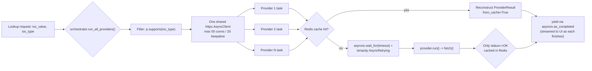

# Providers Reference

Every intelligence source in the platform — real connector or stub — implements the
same `BaseProvider` interface (`backend/app/providers/base.py`) and is registered as a
module-level singleton in `backend/app/providers/registry.py`. The orchestrator
(`backend/app/providers/orchestrator.py`) never imports a concrete provider; it only
calls `BaseProvider.run()`, which is what makes adding a new source a two-line change
(import + append to `_ALL_PROVIDERS`) with no other code touched.

For the overall request flow, correlation, and AI summarization stages that sit
downstream of this fan-out, see [ARCHITECTURE.md](ARCHITECTURE.md). For the IOC type
enum referenced throughout this document, see [DATA_MODEL.md](DATA_MODEL.md).

**Not covered by this document:** the Security Assessment Toolkit
(`backend/app/security_assessment/`) implements the same `ProviderResult` output
shape as every provider below, but its Nmap/DNS/TLS/HTTP-header/hash tools are
deliberately **not** registered in `registry.py` and never run by the automatic
fan-out described here — they're active checks (real traffic to the target itself),
opt-in per investigation, gated by an explicit authorization step. See
[SECURITY_ASSESSMENT_TOOLKIT.md](SECURITY_ASSESSMENT_TOOLKIT.md) for the full writeup.

## How a lookup fans out



`run_all_providers_collected()` is a non-streaming wrapper over the same generator,
used only by callers that need the whole batch before proceeding (the correlation
engine and the AI service, both of which run after every provider has reported back).

## Shared building blocks

| Component | Location | Behavior |
|---|---|---|
| `ProviderCategory` enum | `base.py:21-28` | `THREAT_INTEL`, `SANDBOX`, `PASSIVE_DNS`, `CERTIFICATE_INTEL`, `WHOIS`, `VULNERABILITY`, `OSINT` |
| `ProviderStatus` enum | `base.py:31-38` | `OK`, `ERROR`, `TIMEOUT`, `RATE_LIMITED`, `NOT_CONFIGURED`, `UNSUPPORTED_IOC`, `NO_DATA` |
| `ProviderResult` dataclass | `base.py:41-73` | Normalized envelope every provider returns: `provider_id`, `provider_name`, `category`, `status`, `ioc_value`, `ioc_type`, `data`, `raw`, `source_url`, `error_message`, `latency_ms`, `fetched_at`, `from_cache`. `.to_dict()` serializes enums via `.value`. |
| `BaseProvider.run()` | `base.py:93-153` | Short-circuits to `UNSUPPORTED_IOC` if `not self.supports(ioc_type)`; to `NOT_CONFIGURED` if `requires_key and not configured`. Catches `httpx.HTTPStatusError`: status 429/403/509 -> `RATE_LIMITED` (509 is PhishTank's documented over-limit code), any other status -> `ERROR`. Any other exception -> `ERROR`. |
| Retry/timeout policy | `orchestrator.py:45-58` | Per attempt: `asyncio.wait_for(timeout=settings.provider_timeout_seconds)` (default 20s). Retries only on `httpx.ConnectError`, `httpx.ReadTimeout`, `httpx.PoolTimeout`, via `tenacity.AsyncRetrying(stop_after_attempt(provider_max_retries + 1), wait_exponential(multiplier=0.5, max=4))` (default 2 retries). Individual connectors implement **no** retry logic themselves — this is enforced solely by the orchestrator, per `base.py`'s own docstring. |
| Redis result cache | `core/cache.py:24-39`, used in `orchestrator.py:32-43,80-83` | Key: `provider_cache:{provider_id}:{ioc_type}:{sha256(ioc_value)}` — the IOC value itself is SHA-256-hashed before being placed in the key. Only `status == OK` results are cached, with `EX=settings.provider_cache_ttl_seconds` (default 3600s). |

**Not implemented:** no per-provider `RateLimiter` (the Redis-backed fixed-window
limiter in `core/cache.py`) is instantiated anywhere in `providers/*.py` or
`providers/stubs/*.py`. That class is only used in `api/routes/lookup.py` to rate-limit
lookup *creation* per user (`lookup_rate_limit_max_calls=10` per 60s window), not to
self-throttle any individual connector. There is also no per-provider circuit breaker —
all resilience logic lives in the orchestrator as described above.

---

## VirusTotal

| Field | Value |
|---|---|
| **Provider Name** | VirusTotal |
| **provider_id** | `virustotal` |
| **Purpose** | Multi-engine reputation lookup (public API v3) |
| **Supported IOC Types** | `IPV4`, `IPV6`, `DOMAIN`, `URL`, and all `HASH_TYPES` (`MD5`, `SHA1`, `SHA256`, `SHA512`) |
| **Authentication** | Header `x-apikey`; env var `VIRUSTOTAL_API_KEY` |
| **Free or Paid** | Free tier documented in source docstring: "4 req/min, 500/day". No paid-tier code path found in the connector. |
| **Data Returned** | Multi-engine detection data from the VT v3 API, normalized into `ProviderResult.data` |
| **Failure Behavior** | 404 -> `NO_DATA`; HTTP 429/403/509 -> `RATE_LIMITED` (via `BaseProvider.run`); other HTTP errors -> `ERROR` |
| **Code quirk** | URL IOCs are base64 urlsafe-encoded with trailing `=` stripped to build the `/urls/{id}` endpoint path, per VT's URL-identifier scheme (`virustotal.py:35-38`). |

## AbuseIPDB

| Field | Value |
|---|---|
| **Provider Name** | AbuseIPDB |
| **provider_id** | `abuseipdb` |
| **Purpose** | Crowd-sourced IP abuse reputation |
| **Supported IOC Types** | `IPV4`, `IPV6` |
| **Authentication** | Header `Key` (not `Bearer`/`apikey`); env var `ABUSEIPDB_API_KEY` |
| **Free or Paid** | Free tier documented in source docstring: "v2 API, free tier: 1000 checks/day". No paid-tier code path found in the connector. |
| **Data Returned** | Abuse score, report count, and derived verdict |
| **Failure Behavior** | Empty `payload["data"]` maps to `NO_DATA` (distinct from an HTTP 404) |
| **Code quirk** | Verdict logic (`abuseipdb.py:61-66`): `score > 25` -> `malicious`; `elif total_reports == 0` -> `unknown`; `else` -> `clean`. |

## AlienVault OTX

| Field | Value |
|---|---|
| **Provider Name** | AlienVault OTX |
| **provider_id** | `otx` |
| **Purpose** | Community threat-pulse correlation |
| **Supported IOC Types** | `IPV4`, `IPV6`, `DOMAIN`, `HOSTNAME`, `URL`, plus all `HASH_TYPES` |
| **Authentication** | Header `X-OTX-API-KEY`; env var `OTX_API_KEY` |
| **Free or Paid** | Docstring: "Requires a free OTX API key". |
| **Data Returned** | Pulse count and related pulse metadata |
| **Failure Behavior** | `pulse_count == 0` maps to `NO_DATA` even on an HTTP 200 |
| **Code quirk** | Maps `IOCType` to a URL-path "section" via a `_SECTION_BY_TYPE` dict; all hash types are hardcoded to the `file` section (`otx.py:37-41`). Verdict = `malicious` if `pulse_count > 0` else `unknown` — OTX never returns `clean`. |

## URLhaus

| Field | Value |
|---|---|
| **Provider Name** | URLhaus |
| **provider_id** | `urlhaus` |
| **Purpose** | Malicious URL / malware-hosting-host database (abuse.ch) |
| **Supported IOC Types** | `URL`, `DOMAIN`, `IPV4` |
| **Authentication** | Header `Auth-Key`; env var `ABUSECH_AUTH_KEY` (shared across URLhaus, ThreatFox, MalwareBazaar) |
| **Free or Paid** | Docstring: "now requires a free abuse.ch account Auth-Key". |
| **Data Returned** | Host/URL malware-hosting records |
| **Failure Behavior** | Non-`"ok"` `query_status` delegates to the shared `map_query_status()` helper (see abuse.ch helper below) |
| **Code quirk** | `DOMAIN` and `IPV4` are both routed to the `/host/` endpoint as a "host" lookup; only `URL` uses `/url/` (`urlhaus.py:32-37`). |

## ThreatFox

| Field | Value |
|---|---|
| **Provider Name** | ThreatFox |
| **provider_id** | `threatfox` |
| **Purpose** | IOC-to-malware-family attribution (abuse.ch) |
| **Supported IOC Types** | `IPV4`, `IPV6`, `DOMAIN`, `URL`, `MD5`, `SHA256` (note: only two of the four hash types — not `SHA1`/`SHA512`) |
| **Authentication** | Header `Auth-Key`; env var `ABUSECH_AUTH_KEY` |
| **Free or Paid** | Free abuse.ch account (same key family as URLhaus/MalwareBazaar). |
| **Data Returned** | Matched IOC entries with malware-family attribution |
| **Failure Behavior** | Shared abuse.ch `query_status` mapping (see below) |
| **Code quirk** | An `"ok"` `query_status` with zero entries is explicitly downgraded from `OK` to `NO_DATA` (`threatfox.py:56-60`) — code comment: `"ok" with zero entries is a genuine empty result, not an error`. |

## MalwareBazaar

| Field | Value |
|---|---|
| **Provider Name** | MalwareBazaar |
| **provider_id** | `malwarebazaar` |
| **Purpose** | Malware-sample hash lookup (abuse.ch) |
| **Supported IOC Types** | All `HASH_TYPES` (`MD5`, `SHA1`, `SHA256`, `SHA512`) |
| **Authentication** | Header `Auth-Key`; env var `ABUSECH_AUTH_KEY`; request body `form={"query": "get_info", "hash": ioc_value}` |
| **Free or Paid** | Free abuse.ch account (same key family as URLhaus/ThreatFox). |
| **Data Returned** | Malware sample metadata |
| **Failure Behavior** | Same `"ok"` + empty-entries -> `NO_DATA` override as ThreatFox (`malwarebazaar.py:49-53`) |
| **Code quirk** | Only `entries[0]` is used even if the API returns multiple matching entries (`malwarebazaar.py:66`). |

### Shared abuse.ch helper (`backend/app/providers/abusech.py`)

Used by URLhaus, ThreatFox, and MalwareBazaar. `map_query_status(query_status)` returns
`(ProviderStatus, error_message)`:

| `query_status` value | Mapped status |
|---|---|
| `"ok"` | `OK` |
| `"no_api_key"`, `"invalid_api_key"`, `"unauthorized"` | `ERROR` (`"abuse.ch Auth-Key rejected (query_status=...)"`) |
| anything else | `NO_DATA` |

Rationale (docstring, `abusech.py:5-9`): auth failures must map to `ERROR`, not
`NO_DATA`, because `NO_DATA` is rendered by the UI as "nothing malicious found" — a
misconfigured key must never look like a clean verdict.

## crt.sh

| Field | Value |
|---|---|
| **Provider Name** | crt.sh |
| **provider_id** | `crtsh` |
| **Purpose** | Certificate Transparency log search |
| **Supported IOC Types** | `DOMAIN`, `TLS_CERTIFICATE` |
| **Authentication** | None — `requires_key=False`, `configured=True` always |
| **Free or Paid** | Free community service, no key. |
| **Data Returned** | Up to 25 certificates (`_MAX_CERTIFICATES=25`) |
| **Failure Behavior** | JSON parse failures (`json.JSONDecodeError`/`ValueError`) are explicitly caught and degraded to `NO_DATA` (not raised) with `error_message="crt.sh returned malformed JSON"` |
| **Code quirk** | Docstring explicitly documents crt.sh as "sometimes slow/flaky" and "known to emit malformed JSON" — the malformed-JSON handling exists specifically to work around that (`crtsh.py:8-13,58-73`). |

## NIST NVD

| Field | Value |
|---|---|
| **Provider Name** | NIST NVD |
| **provider_id** | `nvd` |
| **Purpose** | CVE detail and CVSS scoring lookup |
| **Supported IOC Types** | `CVE` |
| **Authentication** | Optional header `apiKey`; env var `NVD_API_KEY` — purely a rate-limit booster, not required for access |
| **Free or Paid** | Free. Docstring: works without a key at ~5 req/30s; with `NVD_API_KEY` set, ~50 req/30s. |
| **Data Returned** | CVE detail, best-available CVSS metric, derived severity |
| **Failure Behavior** | Standard `BaseProvider` HTTP-error handling (no CVE-specific NO_DATA override documented) |
| **Code quirk** | `_best_metric()` prefers CVSS v3.1 over v3.0 over v2, and within a metric list prefers the entry with `type == "Primary"` (`nvd.py:78-91`); severity -> verdict mapping: `CRITICAL`/`HIGH` -> `malicious`, `MEDIUM`/`LOW` -> `suspicious`, else `unknown`. |

## CISA Known Exploited Vulnerabilities (KEV)

| Field | Value |
|---|---|
| **Provider Name** | CISA Known Exploited Vulnerabilities |
| **provider_id** | `cisa_kev` |
| **Purpose** | Confirmed-exploited-in-the-wild CVE catalog |
| **Supported IOC Types** | `CVE` |
| **Authentication** | None — fully free/public |
| **Free or Paid** | Free, public. |
| **Data Returned** | Matched KEV catalog entry |
| **Failure Behavior** | Standard `BaseProvider` HTTP-error handling |
| **Code quirk** | The entire ~1MB catalog is cached in a module-level in-memory dict, refreshed at most once per hour (`_CACHE_TTL_SECONDS=3600`), guarded by an `asyncio.Lock` with a double-check-after-acquire pattern (`cisa_kev.py:20-55`). Any matched entry gets `verdict="malicious"` unconditionally, since presence in KEV means confirmed exploitation. |

## MITRE ATT&CK

| Field | Value |
|---|---|
| **Provider Name** | MITRE ATT&CK |
| **provider_id** | `mitre_attack` |
| **Purpose** | ATT&CK technique lookup from the Enterprise ATT&CK STIX bundle |
| **Supported IOC Types** | `MITRE_TECHNIQUE` |
| **Authentication** | None — free, public STIX bundle |
| **Free or Paid** | Free, public. |
| **Data Returned** | Technique detail from the STIX bundle |
| **Failure Behavior** | Standard `BaseProvider` HTTP-error handling |
| **Code quirk** | Docstring notes the bundle is "~30MB"; uses the same module-level cache + `asyncio.Lock` pattern as CISA KEV (TTL 3600s), but the fetch call overrides the client timeout to an explicit `timeout=60.0` (`mitre_attack.py:61`) since the bundle download can legitimately exceed the orchestrator's default `provider_timeout_seconds`. |

## WHOIS/RDAP

| Field | Value |
|---|---|
| **Provider Name** | WHOIS/RDAP |
| **provider_id** | `whois_rdap` |
| **Purpose** | Domain WHOIS and IP/ASN RDAP registration lookup |
| **Supported IOC Types** | `DOMAIN`, `IPV4`, `IPV6`, `ASN` |
| **Authentication** | None |
| **Free or Paid** | Free. |
| **Data Returned** | WHOIS record (domains) or RDAP record (IPs/ASNs) |
| **Failure Behavior** | Socket failures during the WHOIS call raise real exceptions that map to `TIMEOUT`/`ERROR` rather than being silently swallowed |
| **Code quirk** | `DOMAIN` lookups run the blocking `python-whois` library off the event loop via `asyncio.to_thread`, deliberately passing `ignore_socket_errors=False` — overriding the library's own default of `True` — precisely so socket errors don't get silently absorbed into unparseable text that would otherwise look like a clean `NO_DATA` result. `IPV4`/`IPV6`/`ASN` instead query RDAP against `https://rdap.org`, which bootstraps to whichever Regional Internet Registry actually holds the record. |

---

## Stub Connectors

These implement the identical `BaseProvider` interface and are fully wired into the
registry and orchestrator, but the platform ships without valid credentials for the
ones that require a key. Per the top-level README, "adding a new provider is a
two-line change" — activating these is just a matter of populating the relevant `.env`
variable.

## Hybrid Analysis (Falcon Sandbox) — stub

| Field | Value |
|---|---|
| **Provider Name** | Hybrid Analysis (Falcon Sandbox) |
| **provider_id** | `hybrid_analysis` |
| **Purpose** | Sandbox detonation report lookup |
| **Supported IOC Types** | `SHA256` only |
| **Authentication** | Header `api-key`; env var `HYBRID_ANALYSIS_API_KEY`. Also requires header `user-agent: Falcon Sandbox` (Hybrid Analysis rejects requests without a descriptive user-agent) and `accept: application/json`. |
| **Free or Paid** | Docstring explicitly: "requires a paid/free-tier API key". |
| **Data Returned** | Sandbox summary/overview for a SHA256 sample |
| **Failure Behavior** | Both HTTP 400 and HTTP 404 map to `NO_DATA` |
| **Code quirk** | Documented in the module docstring: the historical `/api/v2/search/hash` endpoint is deprecated and now returns HTTP 410 Gone, so the connector was rewritten against `GET /api/v2/overview/{sha256}/summary` — which only accepts SHA256, which is why `MD5`/`SHA1` support was dropped from `supported_types`. URL support was removed entirely because the documented `/api/v2/search/terms` parameter contract "could not be confirmed against the live API" — every plausible field name tried returned `"Search terms were not given"`. |

## Spamhaus DBL/ZEN — stub

| Field | Value |
|---|---|
| **Provider Name** | Spamhaus DBL/ZEN |
| **provider_id** | `spamhaus` |
| **Purpose** | DNSBL-based IP/domain reputation |
| **Supported IOC Types** | `IPV4`, `DOMAIN` |
| **Authentication** | None — `requires_key=False`, `configured=True` |
| **Free or Paid** | Free public DNSBL, no key. |
| **Data Returned** | Listing reason decoded from a DNSBL return code |
| **Failure Behavior** | Both "listed" and "not listed" outcomes return `ProviderStatus.OK` — never `NO_DATA`/`ERROR` — because a negative DNS lookup is itself a valid, definitive DNSBL answer |
| **Code quirk** | Makes **no HTTP call at all**. Performs a DNS A-record lookup via `loop.getaddrinfo()` against `{reversed-octets}.zen.spamhaus.org` (IPs) or `{domain}.dbl.spamhaus.org` (domains); a returned `127.0.0.x`/`127.0.1.x` address is decoded against hardcoded `_ZEN_CODES`/`_DBL_CODES` tables to build a human-readable listing reason. `socket.gaierror` (NXDOMAIN) is treated as "not listed" -> `verdict="clean"`. |

## PhishTank — stub

| Field | Value |
|---|---|
| **Provider Name** | PhishTank |
| **provider_id** | `phishtank` |
| **Purpose** | Community-verified phishing URL lookup |
| **Supported IOC Types** | `URL` |
| **Authentication** | None required; optional form field `app_key`, env var `PHISHTANK_API_KEY`, sent only if set, purely to raise rate limits |
| **Free or Paid** | Docstring: "free community-sourced phishing URL verification... works without an API key". |
| **Data Returned** | Phishing-verification record from the PhishTank database |
| **Failure Behavior** | `results.get("in_database")` is `False` -> `NO_DATA`. HTTP 509 (PhishTank's documented over-limit code) -> `RATE_LIMITED` via `BaseProvider.run()`. |
| **Code quirk** | Verdict logic (`phishtank.py:59-60`): `valid == True` -> `malicious`; else -> `suspicious` — PhishTank never returns `clean`, since being "in_database" at all implies some level of suspicion even if community-voted not valid. |

## Censys — stub

| Field | Value |
|---|---|
| **Provider Name** | Censys |
| **provider_id** | `censys` |
| **Purpose** | Internet asset / exposure data for an IP |
| **Supported IOC Types** | `IPV4`, `IPV6` |
| **Authentication** | Header `Authorization: Bearer {token}` plus header `X-Organization-ID`; env vars `CENSYS_PERSONAL_ACCESS_TOKEN` and `CENSYS_ORGANIZATION_ID` — **both** must be set for `configured` to be `True` |
| **Free or Paid** | Not verified — requires a Personal Access Token + Organization ID against the Censys Platform API (`platform.censys.io`), implying a registered/paid account, but no explicit free/paid statement exists in code. |
| **Data Returned** | Host asset/exposure data via `GET /v3/global/asset/host/{ip}` |
| **Failure Behavior** | Standard `BaseProvider` HTTP-error handling |
| **Code quirk** | Verdict is hardcoded to `"unknown"` always (`censys.py:76`) — Censys supplies asset/exposure data, not a malicious/clean verdict, unlike every other threat-intel connector in this platform. |

**Note on the `stubs/` naming:** the `.env.example` comment groups Hybrid Analysis,
Censys, and PhishTank under "Paid providers (stub connectors)", but Spamhaus (also in
`stubs/`) requires no key and is always free/configured, and PhishTank itself is
explicitly free/no-key in its own docstring. The directory name `stubs/` does not
consistently mean "paid" — it groups connectors that ship without a working default
credential, not connectors that are inherently paid.

---

## Internet Intelligence Collector (OSINT crawler-as-provider)

| Field | Value |
|---|---|
| **Provider Name** | Internet Intelligence Collector |
| **provider_id** | `internet_intelligence` |
| **Purpose** | Best-effort OSINT crawl across four open-internet sources (GitHub, Reddit, RSS security news, paste-dump search), wrapped behind the standard `BaseProvider` contract so it flows through the same orchestrator, cache, and API surface as every vendor connector |
| **Supported IOC Types** | `DOMAIN`, `IPV4`, `MALWARE_FAMILY`, `THREAT_ACTOR`, `CAMPAIGN`, `CVE`, `FILE_NAME` (raw network atoms like JA3 hashes or mutexes are excluded — free-text search on them is "nearly always noise" per the module docstring) |
| **Authentication** | None — `requires_key=False`, `configured=True`; every underlying source is unauthenticated / best-effort |
| **Free or Paid** | Free — all four underlying sources are unauthenticated. |
| **Data Returned** | Deduplicated `{title, url, snippet, published_at, source}` hits merged from all four crawler sources, each retaining its original source URL for attribution |
| **Failure Behavior** | Individual source failures are tolerated (the module runs all four sources concurrently and continues if one fails) |
| **Code quirk** | Category is `OSINT` (the only provider using that category); it is registered from `app.crawler`, not `app.providers`, and is the 16th and last entry in the registry's `_ALL_PROVIDERS` list. |

The crawler itself uses a separate, non-Redis, process-local `AsyncMinIntervalLimiter`
(`backend/app/crawler/sources/rate_limit.py:17-43`) to self-throttle its GitHub (6.0s
min interval) and Reddit (1.1s min interval) source calls — this is distinct from the
Redis-backed `RateLimiter` in `core/cache.py` and is not shared across worker
processes.

---

## Configuration reference

Every provider credential is read once, centrally, in
`backend/app/core/config.py` via `pydantic-settings`, and mirrored in `.env.example`:

```bash
# --- Free-tier providers (real connectors) ---
VIRUSTOTAL_API_KEY=<your-key-here>
ABUSEIPDB_API_KEY=<your-key-here>
OTX_API_KEY=<your-key-here>
NVD_API_KEY=<your-key-here>            # optional: raises NVD rate limit if set
ABUSECH_AUTH_KEY=<your-key-here>       # shared by URLhaus, ThreatFox, MalwareBazaar

# --- Paid providers (stub connectors -- add key to activate) ---
HYBRID_ANALYSIS_API_KEY=<your-key-here>
CENSYS_PERSONAL_ACCESS_TOKEN=<your-key-here>
CENSYS_ORGANIZATION_ID=<your-org-id-here>
PHISHTANK_API_KEY=<your-key-here>      # optional: raises PhishTank rate limits
```

Provider execution tuning (also in `.env` / `config.py`, defaults shown):

```bash
provider_timeout_seconds=20       # per-attempt asyncio.wait_for timeout
provider_max_retries=2            # tenacity retries on connect/read/pool timeout
provider_cache_ttl_seconds=3600   # Redis TTL for cached OK results
```

See [CONFIGURATION.md](CONFIGURATION.md) for the full environment-variable reference
across the whole platform, and [SECURITY.md](SECURITY.md) for credential-handling
guidance. Never commit real key values — use `<configure securely>` placeholders in
any shared `.env` file, and keep actual secrets out of version control.

## Health endpoint

`GET /providers/health` (prefix `/providers`, gated by `require_permission("lookup:read")`,
`backend/app/api/routes/providers.py:9-11`) returns `get_provider_health()`
(`backend/app/providers/registry.py:53-64`) — a list of, for every registered provider:

```json
{
  "provider_id": "virustotal",
  "provider_name": "VirusTotal",
  "category": "threat_intel",
  "configured": true,
  "requires_key": true,
  "supported_types": ["domain", "ipv4", "ipv6", "md5", "sha1", "sha256", "sha512", "url"]
}
```

`configured` is computed once, at process import time, from `get_settings()` when each
provider's module-level singleton is instantiated. Setting an API key in `.env` after
the backend process has started will not retroactively flip `configured` for that
provider — a process restart is required. See [API_DOCUMENTATION.md](API_DOCUMENTATION.md)
for the full REST/SSE API reference this endpoint is part of.

## All providers at a glance

| provider_id | category | requires_key | configured by default | Notes |
|---|---|---|---|---|
| `virustotal` | threat_intel | true | no (needs `VIRUSTOTAL_API_KEY`) | Free tier: 4 req/min, 500/day |
| `abuseipdb` | threat_intel | true | no (needs `ABUSEIPDB_API_KEY`) | Free tier: 1000 checks/day |
| `otx` | threat_intel | true | no (needs `OTX_API_KEY`) | Free key required |
| `urlhaus` | threat_intel | true | no (needs `ABUSECH_AUTH_KEY`) | Shared abuse.ch key |
| `threatfox` | threat_intel | true | no (needs `ABUSECH_AUTH_KEY`) | Shared abuse.ch key |
| `malwarebazaar` | threat_intel | true | no (needs `ABUSECH_AUTH_KEY`) | Shared abuse.ch key |
| `crtsh` | certificate_intel | false | yes | No key, free community service |
| `nvd` | vulnerability | false | yes | `NVD_API_KEY` optional, boosts rate limit only |
| `cisa_kev` | vulnerability | false | yes | Free, public catalog |
| `mitre_attack` | threat_intel | false | yes | Free, public STIX bundle |
| `whois_rdap` | whois | false | yes | No key |
| `hybrid_analysis` | sandbox | true | no (needs `HYBRID_ANALYSIS_API_KEY`) | Paid/free-tier key per docstring |
| `spamhaus` | threat_intel | false | yes | DNS-only, no HTTP call |
| `phishtank` | threat_intel | false | yes | `PHISHTANK_API_KEY` optional, boosts rate limit only |
| `censys` | passive_dns | true | no (needs PAT + org ID) | Free/paid tier not verified |
| `internet_intelligence` | osint | false | yes | Crawler-as-provider (GitHub/Reddit/RSS/paste search) |

---

## Adding a new provider

1. Subclass `BaseProvider` in a new module under `backend/app/providers/` (or
   `backend/app/providers/stubs/` if it ships without working default credentials).
2. Implement `async def fetch(self, ioc_value, ioc_type, client) -> ProviderResult`.
   Do not implement your own retry/timeout loop — that is the orchestrator's job.
3. Export a module-level singleton instance.
4. Import and append that instance to `_ALL_PROVIDERS` in
   `backend/app/providers/registry.py`.

No other file needs to change — the orchestrator, API routes, and correlation engine
all discover providers exclusively through the registry.
