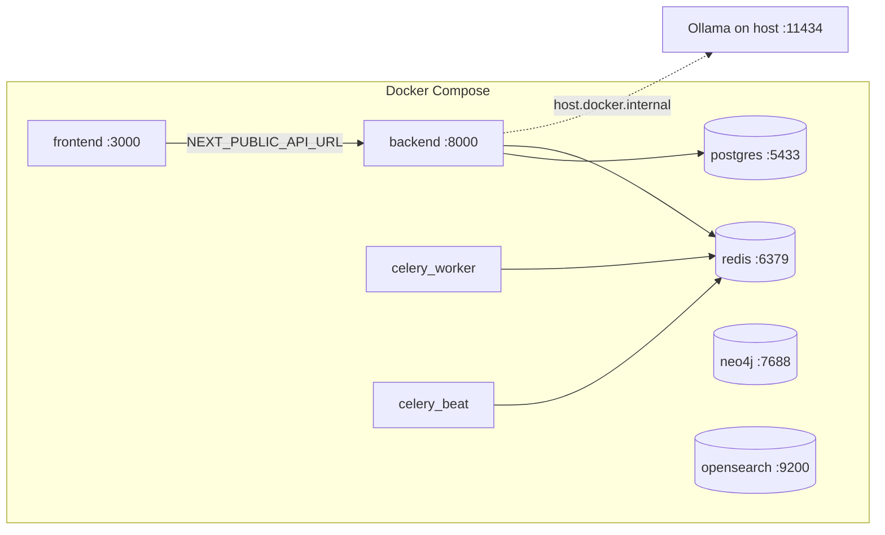
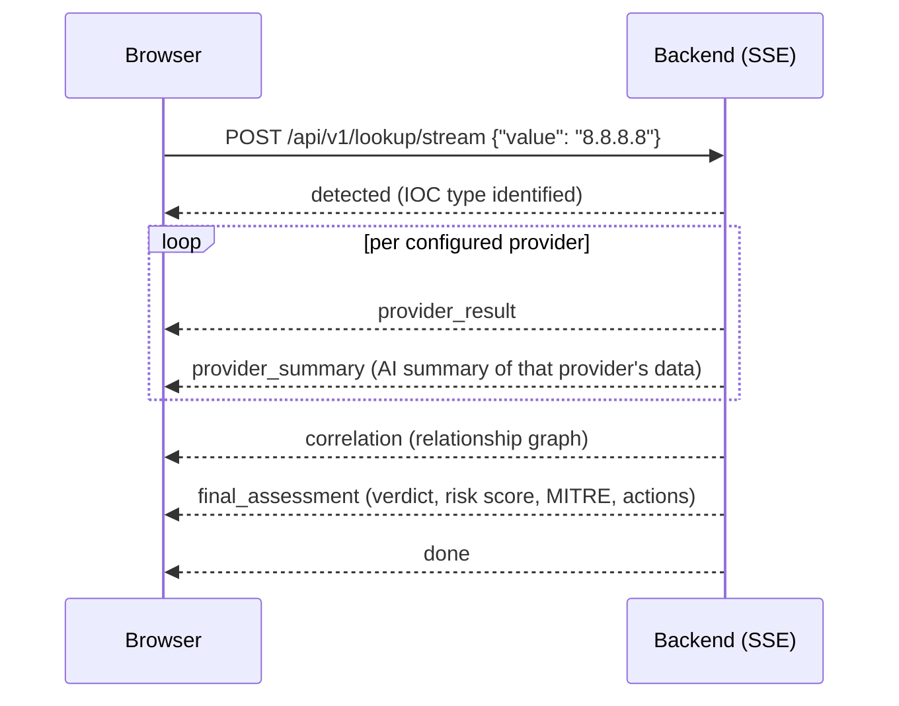

# Quickstart

Zero-to-working walkthrough: bring the stack up, register the first (admin)
account, log in, and run one real IOC investigation.

For everyday analyst workflows once you're running, see
[SOC_ANALYST_GUIDE.md](SOC_ANALYST_GUIDE.md) and
[USER_GUIDE.md](USER_GUIDE.md). This page only covers first boot.

## Prerequisites

| Requirement | Why |
|---|---|
| Docker Desktop (Compose v2) | Runs Postgres, Redis, Neo4j, OpenSearch, the FastAPI backend, Celery worker + beat, and the Next.js frontend — all defined in `docker-compose.yml`. |
| [Ollama](https://ollama.com) installed on the **host** (not in Docker) with a model pulled | Default AI backend (`AI_BACKEND=ollama`). The backend container reaches it at `http://host.docker.internal:11434`. Without it, provider/AI summaries degrade gracefully but the rest of the pipeline still works. |
| A terminal with `curl` (optional) | Used below to confirm health and to demonstrate the register API call. |

Pull a small model that fits your GPU's VRAM before starting the stack:

```bash
ollama pull llama3.2:3b
```

## 1. Configure environment

```bash
cp .env.example .env
```

Edit `.env`:

- `JWT_SECRET_KEY` — replace the placeholder with a long random string (signs access/refresh tokens). Use `<configure securely>` as a reminder if you're not setting it yet.
- `OLLAMA_MODEL` — set to whatever you pulled (`ollama list` to check the exact tag). Leave `AI_BACKEND=ollama` and `OLLAMA_BASE_URL` at their defaults for local Docker Desktop use.
- Provider API keys (`VIRUSTOTAL_API_KEY`, `ABUSEIPDB_API_KEY`, `OTX_API_KEY`, `NVD_API_KEY`, `ABUSECH_AUTH_KEY`) are optional — leave blank and those providers report `not_configured`. See [PROVIDERS.md](PROVIDERS.md).

## 2. Start the stack

```bash
docker compose up --build
```

This starts: `postgres`, `redis`, `neo4j`, `opensearch`, `backend`, `celery_worker`, `celery_beat`, `frontend`.

The backend container's command runs migrations automatically before starting the API — there is no separate migration step:

```
sh -c "alembic upgrade head && uvicorn app.main:app --host 0.0.0.0 --port 8000 --reload"
```

Wait for logs to settle, then confirm the backend is up:

```bash
curl http://localhost:8000/health
```



## 3. Open the app

<http://localhost:3000>

Also available:

| URL | What |
|---|---|
| <http://localhost:3000> | Frontend (Next.js) |
| <http://localhost:8000/docs> | Backend interactive API docs (Swagger UI) |
| <http://localhost:8000/health> | Backend health check |

## 4. Register the first account (becomes admin)

The platform ships with **no seed admin user**. Register via the frontend
`/register` page, or via `curl`:

```bash
curl -X POST http://localhost:8000/api/v1/auth/register \
  -H "Content-Type: application/json" \
  -d '{"email":"you@example.com","password":"<your-password>","full_name":"Your Name"}'
```

The **first user ever created** (i.e. the `users` table is empty at
registration time) is automatically granted the `admin` role. Every
registration attempt after that is rejected with `403 Forbidden` ("Self-
registration is closed. Ask an administrator to create your account from the
Administration page.") — it no longer falls back to creating an `analyst`
account. This is enforced server-side in `backend/app/api/routes/auth.py`;
every account after the first admin must be created by an existing admin from
the Administration page (or `POST /api/v1/admin/users`), which lets the admin
pick the new user's role.

Password rule: the frontend enforces an 8-character minimum client-side only
— the backend itself does not currently validate password length or
strength. See [SECURITY.md](SECURITY.md).

There is no email verification and no password-reset flow in this build —
choose a password you'll remember.

## 5. Log in

Use the frontend `/login` page (email + password), or:

```bash
curl -X POST http://localhost:8000/api/v1/auth/login \
  -H "Content-Type: application/json" \
  -d '{"email":"you@example.com","password":"<your-password>"}'
```

Returns `{ "access_token", "refresh_token", "token_type": "bearer" }`. The
frontend stores both tokens in `localStorage` (`access_token`,
`refresh_token`) and refreshes the access token transparently on a 401.
Access tokens expire in 30 minutes by default (`ACCESS_TOKEN_EXPIRE_MINUTES`);
refresh tokens last 7 days.

## 6. Run one investigation

On the home page, search box placeholder reads *"IP, domain, URL, hash, CVE,
threat actor, YARA rule..."* with example chips you can click:
`8.8.8.8`, `malicious-example.com`, `CVE-2024-3400`, `T1059`.

Use a safe, well-known value for this first run:

```
8.8.8.8
```

Submit it. If you're not logged in, you'll be bounced to `/login` first and
returned to the lookup afterward. Once submitted, the frontend opens a
streaming connection (`POST /api/v1/lookup/stream`) and the page fills in
live as results arrive, in this exact order:



## 7. Reading the results screen (high level)

The lookup page has a main column and a sidebar. As events stream in:

| Area | Fills in when | Shows |
|---|---|---|
| Threat score gauge | `final_assessment` | Overall risk score (0–100), colored by severity. |
| Provider card grid | each `provider_result` / `provider_summary` | One card per provider (VirusTotal, AbuseIPDB, OTX, etc.), raw data plus an AI-written summary per provider. |
| Relationship graph | `correlation` | Force-directed graph of this IOC and everything it correlates with. |
| MITRE matrix | `final_assessment` | ATT&CK techniques implicated, grouped by tactic. |
| Detection rules / Recommended actions | `final_assessment` | Sigma/YARA/Splunk/etc. rule drafts and suggested next steps. |
| Sidebar: Provider progress tracker | streaming | Live count of providers responded vs. expected. |
| Sidebar: Export menu, Add to Basket / Case | always | Investigation actions — see [USER_GUIDE.md](USER_GUIDE.md). |

Once the stream reaches `done`, additional panels unlock: verdict
explanation ("WHY?", "What is this?", false-positive check, etc.), the
evidence panel ("Show Receipts"), pivots, the hunting center, and an
in-page AI copilot you can ask follow-up questions.

Full detail on every panel, what each button does, and how to interpret a
verdict is in [USER_GUIDE.md](USER_GUIDE.md). Analyst workflows (triage,
pivoting, cases, basket) are in [SOC_ANALYST_GUIDE.md](SOC_ANALYST_GUIDE.md).

## Next steps

- [USER_GUIDE.md](USER_GUIDE.md) — full walkthrough of every dashboard panel.
- [SOC_ANALYST_GUIDE.md](SOC_ANALYST_GUIDE.md) — day-to-day analyst workflows (basket, cases, hunting, pivoting).
- [PROVIDERS.md](PROVIDERS.md) — which intelligence providers are wired up, which need API keys, which are stubs.
- [CONFIGURATION.md](CONFIGURATION.md) — every `.env` variable explained.
- [TROUBLESHOOTING.md](TROUBLESHOOTING.md) — Ollama not responding, providers stuck `not_configured`, 401/403s, etc.
