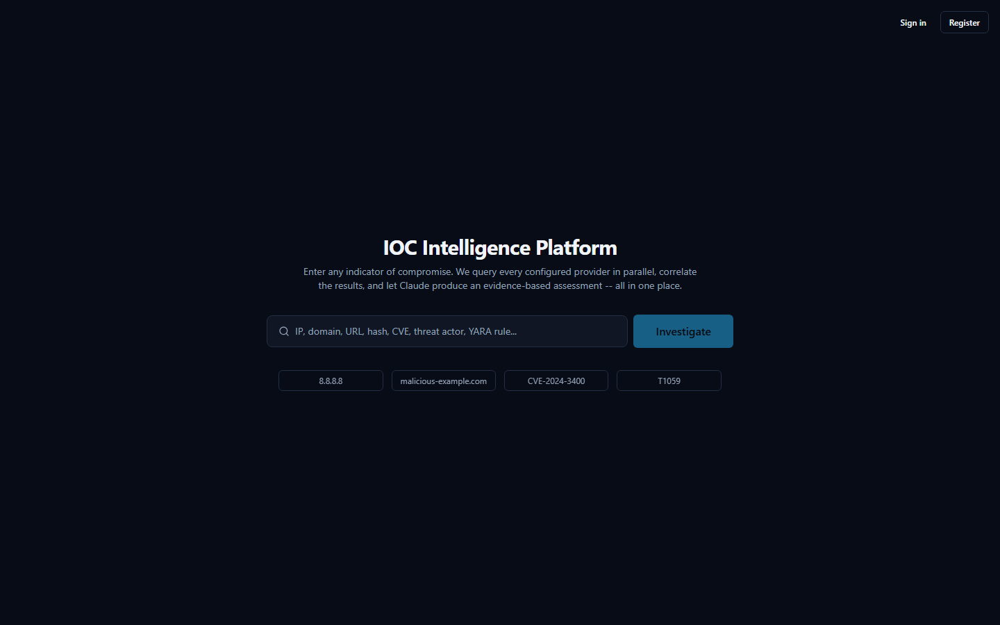
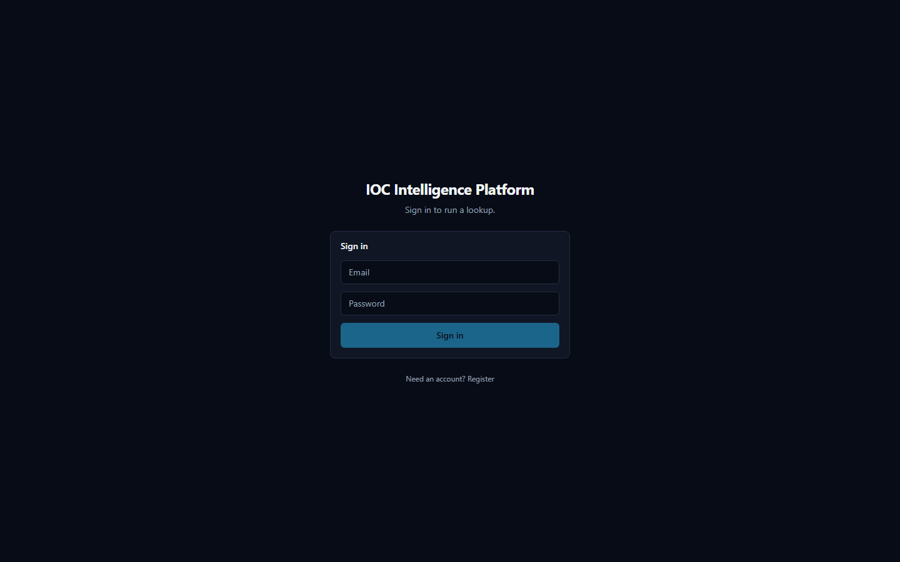
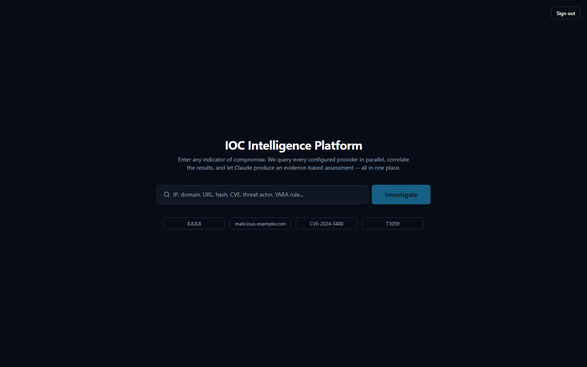
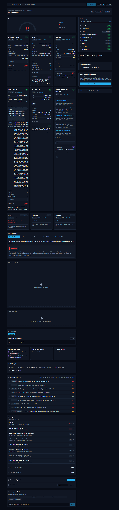
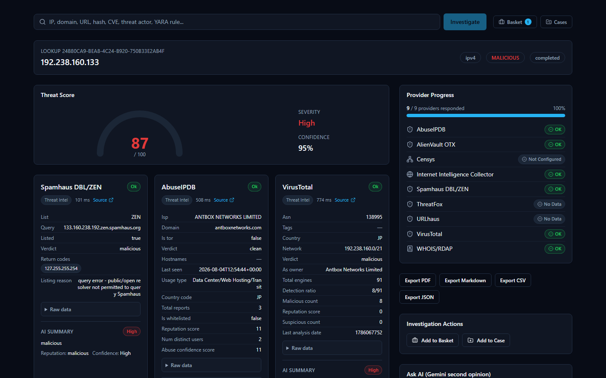
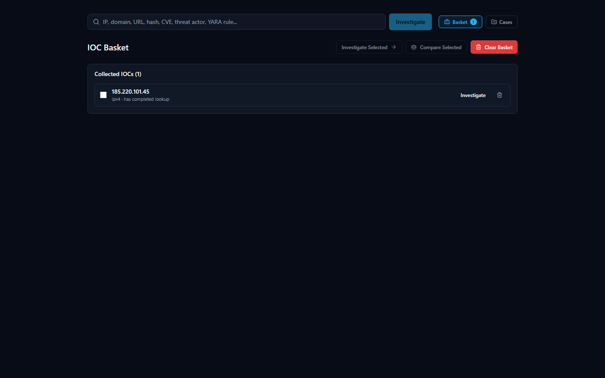
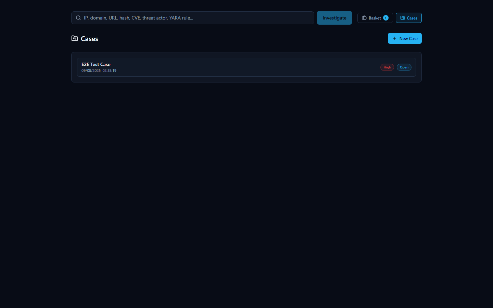
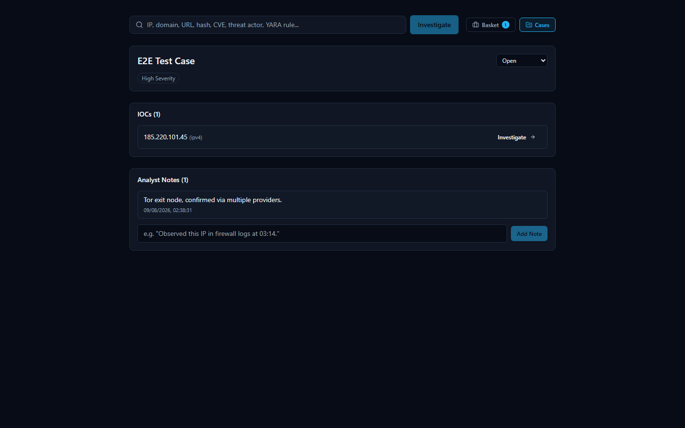
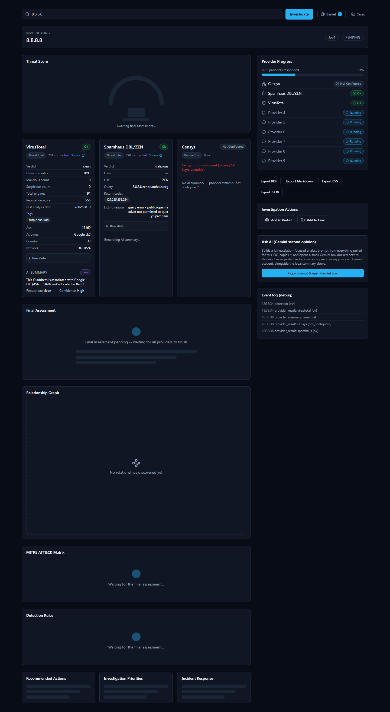

# Screenshots

Real captures from the running platform (`http://localhost:3000`), taken
against a live investigation of `192.238.160.133` (a real historical
lookup already in the database, verdict `malicious`, 14 evidence records)
and a fresh live run against `8.8.8.8`. No mockups — every image below is
a Playwright screenshot of the actual rendered app.

Related: [USER_GUIDE.md](USER_GUIDE.md) explains what every panel shown here
does; [SOC_ANALYST_GUIDE.md](SOC_ANALYST_GUIDE.md) explains how to use them
during a real investigation.

---

## 1. Home page (logged out)

The landing search box. IOC auto-detection handles the input; the four
example chips (`8.8.8.8`, `malicious-example.com`, `CVE-2024-3400`, `T1059`)
are pre-filled suggestions, not live links.

## 2. Login

Plain email/password form (`POST /api/v1/auth/login`). No MFA, no "forgot
password" link — see [SECURITY.md](SECURITY.md) for what authentication
actually implements today.

## 3. Home page (logged in)

Same page, but the top-right corner now shows **Sign out** instead of
**Sign in / Register**.

## 4. Completed lookup — full investigation workspace

The main event: a completed lookup for `192.238.160.133` (verdict
`malicious`, threat score 87/100, confidence 95%). This is the full page,
scrolled through every panel — threat score gauge, per-provider result
cards (Spamhaus, AbuseIPDB, VirusTotal, WHOIS/RDAP, etc.), provider progress
sidebar, and the Investigation Actions / Ask AI panels.

### 4b. Same page, top-of-fold only

The above image is the entire page. Here's just what's visible without
scrolling — this is what an analyst sees first.

## 5. IOC Basket

The analyst's personal scratch space for collecting IOCs across an
investigation before comparing or bulk-investigating them. See
[USER_GUIDE.md](USER_GUIDE.md#5-ioc-basket-basket) for the compare/investigate-all
actions.

## 6. Cases — list view

Team-shared case list (any user with `case:read` sees every case, not just
their own — see [SECURITY.md](SECURITY.md) for the permission model).

## 7. Case detail

A single case: severity badge, status dropdown (`Open` /
`Investigating` / `Contained` / `Resolved` / `False Positive` / `Closed`),
attached IOCs with a one-click **Investigate** shortcut back into the
lookup pipeline, and analyst notes.

## 8. Live investigation in progress

A fresh lookup for `8.8.8.8`, captured mid-stream (3 of 9 providers had
responded when this was taken). This shows what an analyst actually sees
while providers are still reporting back: loading skeletons on
not-yet-arrived provider cards, a live provider-progress list with
per-provider status (`OK`, `Running`, `Not Configured`), and the raw SSE
event log used for debugging. Censys shows `Not Configured` here because no
Censys organization ID is set in this environment — see
[PROVIDERS.md](PROVIDERS.md#censys--stub).

---

## Pages not shown here

The full frontend route list is `/`, `/login`, `/register`, `/lookup/new`,
`/lookup/[id]`, `/basket`, `/cases`, `/cases/[id]` — every one of them is
captured above except `/register` (a plain sign-up form, functionally
identical in layout to the login page in #2). There is no Threat Actor,
Malware, Campaign, Watchlist, or Admin page to screenshot because none
exist — see [DOCUMENTATION_GAPS.md](DOCUMENTATION_GAPS.md).

## Regenerating these screenshots

These were captured with Playwright against a locally running stack
(`docker compose up`) logged in as a real test account, navigating to each
real route and calling `page.screenshot()`. If the UI changes and these go
stale, the same approach works: spin up a headless Chromium, log in via the
real `/login` form, navigate to each route, screenshot. There is no
committed automation script for this in the repo (it was a one-off scratch
script, not part of the codebase) — see
[TESTING.md](TESTING.md) for the project's actual (non-screenshot)
automated test suite.
