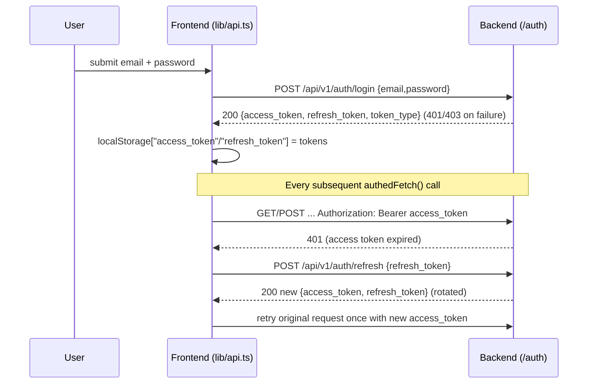

# Security

This document describes the actual, implemented security model of the IOC
Intelligence Platform: authentication, authorization, rate limiting, CORS,
and secrets handling — plus a factual list of gaps an operator must address
before running this in production. It is derived from the backend source
(`backend/app/auth/`, `backend/app/models/user.py`, `backend/app/core/config.py`,
`backend/app/main.py`) and the frontend token-handling code
(`frontend/lib/api.ts`, `frontend/app/login/`, `frontend/app/register/`).

For endpoint-by-endpoint request/response shapes, see
[API_DOCUMENTATION.md](API_DOCUMENTATION.md). For environment variable
defaults and how `.env` is loaded, see [CONFIGURATION.md](CONFIGURATION.md).
For container/network layout, see [DEPLOYMENT.md](DEPLOYMENT.md).

## 1. Authentication (JWT)

Auth endpoints are mounted under `/api/v1/auth` (`backend/app/api/routes/auth.py`,
registered in `backend/app/main.py`):

| Method | Path | Auth required | Notes |
|---|---|---|---|
| POST | `/api/v1/auth/register` | No | Bootstrap-only: succeeds as `admin` only when the `users` table is empty; every later attempt is rejected (`403`) |
| POST | `/api/v1/auth/login` | No | Returns access + refresh token pair |
| POST | `/api/v1/auth/refresh` | No (bearer refresh token in body) | Rotates both tokens |
| GET | `/api/v1/auth/me` | Yes | Returns current user, including the real stored `full_name` |

### Token mechanics

- Library: `python-jose[cryptography]` for signing/verification, `passlib` +
  `bcrypt` for password hashing (`CryptContext(schemes=["bcrypt"])`).
- Every token payload: `{"sub": <email>, "role": <role value>, "token_version": <int>, "type": "access"|"refresh", "iat": <issued>, "exp": <expiry>}`.
- Signed with a single symmetric secret (`JWT_SECRET_KEY`) using `HS256` (default `jwt_algorithm`).
- `decode_token()` swallows all `JWTError`s (expired, bad signature, malformed) and returns `None`; callers treat `None` as "unauthenticated" rather than raising directly.
- `token_version` (`backend/app/models/user.py`) is how an administrator-initiated password reset
  (`POST /api/v1/admin/users/{id}/reset-password`) forces an immediate re-login: the reset bumps
  the user's `token_version` column, and both `get_current_user()` and `POST /auth/refresh` reject
  (`401`) any token whose embedded `token_version` no longer matches — closing the gap a stateless
  JWT would otherwise have (an already-issued token staying valid under the OLD password until it
  naturally expires). A token issued before this column existed carries no such claim and is
  treated as version `0`, matching every user's initial value, so this introduced no forced
  logouts on deploy.

| Setting | Default | Meaning |
|---|---|---|
| `jwt_algorithm` | `HS256` | Signing algorithm |
| `access_token_expire_minutes` | `30` | Access token lifetime |
| `refresh_token_expire_days` | `7` | Refresh token lifetime |

### Login / refresh flow



Implementation details worth knowing:

- `require_permission()` failures and any 401 use `HTTPBearer(auto_error=False)`,
  chosen deliberately over `OAuth2PasswordBearer` because `/auth/login` takes a
  JSON body, not OAuth2 form-encoded credentials (see code comment in
  `backend/app/auth/rbac.py`).
- The frontend stores tokens in `localStorage` under the literal keys
  `access_token` and `refresh_token` — not cookies. This means tokens are
  reachable by any JS running on the page (standard XSS-exposure tradeoff of
  localStorage vs. httpOnly cookies).
- `authedFetch()` in `frontend/lib/api.ts` retries a request **exactly once**
  after a transparent refresh-on-401.
- The SSE lookup stream (`streamLookup()`) uses `fetch` with a manual stream
  reader instead of `EventSource`, specifically because `EventSource` cannot
  send an `Authorization` header; it has its own separate 401-retry-once logic.
- `isLoggedIn()` on the frontend only checks whether `access_token` exists in
  `localStorage` — it does **not** validate signature or expiry client-side.

## 2. Role-Based Access Control (RBAC)

Three roles, defined in `backend/app/models/user.py`:

```python
class Role(str, enum.Enum):
    ADMIN = "admin"
    ANALYST = "analyst"
    VIEWER = "viewer"
```

Every protected route depends on `require_permission("<permission-string>")`
(`backend/app/auth/rbac.py`), which checks the current user's role against a
static `ROLE_PERMISSIONS` dict and raises `403` with
`detail="Role '<role>' lacks permission '<permission>'"` if absent.

### Permission matrix (verbatim from `ROLE_PERMISSIONS`)

| Permission | Admin | Analyst | Viewer |
|---|:---:|:---:|:---:|
| `lookup:create` | ✅ | ✅ | ❌ |
| `lookup:read` | ✅ | ✅ | ✅ |
| `lookup:export` | ✅ | ✅ | ❌ |
| `provider:manage` | ✅ | ❌ | ❌ |
| `user:manage` | ✅ | ❌ | ❌ |
| `audit:read` | ✅ | ❌ | ❌ |
| `evidence:read` | ✅ | ✅ | ✅ |
| `analysis:generate` | ✅ | ✅ | ❌ |
| `hunting:generate` | ✅ | ✅ | ❌ |
| `copilot:query` | ✅ | ✅ | ❌ |
| `basket:manage` | ✅ | ✅ | ❌ |
| `case:create` | ✅ | ✅ | ❌ |
| `case:read` | ✅ | ✅ | ✅ |
| `case:write` | ✅ | ✅ | ❌ |
| `case:close` | ✅ | ✅ | ❌ |
| `security_assessment:create` | ✅ | ✅ | ❌ |
| `security_assessment:read` | ✅ | ✅ | ✅ |

Admin has all 17 permissions. Analyst has 14 (everything except
`provider:manage`, `user:manage`, `audit:read`). Viewer has 4 (read-only:
`lookup:read`, `evidence:read`, `case:read`, `security_assessment:read`).

`security_assessment:create` (`ADMIN`/`ANALYST` — the same tier as `lookup:create`, since it sends
real active-check traffic to a real target) and `security_assessment:read` (`ADMIN`/`ANALYST`/
`VIEWER` — the same tier as `lookup:read`) gate every route in `app/api/routes/security_assessment.py`.
See [SECURITY_ASSESSMENT_TOOLKIT.md](SECURITY_ASSESSMENT_TOOLKIT.md) for the full module writeup,
including the explicit list of capabilities this module deliberately does NOT implement (exploit
execution, credential attacks, malware/payload delivery, stealth/evasion, arbitrary command
construction, automatic/silent scanning) — restated there so a reviewer never mistakes an
intentional boundary for an unfinished feature.

`provider:manage`, `user:manage`, and `audit:read` are all admin-only permissions that gate real
routes: `provider:manage` gates `runtime.py` (runtime provider/AI configuration), `user:manage`
gates every route in `admin.py` (full user CRUD, enable/disable, password reset — the
multi-admin console's backend), and `audit:read` gates `GET /runtime/audit-log`, which carries
every `user.*`/`auth.*` audit event `admin.py` writes in addition to provider/AI configuration
changes — one shared, append-only table (`config_audit_log`), never a credential or password
value. See [API_DOCUMENTATION.md](API_DOCUMENTATION.md)'s §3.5 for the full admin route reference.

### Route → permission reference

| Route file | Permissions enforced |
|---|---|
| `lookup.py` | `lookup:create`, `lookup:read` (×2) |
| `providers.py` | `lookup:read` (on `/providers/health`) |
| `analysis.py` | `evidence:read`, `analysis:generate` (×7), `copilot:query` |
| `hunting.py` | `hunting:generate` (×2) |
| `pivot.py` | `lookup:read` |
| `basket.py` | `basket:manage` (×5) |
| `cases.py` | `case:read` (×2), `case:create`, `case:write` (×4), `case:close` |
| `runtime.py` | `provider:manage` (×11), `lookup:read` (on `/runtime/ai-active` GET), `audit:read` (on `/runtime/audit-log`) |
| `admin.py` | `user:manage` (×7 — list/stats/roles/create/update/set-active/reset-password) |
| `security_assessment.py` | `security_assessment:read` (×3 — profiles/tool-health/list-runs/get-run), `security_assessment:create` (×1 — run) |
| `auth.py` | none (register/login/refresh are unauthenticated; `/me` requires only a valid access token, no specific permission) |

### Multi-admin support and last-administrator protection

Administrators are ordinary database-backed `User` rows with `role=ADMIN` — there is no separate
"the admin account" concept, no hardcoded admin username, and no limit on how many active admins
can exist. `POST /api/v1/admin/users` lets any existing admin create another admin directly; the
public `/auth/register` bootstrap path (first-user-becomes-admin) exists only so a fresh install
never requires a manual database edit to get its first administrator — it closes itself (`403`
on every subsequent attempt) the instant that first user exists, so every account after that is
deliberately created by an admin, with its role picked up front.

Two protections stop an admin action from ever leaving the platform with zero administrators:

- **Self-role-change is blocked** (`400`): an admin can promote/demote any *other* user, but never
  their own role — this exists purely to prevent an accidental self-lockout mid-session (role
  changes take effect immediately, with no re-login required — see below), not as a security
  boundary in itself.
- **Last-admin protection is race-safe** (`409`), not just a check-then-act: both the
  role-demotion path and the disable path take a `SELECT ... FOR UPDATE` lock on **every**
  `ADMIN`-role row before counting how many would remain active. This matters because a bare
  lock on only the request's own target row would let two concurrent requests — one disabling
  admin A, the other disabling admin B, when only A and B are active — both succeed (each sees
  the *other* still active) and leave zero admins. Locking the whole admin set serializes the
  second request behind the first, so it correctly re-evaluates against the post-commit state
  and is rejected.

### Immediate effect of role/disable/password changes — no session-cache to invalidate

`get_current_user()` re-reads `role` and `is_active` from the database on **every** request; it
never trusts the JWT's embedded `role` claim for authorization. This means a role change or an
account disable takes effect on the very next request with the user's existing, still-unexpired
token — no server-side session table, no revocation list, and no forced re-login needed for
either case. Password resets are the one exception that genuinely needs new machinery: changing
`hashed_password` alone doesn't invalidate an already-issued JWT (JWTs are stateless — signature
and expiry only), so `token_version` (above) exists specifically to close that gap.

## 3. Rate Limiting

There is **one** rate limiter in the codebase, and it applies to **one**
endpoint: `POST /api/v1/lookup/stream` (`backend/app/api/routes/lookup.py`).

- Implementation: fixed-window counter in Redis (`backend/app/core/cache.py`,
  `RateLimiter` class), keyed as `rate_limit:lookup_create:<user_id>` — scoped
  per authenticated user, enforced across all backend workers (not per-process).
- Rationale (from code comment): each lookup fans out to every provider plus
  the crawler plus multiple AI calls, so this bounds cost/load per user.
- Exceeding the limit returns `429` with a descriptive `detail` message.

| Setting | Default | Meaning |
|---|---|---|
| `lookup_rate_limit_max_calls` | `10` | Max lookups per window |
| `lookup_rate_limit_window_seconds` | `60` | Window length, seconds |

**NOT IMPLEMENTED**: no rate limiting or account-lockout exists on
`/auth/login` or `/auth/register` — repeated failed login attempts are not
throttled or locked out anywhere in the code.

## 4. CORS

Configured once, in `backend/app/main.py`, as a private-network-shaped
regex rather than a fixed origin list:

```python
PRIVATE_NETWORK_ORIGIN_REGEX = (
    r"^http://("
    r"localhost"
    r"|127\.0\.0\.1"
    r"|10\.\d{1,3}\.\d{1,3}\.\d{1,3}"
    r"|172\.(?:1[6-9]|2\d|3[01])\.\d{1,3}\.\d{1,3}"
    r"|192\.168\.\d{1,3}\.\d{1,3}"
    r")(:\d+)?$"
)

app.add_middleware(
    CORSMiddleware,
    allow_origins=[],
    allow_origin_regex=PRIVATE_NETWORK_ORIGIN_REGEX,
    allow_credentials=True,
    allow_methods=["*"],
    allow_headers=["*"],
)
```

- Any origin that is `localhost`, `127.0.0.1`, or an RFC 1918 private IP
  (`10.x.x.x`, `172.16-31.x.x`, `192.168.x.x`), on any port, over plain
  `http://` (this app terminates no TLS of its own), is allowed. This is
  what makes the platform's LAN-access feature work: a browser on another
  device on the same network, reached via the host's real LAN IP, is a
  private-network origin and is therefore permitted.
- This relaxes only the browser's same-origin policy for these hosts — it
  is **not** the platform's real authorization boundary. That boundary is
  JWT auth (`app/auth/rbac.py`): a request from a matching origin still
  needs a valid bearer token for every protected route. `settings.debug` is
  no longer read anywhere in the backend as a result of this change (it was
  previously the sole gate on the old, single-origin CORS policy).
- There is still no `CORS_ORIGINS` environment variable — the private-
  network policy is a fixed, code-level rule, not something that needs
  per-deployment configuration. A deployment that genuinely needs a
  non-private, non-localhost origin allowed (e.g. a real domain behind a
  reverse proxy) would need a code change to add it.

## 5. Secrets Handling

Settings are loaded via `pydantic-settings` (`backend/app/core/config.py`),
reading from a `.env` file (`env_file=".env"`) and/or process environment
variables. `.env` is listed in `.gitignore` (`.env`, `.env.*`, with
`!.env.example` explicitly un-ignored so the template stays tracked). Never
commit a real `.env`; use `.env.example` as the template and fill in real
values only in your local/deployed `.env`.

Env var **names** referencing credentials/secrets (values intentionally
omitted — see `.env.example` for the full template):

| Category | Env var names |
|---|---|
| JWT signing | `JWT_SECRET_KEY` |
| Database | `DATABASE_URL` (embeds Postgres credentials) |
| Graph DB | `NEO4J_USER`, `NEO4J_PASSWORD` |
| AI backend — Bedrock | `AWS_ACCESS_KEY_ID`, `AWS_SECRET_ACCESS_KEY`, `BEDROCK_API_KEY` |
| AI backend — Gemini | `GEMINI_API_KEY` |
| AI backend — Anthropic direct | `ANTHROPIC_API_KEY` |
| Threat-intel providers | `VIRUSTOTAL_API_KEY`, `ABUSEIPDB_API_KEY`, `OTX_API_KEY`, `NVD_API_KEY`, `ABUSECH_AUTH_KEY` |
| Stub/paid providers | `HYBRID_ANALYSIS_API_KEY`, `CENSYS_PERSONAL_ACCESS_TOKEN`, `CENSYS_ORGANIZATION_ID`, `PHISHTANK_API_KEY` |

Use `<configure securely>` as a placeholder in any shared `.env` template or
secrets manager entry — never write a real value into version control or
documentation.

## 6. Known Limitations

These are factual gaps identified in the current source. They are framed as
things to address before production use, not defects introduced carelessly —
this is a threat-intel workbench, and the auth model is intentionally minimal.

- **Default JWT secret in code**: `jwt_secret_key` defaults to the literal
  string `"change-me-in-production"` (`backend/app/core/config.py`) if
  `JWT_SECRET_KEY` is not set. If this default ships to a real deployment,
  anyone can forge valid access/refresh tokens for any user/role. **Action:**
  always set a long, random `JWT_SECRET_KEY` in `.env` before any
  non-local deployment.
- **No self-service "log out everywhere"**: a user cannot themselves revoke their own
  other-device sessions — `token_version` (§1) is only ever bumped by an *administrator's*
  password reset (`POST /api/v1/admin/users/{id}/reset-password`), not by any self-service
  action. A refresh token an attacker has stolen (but the legitimate user hasn't otherwise
  triggered a reset for) remains valid and reusable until it naturally expires
  (`refresh_token_expire_days`, default 7 days); client-side `logout()` only clears
  `localStorage` and does not invalidate the token server-side.
- **No login rate limiting / brute-force protection**: `/auth/login` and
  `/auth/register` have no per-IP or per-account throttling or lockout.
- **No MFA/2FA**: no TOTP, SMS, or other second factor exists anywhere in the
  backend or frontend.
- **No self-service password reset / account recovery**: no forgot-password endpoint,
  reset-token field, or unauthenticated recovery UI exists. A user locked out of their own
  account needs an *administrator* to reset their password via
  `POST /api/v1/admin/users/{id}/reset-password` (§2) — there is still no path that doesn't
  require another human with an admin account.
- **No email verification**: the `User` model has no verified/unverified
  state; any syntactically valid email is accepted at registration.
- **CORS is a fixed private-network-vs-public policy, not per-deployment
  configurable**: any `localhost`/loopback/RFC 1918 private-IP origin is
  allowed on any port; anything else (a real public domain behind a
  reverse proxy, for instance) is not, and adding one requires a code
  change to `PRIVATE_NETWORK_ORIGIN_REGEX` in `backend/app/main.py` rather
  than an environment variable.

## Related Documentation

- [API_DOCUMENTATION.md](API_DOCUMENTATION.md) — full endpoint reference
- [CONFIGURATION.md](CONFIGURATION.md) — environment variables and defaults
- [DEPLOYMENT.md](DEPLOYMENT.md) — docker-compose / network topology
- [ADMIN_GUIDE.md](ADMIN_GUIDE.md) — operational guidance for administrators
- [SECURITY_ASSESSMENT_TOOLKIT.md](SECURITY_ASSESSMENT_TOOLKIT.md) — active-check tools, profiles, and scope boundaries
