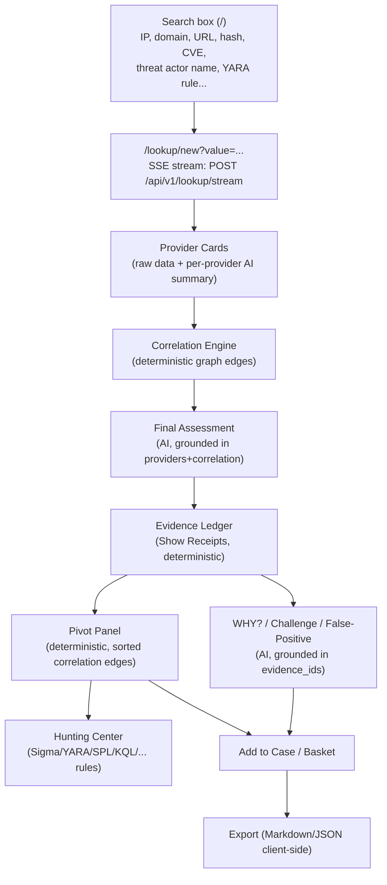

# SOC Analyst Guide

A practical, end-to-end SOP for investigating an indicator of compromise
(IOC) in the platform using only features that actually exist in the
codebase today. For API/route details see [API.md](API.md); for system
design see [ARCHITECTURE.md](ARCHITECTURE.md).

> Scope note: this platform has **no dedicated Threat Actor, Malware
> Family, or Campaign pages**. Attribution data (actor/family/campaign
> names) surfaces only *inside* a lookup's provider cards, evidence ledger,
> and correlation graph — there is nothing to browse under `/actors`,
> `/malware`, or `/campaigns` because those routes/pages do not exist.

---

## 1. The investigation loop, at a glance



Everything left of "Export" is real and working. The single gap is noted in
[Step 9](#9-export-what-works-and-what-does-not).

---

## 2. Step 1 — Submit an IOC

1. Sign in at `/login` (or `/register` on a brand-new install — the **first
   account ever created becomes `admin`**; once that admin exists, later
   registration attempts are rejected with `403` and an admin must create
   your account from the Administration page).
2. From the home page (`/`), type a value into the search box. Supported
   example inputs shown as chips: `8.8.8.8`, `malicious-example.com`,
   `CVE-2024-3400`, `T1059`.
3. Submitting navigates to `/lookup/new?value=<value>`, which opens a
   Server-Sent Events (SSE) stream:

```
POST /api/v1/lookup/stream
Authorization: Bearer <access_token>
Content-Type: application/json

{ "value": "8.8.8.8" }
```

   Requires permission `lookup:create`. Rate-limited per user to **10 calls
   per 60 seconds** (defaults `lookup_rate_limit_max_calls=10`,
   `lookup_rate_limit_window_seconds=60`) — a `429` means you've hit the
   limit, not an error in your input.

4. If the platform cannot classify your input, it returns `422 "Could not
   determine IOC type; pass ioc_type_hint."` — retry with an explicit
   `ioc_type_hint` (one of the `IOCType` enum values, e.g. `ipv4`, `domain`,
   `sha256`, `cve`, `threat_actor`).

The SSE event sequence, in order, is always:

```
detected → N × provider_result → N × provider_summary → correlation → final_assessment → done
```

(or a single `error` event on failure). The UI's "Event log" debug card in
the sidebar shows this raw stream if you need to see exactly what arrived
and when.

Re-visiting a completed lookup later via `/lookup/{id}` re-fetches the
same data with a plain `GET /api/v1/lookup/{id}` (no SSE) — but note that
endpoint does **not** return correlation edges, so the Relationship Graph
on that page is always empty; only the original `/lookup/new` stream view
shows the live graph payload.

---

## 3. Step 2 — Read the provider cards

Each `provider_result` SSE event renders as a card (`ProviderCardGrid` /
`ProviderCard`). Cards with `status: "ok"` sort first. Each card shows:

- The provider's **raw returned data** (fields rendered generically;
  small arrays as pills, large arrays comma-joined, nested objects behind
  a collapsible "Raw data" JSON dump).
- An **AI summary** (`ProviderSummary`, one per provider, generated
  independently per provider and grounded *only* in that provider's own
  payload — never in another provider's data): `what_it_knows`,
  `reputation` (`malicious | suspicious | clean | unknown | no data`),
  `threat_level` (`none | low | medium | high | critical`), `confidence`
  (`low | medium | high`), plus `interesting_findings`, `relationships`,
  `unique_observations`, and optional `caveats`.
- Non-`ok` providers show "No AI summary" — a failed/errored provider
  contributes **zero** correlation nodes/edges and zero evidence.

Use `GET /api/v1/providers/health` (permission `lookup:read`) if a
provider looks suspiciously absent — see [PROVIDERS.md](PROVIDERS.md) for
the provider roster.

---

## 4. Step 3 — Correlation graph (deterministic)

After every provider has responded, the backend runs a **pure, no-I/O**
correlation function once (`app/correlation/engine.py`) over all `status:
ok` provider results and streams a single `correlation` event containing
`nodes` and `edges`. This is rendered as `RelationshipGraph` (force-graph,
with an accessible "View as list" table toggle).

Key mechanics to know when judging an edge's strength:

| Concept | Mechanic |
|---|---|
| Base confidence | Per-field defaults, e.g. `resolved_ips`/`resolved_domains`/`asn` = 0.9, `related_urls`/`related_hashes`/`cves` = 0.8, `malware_families`/`threat_actors`/`campaigns` = 0.5 |
| Corroboration bonus | +0.15 per **additional distinct provider** asserting the exact same (source, target, relationship) edge, capped at 1.0 |
| Provenance | Comma-separated list of provider IDs that asserted the edge — this is what the corroboration count is derived from |

An edge with `provenance` listing 3 providers is materially stronger
evidence than one with a single provider, even if their raw confidence
numbers look similar — check provenance, not just the confidence percent.

Correlation edges are persisted to Postgres (`correlation_edges` table) so
the [Pivot Panel](#6-step-5--pivot-dont-re-search-manually) and case/hunt
tooling can rebuild the graph after the stream ends, **without** re-running
correlation. (A Neo4j mirror of this graph is referenced in code comments
as an intent but is **NOT IMPLEMENTED** — there is no Neo4j driver call
anywhere in the codebase; Postgres is the only real store for edges.)

---

## 5. Step 4 — Final Assessment: Threat Score vs Confidence Score vs Evidence Quality

The `final_assessment` SSE event carries a `FinalAssessment` object,
including a `risk: RiskAssessment` block. **All three of these numbers are
0–100 scales, not 0–1 probabilities** — the schema explicitly rejects and
auto-rescales a value under 1 (a defensive fix for local models that
default to 0–1 despite instructions). Do not confuse them:

| Field | What it actually measures | Where in UI |
|---|---|---|
| `overall_risk_score` (0–100) | **Threat Score.** How dangerous the AI judges this IOC to be, given everything it saw. Higher = more dangerous. | Threat Score Gauge (top of page); "Risk & Verdict" tab in Final Assessment |
| `confidence_score` (0–100) | **Confidence Score.** How confident the AI is *in its own assessment* — a measure of certainty, independent of how bad the IOC is. A high threat score with a low confidence score means "probably bad, but the evidence is thin." | "Risk & Verdict" tab |
| `malicious_probability` (0–100) | The AI's estimated probability this IOC is malicious specifically (distinct from severity). | "Risk & Verdict" tab |
| `severity` | `none \| low \| medium \| high \| critical` | Risk & Verdict tab |
| `reputation` | `malicious \| suspicious \| clean \| unknown \| no data` | Risk & Verdict tab |
| `analyst_confidence` | `low \| medium \| high` — a categorical companion to `confidence_score` | Risk & Verdict tab |

**"Evidence Quality" is not a single field the AI emits** — there is no
`evidence_quality` score in the schema. Judge it yourself from the
**Evidence Ledger** (next section): how many evidence records exist, how
many distinct providers corroborate each claim, and each record's own
`confidence` (0–100). Treat `confidence_score` as the AI's self-reported
certainty, and the evidence ledger's per-record confidence + corroboration
counts as the *actual, auditable* evidence quality.

`final_verdict` (`highly_malicious | malicious | suspicious | unknown |
likely_benign | benign | scanner | tor_exit_node | vpn | cdn |
cloud_infrastructure | dormant_infrastructure`) is validated server-side to
not flatly contradict `malicious_probability` (e.g. a `malicious` verdict
with probability < 30 is rejected and the AI call is retried/degraded) —
so if you see a malicious verdict on this platform, the probability number
backing it was at least self-consistent at generation time.

The Final Assessment panel has 5 tabs: **Executive Summary**, **Technical
Summary**, **Threat Assessment** (with `agreeing_providers` /
`disagreeing_providers` pill lists and a numbered `supporting_evidence`
list), **Relationships**, **Risk & Verdict**.

---

## 6. Step 5 — Evidence Ledger and "Show Receipts"

The Evidence tab (`EvidencePanel`, backed by `GET
/api/v1/lookup/{id}/analysis/evidence`, permission `evidence:read`) is
**deterministically built** by `app/evidence/builder.py` — "No AI involved
in this endpoint." Treat it as the audit trail underneath every AI claim.

Every evidence record has an `evidence_type`, one of:

```
detection | reputation | relationship | malware_association |
threat_actor_association | campaign_association | mitre_technique |
infrastructure | other
```

Two sources populate the ledger:

1. **Per-provider records** — one per `ok` provider result: `detection`
   (if reputation was `unknown`/`no data`) or `reputation` (otherwise),
   plus one `other` record per `interesting_finding` the provider's AI
   summary surfaced.
2. **Per-correlation-edge records** — one per correlation edge, confidence
   = `edge.confidence × 100` (converted to the 0–100 evidence scale).
   `source_label` reads `"Correlation Engine (corroborated)"` when more
   than one provider asserted that edge, otherwise the single provider's
   ID, or plain `"Correlation Engine"` if provenance is empty.

**"Show Receipts" links** (`ShowReceiptsLink`) appear next to AI-generated
claims throughout the UI. Clicking one scrolls to and highlights the exact
evidence rows an AI answer cited. If a claim has no receipts, the link
reads *"No supporting evidence cited"* in italics — treat any AI claim
with zero receipts as unverified, not as fact.

### The grounding mechanism (why you can trust a citation)

This is the core anti-hallucination control and is worth understanding
precisely (`app/ai/analysis_service.py`):

1. Every AI explanation endpoint below is prompted with the real,
   numbered evidence ledger (`[id=<uuid>] (type, confidence=NN) label:
   claim`) and instructed: *"Every reason you give MUST cite the
   evidence_ids of the specific evidence records... NEVER invent an
   evidence_id that isn't in the ledger."*
2. After the AI responds, the backend recursively walks the validated
   response and **strips any `evidence_id` that does not exist in the
   real ledger** (`_strip_invalid_evidence_ids`) — a fabricated ID is
   silently removed before you ever see it, not flagged, just deleted
   from the citation list.
3. If the AI call fails outright, the endpoint returns a safe fallback
   object (e.g. `"AI explanation unavailable (generation error)."`) rather
   than propagating an error to you.

**What this means in practice:** if an AI answer cites `evidence_ids`,
every one of those IDs is a real, clickable row in the ledger you can go
inspect via Show Receipts. If an AI answer cites *zero* `evidence_ids`,
either nothing in the ledger supported the claim, or the model's
citations were all invalid and got stripped — either way, treat an
uncited claim with the same skepticism you'd give an uncorroborated
provider.

The same grounding pattern applies to MITRE ATT&CK technique mappings in
the Final Assessment: each `mitre_mappings[]` entry has a `grounded`
boolean, `true` only if that technique ID was explicitly surfaced by a
provider's own data (e.g. a MITRE ATT&CK provider's `mitre_techniques`
field); the UI shows an **"AI-inferred" badge** on any mapping where
`grounded=false`, meaning it's the model's own inference, not a
provider-observed fact.

---

## 7. Step 6 — Ask the AI cluster (all grounded, all on-demand)

The **Verdict Analysis** panel exposes six explicitly-triggered AI modes
(none run automatically — you click a button):

| Mode | Endpoint | What it answers |
|---|---|---|
| WHY? | `POST .../analysis/why` | Step-by-step reasons for the verdict, each citing `evidence_ids` |
| What is this? | `POST .../analysis/what-is-this` | Plain-language + technical explanation of what the IOC is |
| Score Explanation | `POST .../analysis/score-explanation` | Breaks the risk score into evidence-backed components |
| Intelligence Conflicts | `POST .../analysis/disagreement` | Where providers agree/disagree, and what's missing |
| False Positive Check | `POST .../analysis/false-positive` | Checks for shared/legitimate infra (CDN, cloud, NAT, VPN, scanner, crawler...) as a false-positive explanation |
| Challenge This Verdict | `POST .../analysis/challenge` | Red-teams the platform's own verdict: supporting vs. contradictory evidence, alternative benign explanation, and an honest `final_confidence` that may be *lower* than the original score implied |

All require permission `analysis:generate` and a **completed** lookup
(`409` if the lookup isn't `status=completed` yet). Each result is cached
client-side per mode for the session and comes with Show Receipts wiring.

The **Investigation Copilot** (`POST .../analysis/copilot`, permission
`copilot:query`) answers free-text questions grounded in this lookup's
evidence ledger, correlation edges, and your running notes — it never
requires re-pasting context. Suggested starters: *"Why is this
suspicious?"*, *"What changed since last week?"*, *"Which provider has the
strongest evidence?"*, *"Is this likely a false positive?"*, *"What should
I investigate next?"*. It explicitly answers "only from the supplied
context" and says so plainly if the context doesn't contain an answer,
rather than guessing.

> **Separate from all of the above:** the sidebar's "Ask AI (Gemini second
> opinion)" button is a **manual workflow**, not a platform AI call. It
> copies a client-built prompt to your clipboard and opens
> `gemini.google.com` in a popup for you to paste into with your own
> Google account. No backend endpoint is involved and no grounding/receipt
> mechanism applies to whatever Gemini says there — treat it as an
> unaffiliated second opinion, not part of this platform's evidence chain.

Two more AI features live inside the **Pivot Panel** (see next section)
and are also click-triggered, not automatic: *"What should I do next?"*
(`getNextActions`) and *"What don't we know?"* (`getIntelligenceGaps`).

---

## 8. Step 7 — Pivot, hunt, and escalate

### Pivot Panel (deterministic — never AI)

`GET /api/v1/lookup/{id}/pivots` (permission `lookup:read`) is a **pure
sort over real correlation edges**, deliberately not AI-generated so it
"can never hallucinate a pivot target." It only surfaces edges that
directly touch your seed IOC (one-hop only — deeper relationships belong
in the graph view). Each row shows `ioc_value`, `ioc_type`, `relationship`,
`corroborating_providers` count, `confidence` (0–100), and a `relevance`
band:

- **high** — more than 1 corroborating provider, OR raw edge confidence ≥ 0.85
- **medium** — raw edge confidence ≥ 0.6
- **low** — everything else

Rows are sorted by corroborating-provider count first, confidence second.
Click a row to pivot: it navigates to `/lookup/new?value=<pivot value>` and
starts a fresh investigation.

### Hunting Center

"Hunt This IOC" (`POST .../hunt`, permission `hunting:generate`) generates
exact-match hunting queries plus grounded expansion targets/broader
queries across formats: `sigma, splunk_spl, sentinel_kql, elastic,
qradar_aql, chronicle_yara_l, suricata, snort, zeek`. "Create Detection"
(`POST .../detection`, same permission) generates a single named detection
rule (title, rule body, objective, data source, logic explanation,
false-positive considerations, severity, and MITRE technique IDs) for a
chosen format — the format selector here additionally offers `yara`.

### Basket and Cases

- **IOC Basket** (`/basket`) is a **per-analyst private scratch space**
  (`basket:manage` permission) for collecting IOCs mid-investigation.
  "Investigate Selected" opens each item's lookup in a new tab;
  "Compare Selected" (needs ≥2 completed items) calls `POST
  /api/v1/basket/compare` for a side-by-side table (IOC, Verdict, Risk,
  ASN, Malware, Threat Actors) plus an AI narrative naming the
  `most_dangerous_ioc_value`.
- **Cases** (`/cases`) are **shared across the whole SOC team** — anyone
  with `case:read` sees every case, unlike the private basket. From a
  lookup page, "Add to Case" attaches the current IOC via `POST
  /api/v1/cases/{id}/iocs`. Case statuses: `open, investigating, contained,
  resolved, false_positive, closed`. Severities: `low, medium, high,
  critical`.

---

## 9. Export: what works and what does not

| Export | Mechanism | Status |
|---|---|---|
| Markdown | Built entirely client-side from the already-fetched Final Assessment (executive/technical summary, threat assessment, verdict rationale, evidence, MITRE mappings, actions, IR recommendations, detection rules) | **Works** |
| JSON | `JSON.stringify()` of the in-browser assessment object, downloaded as a Blob | **Works** |
| PDF | Calls `POST /api/v1/lookup/{id}/export?format=pdf` | **NOT IMPLEMENTED** — no such backend route exists anywhere in `backend/app/api/routes/`. The button will always fail and the UI shows *"Export format not yet available."* |
| CSV | Calls `POST /api/v1/lookup/{id}/export?format=csv` | **NOT IMPLEMENTED** — same missing route, same fallback message |

There is also a `lookup:export` permission string defined in the role
table for `admin`/`analyst`, but it is never checked by any route — it is
configured but currently unused, presumably reserved for the missing
export endpoint. **Do not rely on server-side PDF/CSV export for
reporting today** — use Markdown or JSON, or copy content out of the UI
manually.

---

## 10. Quick reference: permissions you'll hit as an analyst

| Action | Permission required |
|---|---|
| Start a lookup | `lookup:create` |
| View a lookup / list lookups / pivots / provider health | `lookup:read` |
| View evidence ledger | `evidence:read` |
| Run any "Ask AI" explanation (WHY?, Challenge, etc.) or Copilot | `analysis:generate` / `copilot:query` |
| Generate hunting queries / detection rules | `hunting:generate` |
| Manage your basket | `basket:manage` |
| Read / create / edit / close cases | `case:read` / `case:create` / `case:write` / `case:close` |

`viewer` role has only `lookup:read`, `evidence:read`, `case:read` — a
viewer can read everything above but cannot start lookups, run AI
explanations, hunt, or touch the basket/cases. See
[ARCHITECTURE.md](ARCHITECTURE.md) for role/permission internals.

---

## 11. Things that do not exist (so you stop looking for them)

- No dedicated Threat Actor, Malware Family, Campaign, or Watchlist pages
  — this data only appears inline within a lookup's evidence/correlation
  data.
- No bulk-upload / batch-lookup page.
- No server-side PDF/CSV export (see [Section 9](#9-export-what-works-and-what-does-not)).
- No Neo4j-backed graph traversal — the "Neo4j mirror" mentioned in some
  backend code comments was never implemented; the correlation graph you
  see is rebuilt from Postgres every time.
- The "Ask AI (Gemini second opinion)" button is not a platform feature in
  the same sense as everything else in this guide — it's a clipboard +
  popup convenience, with no grounding guarantee.
