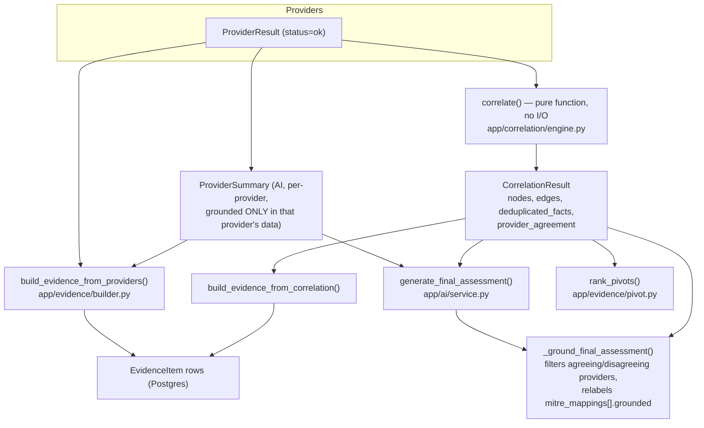

# Threat Intelligence Guide: Evidence Quality & Trust Calibration

This is the analyst-facing reference for **how much to trust a piece of evidence** produced by
HORIZON GRID. It covers the `EvidenceType` taxonomy, the exact confidence-scoring
math (correlation-edge confidence and corroboration bonus, verbatim from source), how provider
disagreement is surfaced, and precisely what `grounded: false` means on a MITRE ATT&CK mapping.

Source of truth: `backend/app/correlation/engine.py`, `backend/app/evidence/builder.py`,
`backend/app/evidence/pivot.py`, `backend/app/models/evidence.py`, `backend/app/ai/service.py`,
`backend/app/ai/schemas.py`, `backend/app/ai/analysis_service.py`.

See also: [PROVIDERS.md](PROVIDERS.md) for what each provider's `data` fields mean,
[AI_ENGINE.md](AI_ENGINE.md) for the two-step AI summarization/assessment flow this document's
grounding logic feeds into, [ARCHITECTURE.md](ARCHITECTURE.md) for the end-to-end pipeline,
[DATA_MODEL.md](DATA_MODEL.md) for the `evidence_items` / `correlation_edges` table schemas, and
[API_DOCUMENTATION.md](API_DOCUMENTATION.md) for the SSE event payloads referenced below.

---

## 1. Why this document exists

Every claim the platform shows an analyst — a reputation verdict, a "related to malware family
X" link, a MITRE technique mapping — has a different evidentiary basis. Some claims come straight
from a provider's raw response. Some are inferred by deterministic correlation logic across
multiple providers. Some are generated by an LLM and then checked against real data before
display. This document exists so an analyst can look at any evidence item, correlation edge, or
MITRE mapping and know **exactly which of those three buckets it came from**, and how much
corroboration backs it.

---

## 2. Evidence assembly pipeline



Two independent things are built from the same `CorrelationResult`:

1. **`EvidenceItem` rows** — persisted, analyst-visible facts with a 0–100 confidence score
   (`build_evidence()`, §3–§5 below).
2. **The final AI assessment's grounding pass** — `agreeing_providers`, `disagreeing_providers`,
   and `mitre_mappings[].grounded` are cross-checked against the correlation graph before the
   `final_assessment` SSE event is emitted (§6–§7 below).

Only providers whose `ProviderResult.status == "ok"` contribute anything to either path
(`backend/app/correlation/engine.py:106`). A provider that returned `error`, `timeout`,
`rate_limited`, `not_configured`, `unsupported_ioc`, or `no_data` contributes **zero** nodes,
edges, deduplicated facts, or evidence — its silence is not evidence of anything, and the platform
does not synthesize a placeholder claim for it.

---

## 3. The `EvidenceType` taxonomy

Enum: `EvidenceType` (`backend/app/models/evidence.py:19-28`), persisted on the `evidence_items`
table's `evidence_type` column. All nine values are actually producible by
`backend/app/evidence/builder.py` — there is no dead enum value.

| Value | Produced by | Condition |
|---|---|---|
| `detection` | `build_evidence_from_providers()` | Per `ok` provider result with a matching `ProviderSummary`, when `summary.reputation` is `"unknown"` or `"no data"` |
| `reputation` | `build_evidence_from_providers()` | Same as above, when `summary.reputation` is anything else (`malicious`, `suspicious`, `clean`) |
| `other` | `build_evidence_from_providers()` | One record per entry in `summary.interesting_findings` |
| `malware_association` | `build_evidence_from_correlation()` | Correlation edge whose target type is `malware_family` |
| `threat_actor_association` | `build_evidence_from_correlation()` | Correlation edge whose target type is `threat_actor` |
| `campaign_association` | `build_evidence_from_correlation()` | Correlation edge whose target type is `campaign` |
| `mitre_technique` | `build_evidence_from_correlation()` | Correlation edge whose target type is `mitre_technique` |
| `infrastructure` | `build_evidence_from_correlation()` | Correlation edge whose target type is a network type (`app/ioc/types.py` `NETWORK_TYPES`) or `tls_certificate` / `asn` |
| `relationship` | `build_evidence_from_correlation()` | Fallback for any correlation-edge target type not matched above (e.g. `cve`) |

Dispatch order for the correlation-edge path (`_relationship_evidence_type()`,
`backend/app/evidence/builder.py:51-62`) is checked **in this exact sequence** —
malware → threat actor → campaign → MITRE technique → infrastructure → `relationship` fallback.
A target type could in principle match more than one bucket; the first match in this order wins.

### `EvidenceRecord` fields

`backend/app/evidence/builder.py:33-48` — mirrors the `EvidenceItem` table minus `lookup_id`
(assigned once the parent `IOCLookup` row exists):

```
evidence_type, source_label, provider_id, claim, interpretation, confidence,
related_ioc_type, related_ioc_value, source_url, observed_at, raw_data
```

### Claim text by source

| Path | `claim` format | `source_label` |
|---|---|---|
| Provider (`detection`/`reputation`) | `"{provider_name} reports reputation={reputation}, threat_level={threat_level} ({detection_status})"` | provider's own name |
| Correlation edge | `"{source_value} {relationship.replace('_',' ')} {target_value}"` | `"Correlation Engine (corroborated)"` if more than one provider id appears in the edge's provenance, else the single provider id, else `"Correlation Engine"` if provenance is empty |

On a correlation-edge evidence record, `provider_id` is set only when the edge's provenance
contains **exactly one** provider ID; if it was corroborated by more than one provider,
`provider_id` is left `None` (the attribution lives in `source_label` /
`raw_data.provenance` instead) (`backend/app/evidence/builder.py:129`).

`build_evidence(provider_results, provider_summaries, correlation)`
(`backend/app/evidence/builder.py:142-147`) is simply the concatenation of the two functions above
— no other evidence is generated anywhere else in the codebase.

**Coverage gap to know about**: the provider path only fires when a `ProviderSummary` exists for
that `provider_id` in `summaries_by_id`; if no matching summary was found (e.g. its persisted
`AISummaryRecord` row failed to re-validate on reload), that provider's `ok` result is **silently
skipped** — no evidence record, no error surfaced (`backend/app/evidence/builder.py:77-79`).

---

## 4. Confidence scale — two systems, one final number

The platform runs two different confidence calculations that ultimately share the same 0–100
display scale as `RiskAssessment` (`app/ai/schemas.py`) "so evidence and risk numbers are directly
comparable in the UI" (`backend/app/evidence/builder.py:1-10`).

### 4a. Provider-summary confidence (qualitative → 0–100)

`ProviderSummary.confidence` is a qualitative `low`/`medium`/`high` label set by the AI when it
summarizes a single provider's raw data. The evidence builder converts it via a fixed lookup table
— `_CONFIDENCE_LEVEL_TO_SCORE` (`backend/app/evidence/builder.py:21`):

```python
_CONFIDENCE_LEVEL_TO_SCORE = {"low": 30.0, "medium": 60.0, "high": 90.0}
```

An unrecognized or missing confidence level defaults to `50.0` (`builder.py:81`).

### 4b. Correlation-edge confidence (0–1 internal → ×100 display)

Correlation edges carry an internal `confidence: float` on a **0–1** scale
(`GraphEdge`, `backend/app/correlation/engine.py:33-39`). When an edge becomes an `EvidenceRecord`,
its confidence is rescaled: `confidence = round(edge.confidence * 100, 1)`
(`backend/app/evidence/builder.py:132`). This 0–1 → 0–100 edge-confidence model is described in
detail in §5.

---

## 5. Correlation engine confidence model (verbatim)

### Base confidence per field

`_FIELD_BASE_CONFIDENCE` (`backend/app/correlation/engine.py:77-90`) — the starting confidence for
a correlation edge, keyed by which `ProviderResult.data` field produced it:

| `data` field | Correlation relationship | Base confidence (0–1) |
|---|---|---|
| `resolved_ips` | `resolves_to` → `IOCType.IPV4` | 0.9 |
| `resolved_domains` | `resolves_to` → `IOCType.DOMAIN` | 0.9 |
| `asn` | `belongs_to_asn` → `IOCType.ASN` | 0.9 |
| `certificates` | `serves_certificate` → `IOCType.TLS_CERTIFICATE` | 0.85 |
| `related_urls` | `hosts` → `IOCType.URL` | 0.8 |
| `related_hashes` | `delivers` → `IOCType.SHA256` | 0.8 |
| `cves` | `exploits` → `IOCType.CVE` | 0.8 |
| `mitre_techniques` | `uses_technique` → `IOCType.MITRE_TECHNIQUE` | 0.75 |
| `related_domains` | `related_to` → `IOCType.DOMAIN` | 0.7 |
| `malware_families` | `associated_with` → `IOCType.MALWARE_FAMILY` | 0.5 |
| `threat_actors` | `attributed_to` → `IOCType.THREAT_ACTOR` | 0.5 |
| `campaigns` | `part_of_campaign` → `IOCType.CAMPAIGN` | 0.5 |

**Read the table as a trust ranking**: DNS/network-topology facts (resolution, ASN, certificates)
start at 0.7–0.9 because they're closer to raw technical fact; attribution-style facts (malware
family, threat actor, campaign) start at only 0.5 because naming conventions and attribution are
inherently fuzzier across providers.

**Fallback rule** for any field not in the table above
(`backend/app/correlation/engine.py:125-127`):

```python
base_confidence = _FIELD_BASE_CONFIDENCE.get(
    field_name,
    1.0 if result.category.value == "threat_intel" else 0.7,
)
```

i.e. an unmapped field from a `threat_intel`-category provider defaults to full confidence (1.0);
from any other category, 0.7.

### Corroboration bonus

```python
_CORROBORATION_BONUS_PER_PROVIDER = 0.15
```

(`backend/app/correlation/engine.py:94`) — "Per additional distinct provider corroborating the
exact same (source, target, relationship) edge, beyond the first."

Merge logic when two providers assert the **same** `(source, target, relationship)` edge
(`backend/app/correlation/engine.py:154-175`):

1. `base_confidences[dedup_key] = max(existing_base, new_edge.confidence)` — the base is the
   **maximum**, not the sum, of the base confidences contributed by each provider for that field.
2. `boosted = min(1.0, base + 0.15 * (len(distinct_providers) - 1))` — capped at 1.0.
3. `provenance` strings are concatenated with commas (`existing.provenance + "," + edge.provenance`).

**Worked example**: three distinct providers each report the same IOC is `associated_with` the
same malware family (base confidence 0.5 each, from the table above):

```
boosted = min(1.0, 0.5 + 0.15 * (3 - 1)) = min(1.0, 0.80) = 0.80
```

That edge, when written to `EvidenceItem.confidence`, becomes `round(0.80 * 100, 1) = 80.0`.

**Known double-counting caveat**: the merge step has *no* uniqueness check on `provenance` itself
— only the confidence-bonus provider set is deduplicated. If a single provider emits the same edge
via two different `data` fields, its provider ID can appear twice in the comma-joined `provenance`
string. `rank_pivots()`'s `corroborating_providers` count (§8) is computed as
`len([p for p in edge.provenance.split(",") if p])` — a **raw split-and-count with no
deduplication** — so it can be inflated relative to the true number of distinct corroborating
providers in this edge case.

---

## 6. How provider disagreement is surfaced

### `provider_agreement` bucketing

Inside `correlate()` (`backend/app/correlation/engine.py:140-142`), for every `ok` provider
result:

```python
verdict = result.data.get("verdict") or result.data.get("reputation")
if verdict:
    provider_agreement.setdefault(str(verdict).lower(), []).append(result.provider_id)
```

`verdict` is checked before `reputation`. The result is a dict like
`{"malicious": ["virustotal", "abuseipdb"], "clean": ["otx"]}` — one bucket per distinct
verdict string, each holding the provider IDs that reported it.

This dict is **not** streamed to the frontend directly. The SSE `correlation` event
(see [API_DOCUMENTATION.md](API_DOCUMENTATION.md)) only carries `nodes` and `edges` — the
`provider_agreement` dict (and `deduplicated_facts`) are consumed internally as prompt context for
`generate_final_assessment()`.

### `agreeing_providers` / `disagreeing_providers`

The AI populates `FinalAssessment.agreeing_providers` and `.disagreeing_providers`
(`backend/app/ai/schemas.py`) from that same context. Before the `final_assessment` SSE event is
emitted, `_ground_final_assessment()` (`backend/app/ai/service.py:122-150`) filters both lists:

1. Builds `real_provider_ids` = the union of every provider ID appearing in `correlation.edges`'
   provenance strings, and every provider ID appearing anywhere in
   `correlation.provider_agreement`'s value lists.
2. Filters `assessment.agreeing_providers` / `.disagreeing_providers` to only the IDs present in
   `real_provider_ids`. **Exception**: if `real_provider_ids` is empty, the model's claimed list is
   passed through unfiltered (nothing real to check it against).

So a provider name appearing in `disagreeing_providers` on the final assessment is guaranteed to be
a provider ID that actually contributed a correlation edge or a verdict/reputation value for this
lookup — it cannot be a hallucinated provider name (as long as at least one real provider
contributed *something* to the correlation graph).

### Verdict/risk consistency is enforced by validation failure, not repair

`FinalAssessment` has a `model_validator` (`_verdict_must_agree_with_risk`,
`backend/app/ai/schemas.py:161-182`, `mode="after"`):

- `final_verdict` in `{malicious, highly_malicious}` but `risk.malicious_probability < 30` → raises.
- `final_verdict` in `{benign, likely_benign}` but `risk.malicious_probability > 50` → raises.

This raise is caught by the generic `except Exception` in `generate_final_assessment()`
(`backend/app/ai/service.py:243`) — **the schema validation failure itself is the enforcement
mechanism**, not a repair step. A contradictory verdict/risk pair from the AI does not get fixed
up; the entire assessment falls back to a degraded `FinalAssessment` stating generation failed,
with `final_verdict: "unknown"`, all risk fields zeroed, and `verdict_rationale` citing the
exception. There is no second attempt (see [AI_ENGINE.md](AI_ENGINE.md) for the broader
no-retry behavior of the AI clients).

---

## 7. MITRE ATT&CK mapping: what `grounded: false` actually means

`MitreMapping` (`backend/app/ai/schemas.py:61-92`) fields:

```
technique_id, technique_name, tactic (Literal of 14 ATT&CK tactic slugs),
kill_chain_stage (optional), rationale, grounded: bool = True
```

The AI is prompted to set `grounded=false` on a mapping it inferred itself (e.g. "this reputation
pattern is consistent with T1071") rather than one a provider explicitly surfaced. **In practice
this initial model-set value is irrelevant** — `_ground_final_assessment()`
(`backend/app/ai/service.py:122-150`) always overwrites it:

1. Builds `grounded_technique_ids` from every correlation edge whose `relationship ==
   "uses_technique"`, taking `edge.target.split(":", 1)[1].upper()` (the technique ID half of the
   `mitre_technique:<id>` node id).
2. For every mapping in `assessment.mitre_mappings`:
   ```python
   mapping.grounded = mapping.technique_id.upper() in grounded_technique_ids
   ```

**What this means for an analyst reading a MITRE mapping:**

| `grounded` | Meaning |
|---|---|
| `true` | This exact technique ID appears as a `uses_technique` correlation edge target for this IOC — i.e. **some provider's raw data actually reported this technique** (e.g. OTX pulse tags, MITRE-tagged threat-intel fields), not just the AI's own inference. |
| `false` | The AI proposed this technique mapping, but no provider result for this lookup produced a matching `uses_technique` edge. It may still be analytically reasonable (the AI is instructed never to fabricate outright), but it is **unverified against real provider data** for this specific lookup. |

Grounding **relabels, it does not remove**. An ungrounded mapping is never stripped from
`mitre_mappings` — it is still returned to the frontend, just flagged. Treat `grounded: false`
mappings as analyst-review items, not as confirmed technique usage.

### Why `technique_id` has no format validation (and why that's safe)

`backend/app/ai/schemas.py:62-71` deliberately omits a `pattern=` regex constraint on
`technique_id`. Reason (verbatim intent): Ollama's grammar compiler (llama.cpp
json-schema-to-grammar) fails to compile a `pattern` constraint into a decoding grammar and returns
HTTP 400 for the **entire** `generate_final_assessment()` call, not just the offending field — a
single unsupported constraint anywhere in the schema breaks every AI backend routed through Ollama.
This is judged safe to skip because grounding (above) already checks `technique_id` by **exact
membership** against real correlation-graph technique IDs, not by format — a malformed ID simply
fails the membership check and is marked `grounded: false`; it was never a security-relevant
validation gap. Cloud backends (Claude/Gemini/Bedrock) don't compile schemas into decoding
grammars, so the field's description alone still guides them.

---

## 8. Grounding beyond MITRE: evidence IDs and expansion targets

The same "never let the AI invent something that isn't in the real ledger" pattern recurs in two
other AI-generated artifacts derived from evidence:

- **AI explanations** (`backend/app/ai/analysis_service.py`) — functions like
  `explain_why_malicious`, `explain_disagreement`, `assess_false_positive`, `challenge_verdict`,
  etc. are prompted with the real `EvidenceItem` ledger (`_evidence_block()`) and asked to cite
  `evidence_ids`. After the AI responds, `_strip_invalid_evidence_ids()`
  (`backend/app/ai/analysis_service.py:55-71`) recursively walks the validated response and filters
  every field literally named `evidence_ids` down to IDs that actually exist in the real ledger
  (`real_ids = {str(item.id) for item in evidence}`) — an invented evidence ID is silently dropped,
  never shown to the analyst as if real.
- **Hunting packages** (`backend/app/ai/hunting_service.py`) — `generate_hunting_package()`'s
  `expansion_targets` are grounded differently: filtered to only targets whose
  `related_ioc_value` (case-insensitive) matches a real node value in the correlation graph
  (`real_values = {node.value.lower() for node in correlation.nodes}`). This module does **not**
  use `_strip_invalid_evidence_ids` — it has no evidence-ledger dependency, only the correlation
  graph. `generate_detection_rule()` has no grounding step at all (single seed IOC, nothing to
  invent against).

Both mechanisms fail closed: on any exception, the AI backend returns the caller's pre-defined
fallback object rather than partially-grounded output.

---

## 9. Pivot relevance banding (uses the same corroboration signal)

`rank_pivots()` (`backend/app/evidence/pivot.py:22-52`) powers `GET
/api/v1/lookup/{id}/pivots` and is explicitly **not** AI-generated — "a pure sort over real
correlation edges can never hallucinate a pivot target." It reuses the same provenance/confidence
signals described above:

```python
provider_count = len([p for p in edge.provenance.split(",") if p])   # see double-counting caveat, §5
relevance = (
    "high" if provider_count > 1 or edge.confidence >= 0.85
    else "medium" if edge.confidence >= 0.6
    else "low"
)
```

Note the thresholds (`0.85`, `0.6`) apply to the raw **0–1** `edge.confidence`, even though the
pivot dict's own `confidence` output field is the `×100` display value
(`round(edge.confidence * 100, 1)`). Results are sorted by `(corroborating_providers, confidence)`
descending, and only edges directly touching the seed IOC are surfaced (no multi-hop pivots). See
[SOC_ANALYST_GUIDE.md](SOC_ANALYST_GUIDE.md) for the analyst workflow this feeds.

---

## 10. Trust-calibration checklist for analysts

- **No evidence ≠ clean.** A provider with status `not_configured`, `error`, `timeout`, or
  `unsupported_ioc` contributes nothing — it is absent from evidence, correlation, and provider
  agreement entirely. Only `no_data` (and DNSBL "not listed") are genuine negative findings.
- **`detection`/`reputation` evidence requires both an `ok` result and a matching AI summary.** If
  the AI summary row for a provider couldn't be reloaded/re-validated, that provider's evidence is
  silently absent — check `provider_results` directly (via `GET /api/v1/lookup/{id}`) if a
  provider you expected to see is missing from the evidence list.
- **Attribution-style edges (malware family, threat actor, campaign) start at 0.5 base
  confidence** — lower than network/DNS facts (0.7–0.9) — reflecting that naming/attribution is
  less standardized across providers than resolution data.
- **Corroboration only compounds, it never multiplies risk.** Three providers agreeing on a
  malware-family link caps out well below the ceiling unless enough distinct providers stack the
  `+0.15` bonus; `min(1.0, ...)` prevents runaway confidence from many providers repeating one fact.
- **`agreeing_providers` / `disagreeing_providers` are grounded**, but grounding only checks that
  the provider ID is *real* for this lookup, not that the AI's characterization of what it agreed
  or disagreed on is itself correct — read `verdict_rationale` and the correlation edges directly
  for the underlying facts.
- **`grounded: false` on a MITRE mapping is a flag for review, not an error** — the mapping is
  still shown; it means no provider explicitly surfaced that technique for this IOC.
- **The correlation SSE event's `nodes`/`edges` are not persisted verbatim.** `GET
  /api/v1/lookup/{id}` does not return correlation nodes/edges at all; only the derived
  `CorrelationEdgeRecord` rows (flat DB rows, used to rebuild a `CorrelationResult` for
  `pivots`/`analysis`/`hunting` routes) and `EvidenceItem` rows persist long-term.

---

## 11. NOT IMPLEMENTED

- **Neo4j graph mirroring.** `engine.py`'s module docstring and the `CorrelationEdgeRecord` model
  docstring both describe correlation edges as "mirrored into Neo4j for graph traversal," and
  `neo4j_uri` / `neo4j_user` / `neo4j_password` settings exist (`backend/app/core/config.py:31-33`).
  There is no Neo4j driver import, session, or write/query call anywhere in the codebase. Postgres
  (`correlation_edges` table) is the **sole** persisted store for correlation edges today.
- **`GraphNode.labels`.** The `GraphNode` dataclass has a `labels: list[str]` field
  (`backend/app/correlation/engine.py:30`), but no code path in `correlate()` ever populates it —
  every node built has `labels: []`. Do not expect node labels in any correlation output.
- **Per-provider proactive rate limiting.** `ProviderStatus.RATE_LIMITED` exists and is reachable
  (HTTP 429/403/509), but no connector self-throttles in advance — all retry/timeout logic lives
  solely in the orchestrator (see [AI_ENGINE.md](AI_ENGINE.md) / [PROVIDERS.md](PROVIDERS.md)).
  Not an evidence-quality gap per se, but relevant context: a `rate_limited` result contributes no
  evidence, same as any other non-`ok` status.

---

## Glossary

See [GLOSSARY.md](GLOSSARY.md) for platform-wide term definitions. Terms specific to this
document: **base confidence**, **corroboration bonus**, **grounding**, **provider agreement**,
**dedup key** (`(source, target, relationship)` tuple used to merge duplicate correlation edges).
