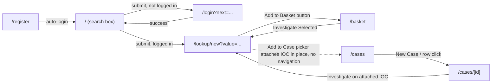

# User Guide

This guide walks through every real page and dashboard component in the IOC
Intelligence Platform frontend (`frontend/app/`), what each button does, and
which backend API call or SSE event feeds each piece of data. It reflects the
actual shipped UI only. For role/permission details see
[ADMIN_GUIDE.md](ADMIN_GUIDE.md); for the underlying REST/SSE contract see
[API.md](API.md); for what each dashboard panel's AI content is grounded in
see [AI_ENGINE.md](AI_ENGINE.md).

The app has ten routes:

| Route | Purpose |
|---|---|
| `/` | Home search box |
| `/login` | Sign in |
| `/register` | Create account |
| `/lookup/new?value=...` | Live SSE investigation view |
| `/lookup/[id]` | Completed-lookup detail view (no live stream) |
| `/basket` | IOC Basket (per-analyst scratch space) |
| `/cases` | Case list + create |
| `/cases/[id]` | Case detail |
| `/providers` | Manage Providers — AI/IOC provider configuration, audit log, network access. Linked from `WorkspaceNav` for every logged-in role, but every underlying call is gated server-side by `provider:manage`/`audit:read`, so it's only actually functional for an admin. Full walkthrough in [ADMIN_GUIDE.md](ADMIN_GUIDE.md). |
| `/admin` | Administration console — user management, the roles &amp; permissions matrix, audit log. Admin-role only, both in the nav (link only renders for `role: admin`) and server-side (`user:manage`). Full walkthrough in [ADMIN_GUIDE.md](ADMIN_GUIDE.md). |

There is **no** threat-actor page, malware page, campaign page, watchlist
page, or bulk-upload page. If you're looking for one of those, see the "Not
implemented / planned" section at the bottom of this guide, and
[CHANGELOG.md](CHANGELOG.md) / [DOCUMENTATION_GAPS.md](DOCUMENTATION_GAPS.md)
for status.



---

## 1. Sign up and sign in

### `/register`

Form fields: full name (optional), email, password (`minLength=8`).
Submitting calls `register()` then `login()` then routes to `/`. On-screen
copy states: **"Self-registration only works on a brand-new installation with
no existing admin. If one already exists, ask an administrator to create your
account from the Administration page."** This matches the backend:
`POST /api/v1/auth/register` makes the very first ever registered user
`role: admin`; every registration attempt after that is rejected with `403
Self-registration is closed` (see [ADMIN_GUIDE.md](ADMIN_GUIDE.md)).

### `/login`

Email + password form. Calls `login(email, password)` against
`POST /api/v1/auth/login`, stores `access_token`/`refresh_token` in
`localStorage`, and redirects to the `next` query param (defaults to `/`).

Session handling notes:
- Access tokens expire (backend `ACCESS_TOKEN_EXPIRE_MINUTES`, default 30
  minutes). The frontend's `authedFetch()` helper transparently retries once
  via `POST /api/v1/auth/refresh` on a 401 before giving up.
- `isLoggedIn()` / `logout()` are pure `localStorage` checks — no network
  call is made just to check login state.

---

## 2. Home page (`/`)

A single search box. Placeholder text: *"IP, domain, URL, hash, CVE, threat
actor, YARA rule..."*. Below it are four example chips you can click to fill
the box: `8.8.8.8`, `malicious-example.com`, `CVE-2024-3400`, `T1059`.

> Note: the placeholder text advertises "threat actor" and "YARA rule" as
> example input types, but the pipeline's real depth (detection → parallel
> provider fetch → correlation → AI summaries → verdict) is documented as
> end-to-end only for IPv4/IPv6, domain, URL, and file-hash IOC types. Other
> `IOCType` enum values (including threat actor names and YARA rules as
> literal search input) route through the same pipeline but light up only as
> matching providers exist — see [IOC_TYPES.md](IOC_TYPES.md) and
> [PROVIDERS.md](PROVIDERS.md) for current provider coverage.

Submitting the form:
- If not logged in, redirects to `/login?next=/lookup/new?value=<value>`.
- If logged in, navigates straight to `/lookup/new?value=<value>`.

Top-right corner shows **Sign in** / **Register** (logged out) or **Sign
out** (logged in), driven by `isLoggedIn()`/`logout()`.

---

## 3. Live investigation (`/lookup/new?value=...`)

This is the main SOC workbench screen. On mount it:

1. Reads the `?value=` query param (redirects to `/login?next=...` first if
   you aren't logged in).
2. Opens a streaming POST to `/api/v1/lookup/stream` via `streamLookup()`
   (a manual `fetch` + stream reader, not `EventSource`, specifically
   because `EventSource` cannot send an `Authorization` header and this
   endpoint requires a bearer token).
3. Renders panels incrementally as SSE events arrive.

The page key is set to the raw `?value=` param, so pivoting to a new IOC
(e.g. via the top search bar) forces a full remount instead of reusing stale
state from the previous IOC.

### SSE event sequence

Per the backend docstring, the exact order is:

```
detected → N × provider_result → N × provider_summary → correlation → final_assessment → done
```

(or an `error` event on failure, at any point). Any event name other than
these seven is silently ignored by the frontend.

| SSE event | Frontend handler | Drives |
|---|---|---|
| `detected` | `onDetected` | IOC type/value confirmation |
| `provider_result` | `onProviderResult` | `ProviderCardGrid`, `ProviderProgressTracker` |
| `provider_summary` | `onProviderSummary` | AI summary section inside each `ProviderCard` |
| `correlation` | `onCorrelation` | `RelationshipGraph` |
| `final_assessment` | `onFinalAssessment` | `ThreatScoreGauge`, `FinalAssessmentPanel`, `MitreMatrix`, `DetectionRulesPanel`, `RecommendedActionsPanel` |
| `done` | `onDone` | unlocks the "post-completion" cluster (below) |
| `error` | `onError` | error banner |

Provider rows and correlation edges are persisted to Postgres incrementally
during the stream, not just at the very end.

### Layout

**Main column** (always mounted, panels self-render loading/empty states
until their data arrives):

- `ThreatScoreGauge`
- `ProviderCardGrid`
- `FinalAssessmentPanel`
- `RelationshipGraph`
- `MitreMatrix`
- `DetectionRulesPanel`
- `RecommendedActionsPanel`

Once the stream reaches `done` (`isDone`), seven more panels mount:

- `AiComparisonPanel`
- `VerdictAnalysisPanel`
- `EvidencePanel`
- `PivotPanel`
- `HuntingCenterPanel`
- `InvestigationCopilot`
- `SecurityAssessmentPanel`

**Sidebar**:

- `ProviderProgressTracker`
- `ExportMenu`
- `InvestigationActions`
- `AskAiPanel`
- A debug **"Event log"** card showing the raw SSE events as they arrive
  (useful for troubleshooting a stuck lookup).

### Dashboard components, in detail

#### ThreatScoreGauge
Plain-SVG semicircular gauge for `final_assessment.risk.overall_risk_score`.
Shows a pulsing skeleton with caption **"Awaiting final assessment…"** until
the `final_assessment` SSE event arrives (it's always the last substantive
event before `done`).

#### ProviderCardGrid / ProviderCard
Grid of one card per provider, `ok`-status results sorted before non-`ok`
ones. Each card generically renders the provider's raw `data` fields
(primitives inline, small arrays as pills, larger nested objects collapsed
into a "Raw data" `<details>` JSON dump). A special-cased renderer shows
OSINT search hits (title/url/snippet/source/published date) for the
`internet_intelligence` provider's `osint_findings` field. Below the raw
data, an AI summary section (what it knows, reputation, confidence,
interesting findings, relationships, unique observations) renders once that
provider's `provider_summary` SSE event arrives; shows "Generating AI
summary…" while waiting, or "No AI summary" if the provider's status wasn't
`ok`.

#### ProviderProgressTracker (sidebar)
Purely derived from the `provider_result` events accumulated so far — it
does not fetch anything itself. Because the SSE stream doesn't announce the
full provider roster up front, the gap between how many results have arrived
and the expected total is rendered as anonymous spinning "Provider N" rows
until real names arrive. Category icons: threat intel, sandbox, passive DNS,
certificate intel, WHOIS, vulnerability, OSINT.

#### RelationshipGraph
Renders the `correlation` event's `{nodes, edges}` payload as a force-graph
(client-side only, via `react-force-graph-2d`). Node/edge colors follow the
IOC type family (network/infra, hash/file, attribution, vuln/technique, host
artifact, other) using the app's own theme colors. Includes a **"View as
list"** toggle that renders the same graph as an accessible HTML table for
keyboard/screen-reader use.

#### FinalAssessmentPanel
Five tabs: **Executive Summary**, **Technical Summary**, **Threat
Assessment**, **Relationships**, **Risk & Verdict**.
- Executive tab: `executive_summary`, verdict badge, `verdict_rationale`.
- Threat tab: `threat_assessment`, agreeing/disagreeing provider pills,
  numbered `supporting_evidence` list.
- Risk tab: overall risk score, confidence score, severity, reputation,
  malicious probability, analyst confidence.
Shows a skeleton placeholder until `final_assessment` arrives.

#### MitreMatrix
Groups `final_assessment.mitre_mappings` by tactic into columns. Each
technique cell links out to `attack.mitre.org`. Mappings the AI inferred
(rather than a provider explicitly asserting) are marked with an
**"AI-inferred"** badge; hovering shows the rationale in a tooltip.

#### DetectionRulesPanel
Tabbed view of `final_assessment.detection_rules`, grouped by rule format
(preferred tab order: Sigma, YARA, Splunk SPL, Sentinel KQL, Elastic, QRadar
AQL, Suricata, Snort, Zeek). Each rule has a **Copy** button. Shows "No
detection logic generated for this IOC type." if empty.

#### RecommendedActionsPanel
Three columns: **Recommended Actions**, **Investigation Priorities**,
**Incident Response** — sourced directly from
`final_assessment.recommended_actions` / `.investigation_priorities` /
`.incident_response_recommendations`.

#### AiComparisonPanel (post-`done`) — "AI Comparison"
Lets you re-run *just* the final-assessment AI step against a different
configured AI backend (e.g. compare the original verdict against Anthropic,
Gemini, Groq, Bedrock, or a local Ollama model), reusing the exact same
already-collected provider evidence — no providers are re-queried. A
dropdown, populated from `GET /api/v1/runtime/ai-providers`, lists every
configured backend and flags any already run against this lookup as
"(already run)"; picking one and clicking **Analyze with `<backend>`** calls
`POST .../lookup/{id}/reanalyze`. Every result — the original assessment plus
every comparison — comes from `GET .../lookup/{id}/assessments` and renders
as its own card labelled **Original** or **Comparison**, showing which
backend/model produced it, its verdict badge, executive summary, and risk/
confidence/malicious-probability stats. Neither result is presented as more
correct than the other; comparing quality and evidence use across backends is
left to the analyst.

#### VerdictAnalysisPanel (post-`done`)
Six on-demand modes, each a button, fetched only when clicked (not
automatic) and cached per-session once fetched:

| Button label | Backend call |
|---|---|
| WHY? | `POST .../analysis/why` |
| What is this? | `POST .../analysis/what-is-this` |
| Score Explanation | `POST .../analysis/score-explanation` |
| Intelligence Conflicts | `POST .../analysis/disagreement` |
| False Positive Check | `POST .../analysis/false-positive` |
| Challenge This Verdict | `POST .../analysis/challenge` |

Every result includes a "Show receipts" link wired to `EvidencePanel`.

#### EvidencePanel (post-`done`) — "Show Receipts"
Fetches `GET .../analysis/evidence`. This is **deterministic, non-AI**
evidence built server-side from provider summaries and correlation edges —
never from an AI call. Evidence rows are categorized as: detection,
reputation, relationship, malware association, threat actor association,
campaign association, MITRE technique, infrastructure, other. Supports
filtering by type, and can auto-expand/scroll to specific rows when a "Show
receipts (N)" link elsewhere on the page is clicked.

#### PivotPanel (post-`done`)
Three sub-sections:
- **Recommended Pivots** — a pure deterministic sort over real correlation
  edges (`GET .../pivots`), never AI-generated. Rows show IOC value/type,
  relationship, number of corroborating providers, confidence %, and a
  relevance badge (high/medium/low). Clicking a row navigates to
  `/lookup/new?value=<that IOC>`.
- **"What should I do next?"** — an explicit **"Ask AI"** button, not
  automatic. Calls `POST .../analysis/next-actions`.
- **"What don't we know?"** — also gated behind an explicit **"Ask AI"**
  button. Calls `POST .../analysis/gaps`.

#### HuntingCenterPanel (post-`done`)
- **"Hunt This IOC"** button calls `POST .../hunt` (formats: sigma,
  splunk_spl, sentinel_kql, elastic, qradar_aql, chronicle_yara_l, suricata,
  snort, zeek). Renders tabbed exact-match queries plus expansion targets and
  broader queries. Expansion targets are explicitly "grounded, never
  invented" per the component's own documentation.
- **"Create Detection"** section: choose a format from a dropdown (same list
  plus YARA) and click to call `POST .../detection?format=...`, rendering
  title, rule body, objective, data source, logic explanation, false-positive
  considerations, severity, and MITRE technique IDs.

#### InvestigationCopilot (post-`done`)
Free-form Q&A against everything this lookup already knows — calls
`POST .../analysis/copilot` with `{question, notes}` where `notes` is the
prior Q/A pairs from the same session (so context carries across turns).
Suggested starter questions: *"Why is this suspicious?"*, *"What changed
since last week?"*, *"Which provider has the strongest evidence?"*, *"Is
this likely a false positive?"*, *"What should I investigate next?"*. Every
answer includes a "Show receipts" link and clickable follow-up-question
chips.

#### SecurityAssessmentPanel (post-`done`) — "Security Assessment"
The one panel on this page that sends real traffic to the target itself,
rather than asking a third party what they already know about it. It appears
once an investigation completes for an IP, domain, hostname, or URL. Admins
and analysts (not viewers) see a run form: toggle buttons for **Nmap**
(port/service scan), **DNS** (record lookup), **TLS** (certificate
inspection), and **HTTP security headers** — only the tools that support the
detected IOC type are offered, and a tool is disabled with an "(unavailable)"
label if `GET .../security-assessment/tool-health` reports it isn't
available on this host; a profile dropdown restricted to profile IDs valid
across every currently-selected tool (only Nmap defines more than one
profile — quick/standard/web — so picking more than one tool collapses this
to "standard"); a text box that requires you to **retype the exact IOC
value** before it will let you submit; and a checkbox confirming **"I am
authorized to run active security checks against this target."** The **Run
Security Assessment** button stays disabled until a tool, a profile, a
matching target retype, and the authorization checkbox are all satisfied, and
calls `POST .../security-assessment/{lookupId}/run`. Every run (visible to
every role, fetched via `GET .../security-assessment/{lookupId}/runs` and
polled every 2 seconds while any run is still `pending`/`running`) renders as
a card with a status badge; once findings exist, they list in a table of
severity/title/detail rows, with severities assigned by fixed rules rather
than guessed. Clicking a finding row opens a dialog with its full
description, any matched CVE badges, and the raw evidence its severity was
computed from. Only run this against targets you own or are explicitly
authorized to test.

### Sidebar components

#### ExportMenu
Four buttons:
- **Export PDF** and **Export CSV** — call `POST .../export?format=pdf` /
  `...?format=csv`. **This backend route does not exist** (see
  "Not implemented" below). The UI handles the resulting 404 gracefully and
  shows *"Export format not yet available."*
- **Export Markdown** — fully client-side, builds a Markdown document from
  the already-fetched assessment (executive/technical summary, threat
  assessment, verdict rationale, supporting evidence, MITRE mappings,
  recommended actions, investigation priorities, IR recommendations,
  detection rules). Downloads as `ioc-assessment-{lookupId}.md`. **Works.**
- **Export JSON** — client-side `JSON.stringify` of the assessment object.
  Downloads as `ioc-assessment-{lookupId}.json`. **Works.**

#### InvestigationActions
Two buttons:
- **Add to Basket** — calls `addToBasket(iocValue)` →
  `POST /api/v1/basket`.
- **Add to Case** — opens a case picker (lazy-loads your case list via
  `GET /api/v1/cases`); clicking a case calls
  `POST /api/v1/cases/{caseId}/iocs`.

#### AskAiPanel — "Ask AI (Gemini second opinion)"
**Not a backend AI call.** This builds a prompt client-side and opens
`https://gemini.google.com/app` in a small popup window, copying the prompt
to your clipboard so you can paste it into your own Gemini account manually.
Google blocks embedding `gemini.google.com` in an iframe, so a true in-page
embed isn't possible — this is a manual copy/paste workflow, not a server
integration.

#### WorkspaceNav
Persistent nav bar linking to `/basket` (with a live item-count badge,
refetched on route change), `/cases`, and `/providers`, so you can move from
IOC → basket → case → hunting without leaving the workbench. An
**Administration** link to `/admin` is also rendered, but only once
`getCurrentUser()` confirms `role === "admin"` — this only hides the link for
a non-admin; the real authorization boundary is server-side (`user:manage`
on every `/api/v1/admin/*` route).

#### TopSearchBar
Persistent pivot search box present on every lookup page. Submitting a new
value pushes a new `?value=` onto `/lookup/new`; because it's the same
route, the page uses a `key={value}` trick to force React to fully remount
rather than silently reuse the previous IOC's state.

---

## 4. Completed lookup view (`/lookup/[id]`)

Same dashboard component layout as `/lookup/new` (all the panels above),
but fed from a single `GET /api/v1/lookup/{id}` fetch on page load instead
of a live SSE stream. Two important differences from the live view:

- **No correlation graph data.** `GET /api/v1/lookup/{id}` does not return
  correlation edges, so the `RelationshipGraph` on this page is always given
  a null/empty correlation payload.
- **Backfilled provider-result fields.** This endpoint's `provider_results`
  rows omit `ioc_value`/`ioc_type`/`fetched_at`/`from_cache`; the frontend
  fills in defaults (`fetched_at: 0`, `from_cache: false`) since the shared
  `ProviderResult` type requires them.
- The post-completion panel cluster (VerdictAnalysisPanel, EvidencePanel,
  PivotPanel, HuntingCenterPanel, InvestigationCopilot,
  SecurityAssessmentPanel) is gated on `status === 'completed'` rather than
  an `isDone` streaming flag — it shows as soon as the fetched lookup's
  status is `completed`, with no waiting. Unlike the live view, this page
  does not render `AiComparisonPanel` at all.

Use this view to revisit a past lookup (e.g. from a case's attached-IOC list,
or a basket "Investigate" link that previously ran) without re-querying every
provider.

---

## 5. IOC Basket (`/basket`)

Per-analyst scratch space for collecting IOCs across an investigation, then
acting on the set. **Private to you** — the backend scopes basket rows to
`owner_id == current user`, unlike lookups and cases which are shared across
the whole SOC team.

- **Investigate Selected** — for every checked item, opens
  `/lookup/new?value=<ioc>` in a **new browser tab** (`window.open`).
  Disabled until at least one item is checked.
- **Compare Selected** — requires at least 2 checked items that already have
  a completed lookup (`latest_lookup_id` set). Calls
  `POST /api/v1/basket/compare` with those lookup IDs. Renders a comparison
  table: IOC, Verdict, Risk, ASN, Malware, Threat Actors — with the row
  matching the response's `most_dangerous_ioc_value` highlighted, plus a
  narrative summary sentence below the table.
- **Clear Basket** — `DELETE /api/v1/basket`, empties the whole basket.
  Disabled when the basket is empty.
- Per-row **Investigate** button navigates to `/lookup/new?value=<ioc>` in
  the same tab; a trash-can icon button removes that single item
  (`DELETE /api/v1/basket/{itemId}`).
- Each row shows the IOC value, type, whether it has a completed lookup yet
  ("has completed lookup" / "not yet investigated"), and any note attached
  when it was added.

Items are added from the lookup pages via `InvestigationActions` → **Add to
Basket** (there is no way to add directly from the basket page itself).

---

## 6. Cases (`/cases`, `/cases/[id]`)

Cases are **shared across the whole SOC team** (anyone with case-read access
sees every case) — unlike the basket, which is private per analyst.

### `/cases` — list and create

- Lists all cases via `GET /api/v1/cases` (id, title, severity, status,
  tags, created date), each with a status badge and severity badge.
- **New Case** button toggles a form: title (required), description
  (optional), and a severity dropdown (Low / Medium / High / Critical,
  default Medium). Submitting calls `POST /api/v1/cases`, then routes to the
  new case's detail page.

### `/cases/[id]` — case detail

Fetched via `GET /api/v1/cases/{id}` on load.

- Title, description, and a **status** dropdown covering all six statuses:
  `open`, `investigating`, `contained`, `resolved`, `false_positive`,
  `closed`. Changing it calls `PATCH /api/v1/cases/{id}` with `{status}`.
- Severity badge and any tags, shown read-only on this page.
- **IOCs** card: every IOC attached to the case, each with an **Investigate**
  button that opens `/lookup/new?value=<ioc>`. IOCs get attached here via the
  **Add to Case** button on a lookup page (`InvestigationActions`), not from
  a control on this page directly.
- **Analyst Notes** card: chronological note list (body + timestamp) plus an
  **Add Note** form. Submitting calls `addCaseNote(caseId, noteText)` →
  `POST /api/v1/cases/{id}/notes` with just `{body}` — the note UI does not
  expose the `anchor_type`/`anchor_ref` fields that the backend endpoint
  otherwise supports.

---

## Not implemented / planned

The following are explicitly **NOT IMPLEMENTED** in the current build. Do
not expect them; they are called out here so they aren't mistaken for a bug:

- **Server-side PDF/CSV export.** `ExportMenu`'s "Export PDF" and "Export
  CSV" buttons call `POST /api/v1/lookup/{id}/export?format=pdf|csv`, but no
  such backend route exists anywhere in `backend/app/api/routes/`. The
  button click will always fail with a 404, surfaced in the UI as *"Export
  format not yet available."* Only client-side **Markdown** and **JSON**
  export actually work today. A `lookup:export` permission string is even
  pre-defined for admin/analyst roles, suggesting this was planned but never
  wired up. See [CHANGELOG.md](CHANGELOG.md) /
  [DOCUMENTATION_GAPS.md](DOCUMENTATION_GAPS.md).
- **No dedicated threat-actor, malware-family, or campaign pages.** These
  entities appear only as fields/labels inside lookup results (e.g. the
  basket comparison table's "Threat Actors"/"Malware" columns, or MITRE/
  relationship data in a lookup's dashboard) — there is no standalone page to
  browse or manage them.
- **No watchlist / monitoring page.** There is no way to subscribe to an IOC
  for ongoing monitoring or alerting from the UI.
- **No bulk-upload page.** IOCs are looked up one at a time via the search
  box or added one at a time to the basket; there is no CSV/bulk-import flow.
- **No server-side AI "second opinion."** `AskAiPanel`'s "Ask AI (Gemini
  second opinion)" button does not call any backend endpoint — it only
  builds a prompt in the browser and opens Google's own Gemini web app for
  you to paste into manually, using your own Gemini account.

For anything not covered in this guide, check
[DOCUMENTATION_GAPS.md](DOCUMENTATION_GAPS.md) before assuming it's a defect.
